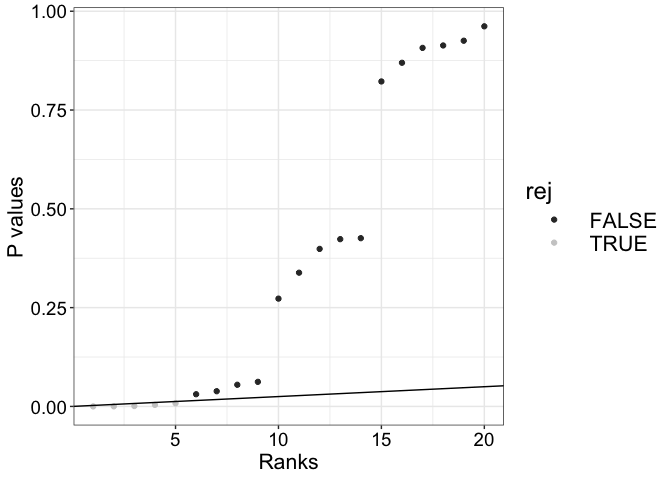
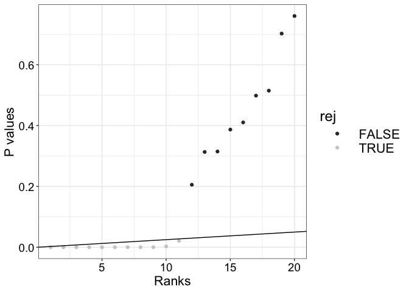
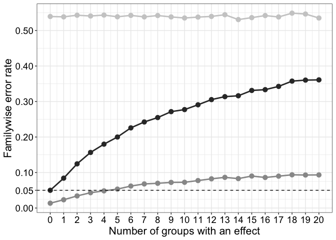

FDR correction: check FWER under full null and in the presence of
effects
================
Guillaume A. Rousselet
2024-09-12

FDR correction: controls the familywise error rate (FWER) under full
null, not when true effects exist.  
FWER = probability of at least one false positive among all comparisons
for which we know there is no effect.  
Similarly, we can define familywise power (FWPR) = probability to detect
at least one true positive among all comparisons for which we know there
is an effect.  
BH95 = Benjamini-Hochberg (1995).  
BY01 = Benjamini-Yekutieli (2001).

There is an excellent description of the BH95 procedure in this
[video](https://www.youtube.com/watch?v=rZKa4tW2NKs&t=194s).

See all the details on the Wikipedia page for the
[FDR](https://en.wikipedia.org/wiki/False_discovery_rate).

BH95 works like this, given $m$ $p$ values:  
- sort the $p$ values in ascending order from 1 to $m$;  
- find the largest k for which $p_{(k)} \leq \frac{\alpha k}{m}$;  
- declare statistically significant all tests associated with $p$ values
1 to $k$.

For instance, if we have 10 $p$ values, the first one (smallest one),
$p_{(k=1)}$ is compared to $\frac{\alpha k}{m}=0.005$, assuming
$\alpha=0.05$, the second one $p_{(k=2)}$ is compared to 0.01, and so
on. For the largest $p$ value, $p_{k=10}$, $k=m$ and therefore it is
compared to $\alpha$.

# Dependencies

``` r
library(Rfast)
library(tibble)
library(ggplot2)
library(cowplot)
source("./code/theme_gar.txt")
# Edit `one_over_f` function from `primer` package to control variance (Stevens, 2009). 
# Original function is available on [GitHub](https://github.com/HankStevens/primer).
# Copyright Hank Stevens.
source("./code/one_over_f.R")
```

# FDR illustrations

## Example 1

20 groups: 10 nulls, 10 with small to large effects

``` r
# set.seed(666)
ng <- 20 
np <- 20
aath <- 0.05

samp <- matrix(rnorm(ng*np), nrow = np)
samp.effect <- matrix(c(rep(0, np*10), rep(seq(0.1,1,length.out=10), each = 20)), nrow = np)

pvals <- sort(Rfast::ttest(samp + samp.effect, 0)[,2]) # 20 p values
pvals.adj <- p.adjust(pvals, method = "BH")

df <- tibble(x = 1:ng,
             y = pvals,
             rej = factor(pvals.adj <= aath))

ggplot(df, aes(x=x, y=y, colour = rej)) + theme_gar +
  geom_point() +
  geom_abline(intercept = 0, slope = aath / ng) +
  labs(x = "Ranks", y = "P values") + 
  scale_colour_grey()
```

<!-- -->

20 groups: 10 nulls, 10 with large to very large effects

Run the code several times to see how often one or more $p$ values are
rejected, beyond the expected 10.

``` r
# set.seed(666)
ng <- 20 
np <- 20
aath <- 0.05

samp <- matrix(rnorm(ng*np), nrow = np)
samp.effect <- matrix(c(rep(0, np*10), rep(seq(1,2,length.out=10), each = 20)), nrow = np)

pvals <- sort(Rfast::ttest(samp + samp.effect, 0)[,2]) # 20 p values
pvals.adj <- p.adjust(pvals, method = "BH")

df <- tibble(x = 1:ng,
             y = pvals,
             rej = factor(pvals.adj <= aath))

ggplot(df, aes(x=x, y=y, colour = rej)) + theme_gar +
  geom_point() +
  geom_abline(intercept = 0, slope = aath / ng) +
  labs(x = "Ranks", y = "P values") + 
  scale_colour_grey()
```

<!-- -->

The presence of many small p values increases the probability that small
$p$ values from the null distribution will be considered significant. So
we have the same problem we encounter with cluster-based statistics:
noise can be lumped together with signal, potentially leading to noisy
onset and offset estimation.

## Example in which we vary the effect size

15 groups with no effect, adjacent to a cluster of 5 groups with an
effect. We vary the effect size in the 5-group cluster.

``` r
set.seed(4)

ng.h0 <- 15 # groups without effect
ng.h1 <- 5 # groups with effect
ng <- ng.h0 + ng.h1 # total number of groups
np <- 30 # number of participants/ trials in each group
aath <- 0.05 # arbitrary alpha threshold
es.vec <- seq(0, 1, 0.2) # vector of effect sizes
nes <- length(es.vec)
  
pvals <- matrix(0, nrow = ng, ncol = nes)
pvals.adj <- matrix(0, nrow = ng, ncol = nes)
samp <- matrix(rnorm(ng*np), nrow = np)
for(ES in 1:nes){
  samp.effect <- matrix(c(rep(0, ng.h0*np), rep(es.vec[ES], ng.h1*np)), nrow = np)  
  # 20 adjusted p values
  pvals[,ES] <- Rfast::ttest(samp + samp.effect, 0)[,2]
  pvals.adj[,ES] <- p.adjust(pvals[,ES], method = "BH")
}

df <- tibble(x = rep(1:ng, nes),
             y = as.vector(pvals.adj),
             rej = factor(as.vector(pvals.adj <= aath)),
             ES = factor(rep(es.vec, each = ng)))

ggplot(df, aes(x=x, y=y, colour = rej)) + theme_gar +
  geom_point() +
  # geom_abline(intercept = 0, slope = aath / ng) +
  labs(x = "Ranks", y = "P values") + 
  scale_colour_grey() +
  facet_wrap(vars(ES)) +
  theme(legend.position = "bottom")
```

<!-- -->

# Simulation: one sample to check

``` r
set.seed(21)

nsim <- 10000 # number of simulation iterations
np <- 20 # number of participants / trials
m <- 0 # hypothesis
aath <- 0.05 # arbitrary alpha threshold 

# Generate nsim * np tests
samp <- matrix(rnorm(nsim * np, mean = 0, sd = 1), nrow = np, ncol = nsim)
# One-sample t-tests
pval <- Rfast::ttest(samp, m)[,2]

mean(pval < aath) # false positive rate
```

    ## [1] 0.0485

Close to the nominal level, as expected.

# Simulation: full null with 10 groups

``` r
set.seed(21)

nsim <- 10000 # number of simulation iterations
np <- 20 # number of participants / trials
ng <- 10 # number of groups
m <- 0 # hypothesis
aath <- 0.05 # arbitrary alpha threshold 
rej.vec <- vector(mode = "logical", length = nsim)

# Generate nsim * np * ng tests
samp <- matrix(rnorm(nsim * np * ng, mean = 0, sd = 1), nrow = np, ncol = nsim*ng)
# One-sample t-tests
pval <- matrix(Rfast::ttest(samp, m)[,2], nrow = ng)
# Adjust p values using BH95
pval.adj <- apply(pval, 2, p.adjust, method = "BH")
# Compute family-wise error rate before correction
fwer.raw <- mean(apply(pval <= aath, 2, sum)>0)
# Compute family-wise error rate after correction
fwer.adj <- mean(apply(pval.adj <= aath, 2, sum)>0)
```

FWER for uncorrected p values = 0.4.  
Theoretical FWER for independent tests = 0.4.  
FWER for corrected p values = 0.05.

# Simulation: true effect in one group

10 groups in total:  
9 groups without effect (mean = 0, SD = 1); 1 group with an effect (mean
= 1, SD = 1).

``` r
set.seed(21)

nsim <- 10000 # number of simulation iterations
np <- 20 # number of participants / trials
ng <- 10 # number of groups
m <- 0 # hypothesis
aath <- 0.05 # arbitrary alpha threshold 
rej.vec <- vector(mode = "logical", length = nsim)

# Generate nsim * np * ng tests
samp <- matrix(rnorm(nsim * np * ng, mean = 0, sd = 1), nrow = np, ncol = nsim*ng)
# Create matrix of effect: 1 in group 1 of each simulation, 0 everywhere else
effect.mat <- matrix(rep(c(rep(1, np), rep(0, np*(ng-1))), nsim), nrow = np)
# add effects to random data
samp <- samp + effect.mat
# One-sample t-tests
pval <- matrix(Rfast::ttest(samp, m)[,2], nrow = ng)
# Adjust p values using BH95
pval.adj <- apply(pval, 2, p.adjust, method = "BH")
# Compute family-wise error rate before correction
fwer.raw <- mean(apply(pval[2:ng,] <= aath, 2, sum)>0)
# Compute family-wise error rate after correction
fwer.adj <- mean(apply(pval.adj[2:ng,] <= aath, 2, sum)>0)
# Power before correction
pwr.raw <- mean(pval[1,] <= aath)
# Power after correction
pwr.adj <- mean(pval.adj[1,] <= aath)
```

FWER for uncorrected p values = 0.37.  
FWER for corrected p values = 0.09.  
Power for corrected p values = 0.88.

The FWER for the 9 groups without true effects is higher than the
nominal level.

# Simulation: true effect in two groups

10 groups in total:  
8 groups without effect (mean = 0, SD = 1); 2 groups with an effect
(mean = 1, SD = 1).

``` r
set.seed(21)

nsim <- 10000 # number of simulation iterations
np <- 20 # number of participants / trials
ng <- 10 # number of groups
m <- 0 # hypothesis
aath <- 0.05 # arbitrary alpha threshold 
rej.vec <- vector(mode = "logical", length = nsim)

# Generate nsim * np * ng tests
samp <- matrix(rnorm(nsim * np * ng, mean = 0, sd = 1), nrow = np, ncol = nsim*ng)
# Create matrix of effect: 1 in groups 1 and 2 of each simulation, 0 everywhere else
effect.mat <- matrix(rep(c(rep(1, np*2), rep(0, np*(ng-2))), nsim), nrow = np)
# add effects to random data
samp <- samp + effect.mat
# One-sample t-tests
pval <- matrix(Rfast::ttest(samp, m)[,2], nrow = ng)
# Adjust p values using BH95
pval.adj <- apply(pval, 2, p.adjust, method = "BH")
# Compute family-wise error rate before correction
fwer.raw <- mean(apply(pval[3:ng,] <= aath, 2, sum)>0)
# Compute family-wise error rate after correction
fwer.adj <- mean(apply(pval.adj[3:ng,] <= aath, 2, sum)>0)
# Power before correction
pwr.raw <- mean(apply(pval[1:2,] <= aath, 2, sum)>0)
# Power after correction -- familywise power = at least one positive test (out of 2 here)
pwr.adj <- mean(apply(pval.adj[1:2,] <= aath, 2, sum)>0)
```

FWER for uncorrected p values = 0.34.  
FWER for corrected p values = 0.11.  
Power for corrected p values = 0.99.

FWER higher when two groups have a true effect.

# Simulation: FWER as a function of effect size

20 groups are considered: 5 have an effect, 15 have no effect. Each
group is composed of 20 participants.

``` r
set.seed(21)

nsim <- 10000 # number of simulation iterations
np <- 20 # number of participants / trials
ng <- 20 # number of groups (15 without effect, 5 with effects)
m <- 0 # hypothesis
aath <- 0.05 # arbitrary alpha threshold 
es.vec <- seq(0, 1.2, 0.1)
nes <- length(es.vec)

fwer.raw <- vector(mode = "numeric", length = nes)
fwer.adj.bh95 <- vector(mode = "numeric", length = nes)
fwer.adj.by01 <- vector(mode = "numeric", length = nes)
pwr.adj.bh95 <- vector(mode = "numeric", length = nes)
pwr.adj.by01 <- vector(mode = "numeric", length = nes)

# Generate nsim * np * ng tests
# Use same random numbers for all effect sizes
samp_all <- matrix(rnorm(nsim * np * ng, mean = 0, sd = 1), nrow = np, ncol = nsim*ng)

for(ES in 1:nes){
  # Create matrix of effect: es.vec[ES] in groups 16-20 of each simulation, 0 everywhere else
  effect.mat <- matrix(rep(c(rep(0, np*(ng-5)), rep(es.vec[ES], np*5)), nsim), nrow = np)
  # add effects to random data
  samp <- samp_all + effect.mat
  # One-sample t-tests
  pval <- matrix(Rfast::ttest(samp, m)[,2], nrow = ng)
  # Compute family-wise error rate before correction
  fwer.raw[ES] <- mean(apply(pval[1:15,] <= aath, 2, sum)>0)
  # Adjust p values using BH95 =====
  pval.adj <- apply(pval, 2, p.adjust, method = "BH")
  # Compute family-wise error rate after correction
  fwer.adj.bh95[ES] <- mean(apply(pval.adj[1:15,] <= aath, 2, sum)>0)
  # Power after correction -- familywise power = at least one positive test (out of 2 here)
  pwr.adj.bh95[ES] <- mean(apply(pval.adj[16:20,] <= aath, 2, sum)>0)
  # Adjust p values using BY01 =====
  pval.adj <- apply(pval, 2, p.adjust, method = "BY")
  # Compute family-wise error rate after correction
  fwer.adj.by01[ES] <- mean(apply(pval.adj[1:15,] <= aath, 2, sum)>0)
  # Power after correction -- familywise power = at least one positive test (out of 2 here)
  pwr.adj.by01[ES] <- mean(apply(pval.adj[16:20,] <= aath, 2, sum)>0)
}

save(fwer.raw, fwer.adj.bh95, fwer.adj.by01,
     pwr.adj.bh95, pwr.adj.by01, es.vec,
     file = "./data/fdr_demo1.RData")
```

## Plot results

### Power = sanity check

``` r
load(file = "./data/fdr_demo1.RData")
nes <- length(es.vec)

df <- tibble(x = rep(es.vec,2), 
             y = c(pwr.adj.bh95, pwr.adj.by01),
             FDR = factor(rep(c("BH95","BY01"), each = nes))
             )

ggplot(df, aes(x = x, y = y, colour = FDR)) + theme_gar +
  geom_line() +
  geom_point() +
  scale_colour_grey() +
  labs(x = "Effect sizes", y = "Familywise power") +
  scale_x_continuous(breaks = es.vec)
```

<!-- -->

### FWER

``` r
df <- tibble(x = rep(es.vec, 3), 
             y = c(fwer.raw, fwer.adj.bh95, fwer.adj.by01),
             Pvalues = rep(c("Uncorrected", "BH95", "BY01"), each = nes))

pA <- ggplot(df, aes(x = x, y = y, colour = Pvalues)) + theme_gar +
  geom_line(linewidth = 1) +
  geom_point(size = 3) +
  scale_colour_grey() +
  geom_hline(yintercept = aath, linetype = "dashed") +
  labs(x = "Effect sizes", y = "Familywise error rate") +
  scale_x_continuous(breaks = es.vec) + 
  scale_y_continuous(breaks = c(0, 0.05, seq(0.1, 1, 0.1))) +
  guides(colour=guide_legend(title="P values")) + 
  theme(legend.position = c(.2, .5))
```

    ## Warning: A numeric `legend.position` argument in `theme()` was deprecated in ggplot2
    ## 3.5.0.
    ## ℹ Please use the `legend.position.inside` argument of `theme()` instead.
    ## This warning is displayed once every 8 hours.
    ## Call `lifecycle::last_lifecycle_warnings()` to see where this warning was
    ## generated.

``` r
pA
```

<!-- -->

Without correction, the FWER is about 53.9%, the level expected in
theory for independent tests (53.7).  
FDR BH95 correction brings FWER down to near 0.05 when effects are weak,
but increases with larger effects.  
So FDR BH95 provides weak control of the FWER.  
The BY01 correction is too conservative, leading to FWER under the
nominal level. The FWER also increases with effect sizes, so FDR BY01
also provides weak control of the FWER.

# Simulation: FWER as a function of number of groups with an effect

15 groups have no effect – we check the FWER for them.  
0 to 20 groups have a large effect (Cohen’s $d$ = 1).  
Each group is composed of 20 participants.

``` r
set.seed(21)

nsim <- 10000 # number of simulation iterations
np <- 20 # number of participants / trials
ng <- 15 # number of groups without effect
m <- 0 # hypothesis
aath <- 0.05 # arbitrary alpha threshold 
es <- 1 # same effect for all groups
gp.vec <- seq(0, 20, 1) # varying number of groups with an effect
nes.gp <- length(gp.vec)

fwer.raw <- vector(mode = "numeric", length = nes.gp)
fwer.adj.bh95 <- vector(mode = "numeric", length = nes.gp)
fwer.adj.by01 <- vector(mode = "numeric", length = nes.gp)

# Generate nsim * np * ng tests
samp_all <- matrix(rnorm(nsim * np * (ng + max(gp.vec)), mean = 0, sd = 1), nrow = np)

for(GP in 1:nes.gp){
  
  if(GP == 1){
    samp <- samp_all[,1:(ng*nsim)] # take only first 20 groups
  }
  
  if(GP > 1){
    # Create matrix of effect: 
    effect.mat <- matrix(rep(c(rep(0, np*ng), rep(es, np * gp.vec[GP])), nsim), nrow = np)
    # add effects to random data
    samp <- samp_all[,1:dim(effect.mat)[2]] + effect.mat
  }
  # One-sample t-tests
  pval <- matrix(Rfast::ttest(samp, m)[,2], nrow = ng + gp.vec[GP])
  # Compute family-wise error rate before correction
  fwer.raw[GP] <- mean(apply(pval[1:ng,] <= aath, 2, sum)>0) # c(1+gp.vec[GP]):c(ng+gp.vec[GP])
  # Adjust p values using BH95 =====
  pval.adj <- apply(pval, 2, p.adjust, method = "BH")
  # Compute family-wise error rate after correction
  fwer.adj.bh95[GP] <- mean(apply(pval.adj[1:ng,] <= aath, 2, sum)>0)
  # Adjust p values using BY01 =====
  pval.adj <- apply(pval, 2, p.adjust, method = "BY")
  # Compute family-wise error rate after correction
  fwer.adj.by01[GP] <- mean(apply(pval.adj[1:ng,] <= aath, 2, sum)>0)
}

save(fwer.raw, fwer.adj.bh95, fwer.adj.by01,
     gp.vec, nes.gp,
     file = "./data/fdr_demo2.RData")
```

## Plot FWER

``` r
load(file = "./data/fdr_demo2.RData")

df <- tibble(x = rep(gp.vec, 3), 
             y = c(fwer.raw, fwer.adj.bh95, fwer.adj.by01),
             Pvalues = rep(c("Original", "BH95", "BY01"), each = nes.gp))

pB <- ggplot(df, aes(x = x, y = y, colour = Pvalues)) + theme_gar +
  geom_line(linewidth = 1) +
  geom_point(size = 3) +
  scale_colour_grey() +
  geom_hline(yintercept = aath, linetype = "dashed") +
  labs(x = "Number of groups with an effect", y = "Familywise error rate") +
  scale_x_continuous(breaks = gp.vec) +
  scale_y_continuous(breaks = c(0, 0.05, seq(0.1, 1, 0.1))) +
  guides(colour=guide_legend(title="P values")) + 
  theme(legend.position = "none")
pB
```

<!-- -->

Same behaviour as in the previous simulation: the presence of strong
effects affects error control for the groups with true null effects.

# Combine panels

``` r
cowplot::plot_grid(pA, pB,
                   ncol = 2,
                   labels = c("A", "B"),
                   label_size = 20)

ggsave(filename = "./figures/fdr_demo.pdf", width = 16, height = 5) #8/8
```

# References

Benjamini, Yoav, and Yosef Hochberg. ‘Controlling the False Discovery
Rate: A Practical and Powerful Approach to Multiple Testing’. Journal of
the Royal Statistical Society: Series B (Methodological) 57, no. 1
(1995): 289–300. <https://doi.org/10.1111/j.2517-6161.1995.tb02031.x>.

Benjamini, Yoav, and Daniel Yekutieli. ‘The Control of the False
Discovery Rate in Multiple Testing under Dependency’. The Annals of
Statistics 29, no. 4 (August 2001): 1165–88.
<https://doi.org/10.1214/aos/1013699998>.

Genovese, Christopher R., Nicole A. Lazar, and Thomas Nichols.
‘Thresholding of Statistical Maps in Functional Neuroimaging Using the
False Discovery Rate’. NeuroImage 15, no. 4 (1 April 2002): 870–78.
<https://doi.org/10.1006/nimg.2001.1037>.

Korthauer, Keegan, Patrick K. Kimes, Claire Duvallet, Alejandro Reyes,
Ayshwarya Subramanian, Mingxiang Teng, Chinmay Shukla, Eric J. Alm, and
Stephanie C. Hicks. ‘A Practical Guide to Methods Controlling False
Discoveries in Computational Biology’. Genome Biology 20, no. 1 (4 June
2019): 118. <https://doi.org/10.1186/s13059-019-1716-1>.

Proschan, Michael A., and Erica H. Brittain. ‘A Primer on Strong vs Weak
Control of Familywise Error Rate’. Statistics in Medicine 39, no. 9 (30
April 2020): 1407–13. <https://doi.org/10.1002/sim.8463>.

Winkler, Anderson M., Paul A. Taylor, Thomas E. Nichols, and Chris
Rorden. ‘False Discovery Rate and Localizing Power’. arXiv, 7 January
2024. <https://doi.org/10.48550/arXiv.2401.03554>.
