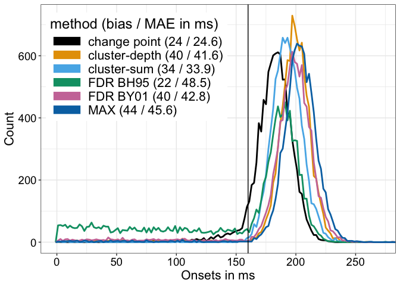

Graphical abstract
================
Guillaume A. Rousselet
2024-09-12

# Dependencies

``` r
library(ggplot2)
library(tibble)
source("./code/functions.R")
source("./code/theme_gar.txt")
source("./code/erp_template.R")
# Colour palette from http://www.cookbook-r.com/Graphs/Colors_(ggplot2)/
categ.palette <- c("#000000", "#E69F00", "#56B4E9", "#009E73", "#CC79A7", "#0072B2", "#D55E00", "#F0E442")
```

Analyses done in `onsetsim_eeg.Rmd`.

# Load data

``` r
load("./data/onsetsim_n50_eegnoise.RData")
```

# Compute summary statistics

## Bias

``` r
bias.bh95 <- median(simres.bh95, na.rm = TRUE) - true_onset
bias.by01 <- median(simres.by01, na.rm = TRUE) - true_onset
bias.max <- median(simres.max, na.rm = TRUE) - true_onset
bias.cs <- median(simres.cs, na.rm = TRUE) - true_onset
bias.cp <- median(simres.cp, na.rm = TRUE) - true_onset
bias.cd <- median(simres.cd, na.rm = TRUE) - true_onset

print("Bias:")
```

    ## [1] "Bias:"

``` r
print(paste("Change point =",bias.cp))
```

    ## [1] "Change point = 24"

``` r
print(paste("Cluster-depth =",bias.cd))
```

    ## [1] "Cluster-depth = 40"

``` r
print(paste("Cluster-sum =",bias.cs))
```

    ## [1] "Cluster-sum = 34"

``` r
print(paste("FDR BH95 =",bias.bh95))
```

    ## [1] "FDR BH95 = 22"

``` r
print(paste("FDR BY01 =",bias.by01))
```

    ## [1] "FDR BY01 = 40"

``` r
print(paste("MAX =",bias.max))
```

    ## [1] "MAX = 44"

## Mean absolute error

``` r
mae.bh95 <- round(mean(abs(simres.bh95 - true_onset), na.rm = TRUE), digits=1)
mae.by01 <- round(mean(abs(simres.by01 - true_onset), na.rm = TRUE), digits=1)
mae.max <- round(mean(abs(simres.max - true_onset), na.rm = TRUE), digits=1)
mae.cs <- round(mean(abs(simres.cs - true_onset), na.rm = TRUE), digits=1)
mae.cp <- round(mean(abs(simres.cp - true_onset), na.rm = TRUE), digits=1)
mae.cd <- round(mean(abs(simres.cd - true_onset), na.rm = TRUE), digits=1)

print("MAE:")
```

    ## [1] "MAE:"

``` r
print(paste("Change point =",mae.cp))
```

    ## [1] "Change point = 24.6"

``` r
print(paste("Cluster-depth =",mae.cd))
```

    ## [1] "Cluster-depth = 41.6"

``` r
print(paste("Cluster-sum =",mae.cs))
```

    ## [1] "Cluster-sum = 33.9"

``` r
print(paste("FDR BH95 =",mae.bh95))
```

    ## [1] "FDR BH95 = 48.5"

``` r
print(paste("FDR BY01 =",mae.by01))
```

    ## [1] "FDR BY01 = 42.8"

``` r
print(paste("MAX =",mae.max))
```

    ## [1] "MAX = 45.6"

# Make figure

``` r
Xf <- seq(0, 500, 2)
true_onset <- 160

df <- tibble(onsets = c(simres.cp, simres.cd, simres.cs, simres.bh95, simres.by01, simres.max),
             method = factor(c(rep("change point", length(simres.cp)),
                               rep("cluster-depth", length(simres.cd)),
                               rep("cluster-sum", length(simres.cs)),
                               rep("FDR BH95", length(simres.bh95)),
                               rep("FDR BY01", length(simres.by01)),
                               rep("MAX", length(simres.max))))
)

# df$method <- keeporder(df$method) 

ggplot(data = df, aes(x = onsets, colour = method)) + theme_gar +
  # stat_density(geom = "line") +
  geom_freqpoly(fill = "white", na.rm = TRUE, breaks = Xf, linewidth = 1) +
  geom_vline(xintercept = true_onset, linetype = "solid") +
  # geom_vline(xintercept = median(simres.cp, na.rm = TRUE))
  scale_colour_manual(values = categ.palette,
                      name = "method (bias / MAE in ms)",
                      labels = c(paste0("change point (",bias.cp," / ",mae.cp,")"),
                                 paste0("cluster-depth (",bias.cd," / ",mae.cd,")"),
                                 paste0("cluster-sum (",bias.cs," / ",mae.cs,")"),
                                 paste0("FDR BH95 (",bias.bh95," / ",mae.bh95,")"),
                                 paste0("FDR BY01 (",bias.by01," / ",mae.by01,")"),
                                 paste0("MAX (",bias.max," / ",mae.max,")"))) +
  theme(legend.position = c(.27, .75)) +
  labs(x = "Onsets in ms", y = "Count") +
  coord_cartesian(xlim = c(0, 270)) +
  scale_x_continuous(breaks = seq(0,300,50)) +
  guides(colour = guide_legend(override.aes = list(linewidth = 5)))
```

<!-- -->

``` r
  # scale_colour_discrete(name = "method (bias / MAE in ms)")

ggsave(filename = "./figures/graphical_abstract.pdf", width = 7, height = 5)
```
