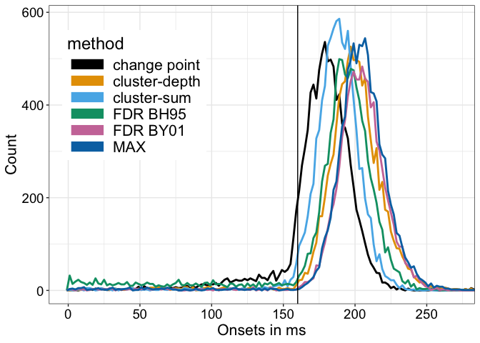
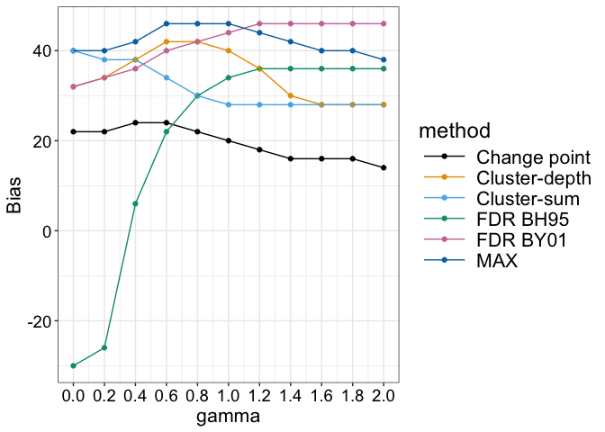
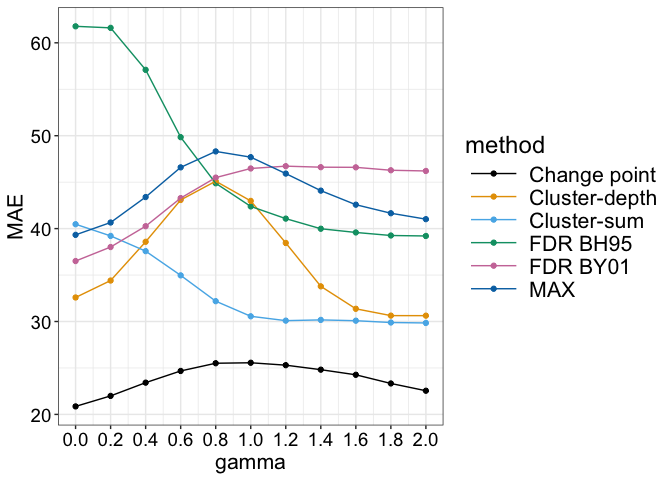
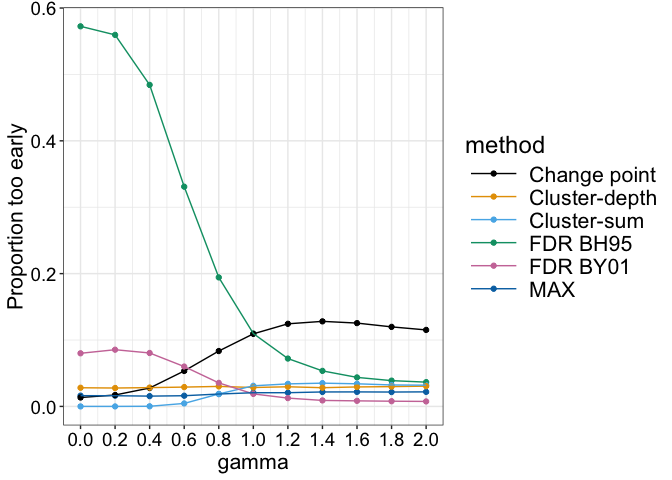
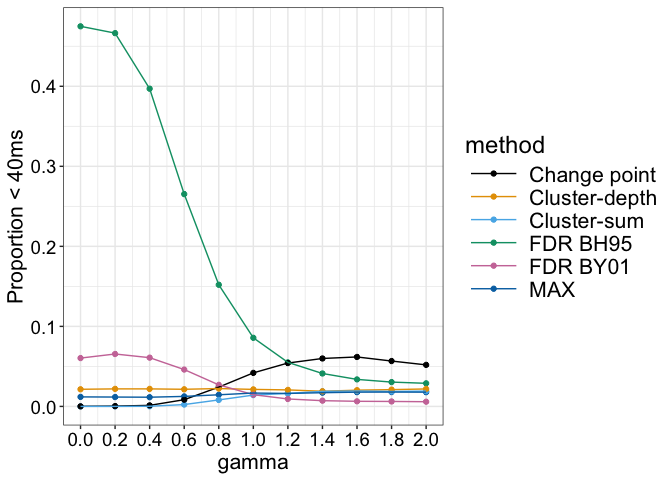
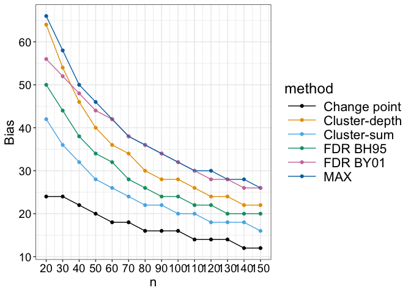
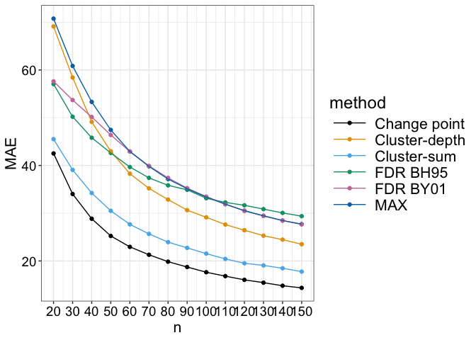
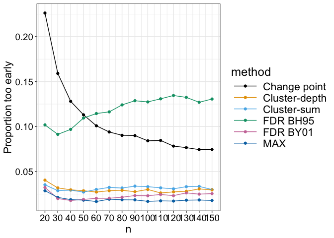
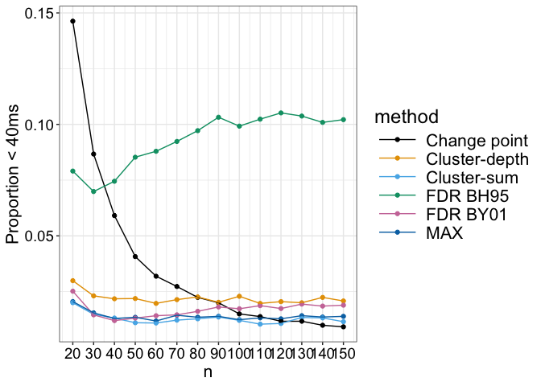

Estimating onsets using cluster statistics: simulation
================
Guillaume A. Rousselet
2024-09-12

The cluster-depth statistics results were computed in
`onsetsim_1overf_cd.Rmd`. FDR `BY` and Bonferroni corrections were
computed in `onsetsim_1overf_fdr.Rmd`.

# Dependencies

``` r
library(ggplot2)
library(tibble)
library(changepoint)
# library(cowplot)
library(beepr)
library(Rfast)
source("./code/functions.R")
source("./code/theme_gar.txt")
# Edit `one_over_f` function from `primer` package to control variance (Stevens, 2009). 
# Original function is available on [GitHub](https://github.com/HankStevens/primer).
# Copyright Hank Stevens.
source("./code/one_over_f.R")
# Load template: true onset = 160 ms, F=81, max at F=126
source("./code/erp_template.R")
# Colour palette from http://www.cookbook-r.com/Graphs/Colors_(ggplot2)/
categ.palette <- c("#000000", "#E69F00", "#56B4E9", "#009E73", "#CC79A7", "#0072B2", "#D55E00", "#F0E442")
```

# Simulation: one gamma value

``` r
set.seed(666)
aath <- 0.05 # arbitrary alpha threshold
nsim <- 10000 # simulation iterations
nboot <- 2000 # number of permutation samples
inc.step <- 500 # console notification every inc.step iterations
simres.cp <- vector(mode = "numeric", length = nsim) * NA
simres.fdr <- vector(mode = "numeric", length = nsim) * NA
simres.max <- vector(mode = "numeric", length = nsim) * NA 
simres.cs <- vector(mode = "numeric", length = nsim) * NA

Nt <- 50 # number of trials
gsp <- 1 # gamma spectral power
outvar <- 1 # noise variance
cond1 <- matrix(0, nrow = Nt, ncol = Nf)
cond2 <- matrix(0, nrow = Nt, ncol = Nf)

for(S in 1:nsim){
  
  sim.counter(S, nsim, inc = inc.step)
  
  for(T in 1:Nt){
    cond2[T,] <- temp2 + one_over_f(gamma = gsp, Nf, outvar = outvar)
    cond1[T,] <- temp1 + one_over_f(gamma = gsp, Nf, outvar = outvar)  
  }
  
  # t-tests
  ori.t2 <- vector(mode = "numeric", length = Nf)
  for(F in 1:Nf){
    ori.t2[F] <- t.test(cond1[,F], cond2[,F])$statistic^2
  }
  # fit change point model
  res <- cpt.meanvar(ori.t2, method = "BinSeg", Q=2)
  simres.cp[S] <- Xf[res@cpts[1]]
  
  # Make permutation table of t values 
  perm.t2 <- permtdist(cond1, cond2, Nt, Nf, nboot = nboot)^2
  perm.th <- apply(perm.t2, 2, quantile, probs = 1-aath)
  
  # FDR -----
  perm.pvals <- vector(mode = "numeric", length = Nf)
  for(F in 1:Nf){
    perm.pvals[F] <- (sum(perm.t2[,F] >= ori.t2[F]) + 1) / (nboot + 1)
  }
  fdr.pvals <- p.adjust(perm.pvals, method = "fdr")
  simres.fdr[S] <- find_onset(fdr.pvals <= aath, Xf)
  
  # MAX -----
  max.th <- quantile(apply(perm.t2, 1, max), probs = 1-aath)
  simres.max[S] <- find_onset(ori.t2 >= max.th, Xf)
  
  # cluster-sum statistics -----
  cmap <- cluster.make(perm.pvals <= aath)
  perm.max.sums <- vector(mode = "numeric", length = nboot)
  for(B in 1:nboot){
    # threshold permutation t2 values and form clusters
    perm.cmap <- cluster.make(perm.t2[B,] <= perm.th)  
    perm.max.sums[B] <- max(cluster.sum(values = perm.t2[B,], cmap = perm.cmap))
  }
  # cluster sum threshold
  cs.th <- quantile(perm.max.sums, probs = 1-aath)
  # cluster test
  cs.test <- cluster.test(values = ori.t2, cmap = cmap, cs.th)
  simres.cs[S] <- find_onset(cs.test, Xf)
}

save(simres.cs, simres.max, simres.fdr, simres.cp,
     file = "./data/onsetsim_n50_gamma1.RData")
```

## Plot onset distributions

``` r
load("./data/onsetsim_n50_gamma1.RData")
load("./data/onsetsim_n50_gamma1_cd.RData")
load("./data/onsetsim_n50_gamma1_fdr.RData")

df <- tibble(onsets = c(simres.cp, simres.cs, simres.bh95, simres.max, simres.cd, simres.by01),
             method = factor(c(rep("change point", length(simres.cp)),
                               rep("cluster-sum", length(simres.cs)),
                               rep("FDR BH95", length(simres.bh95)),
                               rep("MAX", length(simres.max)),
                               rep("cluster-depth", length(simres.cd)),
                               rep("FDR BY01", length(simres.by01))))
)

# df$method <- keeporder(df$method) 

ggplot(data = df, aes(x = onsets, colour = method)) + theme_gar +
  # stat_density(geom = "line") +
  geom_freqpoly(na.rm = TRUE, breaks = Xf, linewidth = 1) +
  geom_vline(xintercept = true_onset, linetype = "solid") +
  # geom_vline(xintercept = median(simres.cp, na.rm = TRUE))
  scale_colour_manual(values = categ.palette) +
  theme(legend.position = c(.2, .7)) +
  labs(x = "Onsets in ms", y = "Count") +
  coord_cartesian(xlim = c(0, 270)) +
  scale_x_continuous(breaks = seq(0, 300, 50)) + 
  guides(colour = guide_legend(override.aes = list(linewidth = 5)))
```

<!-- -->

## Mode

``` r
print("Mode:")
```

    ## [1] "Mode:"

``` r
print(paste("Cluster-depth =",find_mode(simres.cd)))
```

    ## [1] "Cluster-depth = 198"

``` r
print(paste("Change point =",find_mode(simres.cp)))
```

    ## [1] "Change point = 180"

``` r
print(paste("Cluster-sum =",find_mode(simres.cs)))
```

    ## [1] "Cluster-sum = 190"

``` r
print(paste("FDR BH95 =",find_mode(simres.bh95)))
```

    ## [1] "FDR BH95 = 190"

``` r
print(paste("FDR BY01 =",find_mode(simres.by01)))
```

    ## [1] "FDR BY01 = 206"

``` r
print(paste("MAX =",find_mode(simres.max)))
```

    ## [1] "MAX = 208"

## Bias

``` r
print("Bias:")
```

    ## [1] "Bias:"

``` r
print(paste("Change point =",median(simres.cp, na.rm = TRUE) - true_onset))
```

    ## [1] "Change point = 20"

``` r
print(paste("Cluster-depth =",median(simres.cd, na.rm = TRUE) - true_onset))
```

    ## [1] "Cluster-depth = 40"

``` r
print(paste("Cluster-sum =",median(simres.cs, na.rm = TRUE) - true_onset))
```

    ## [1] "Cluster-sum = 28"

``` r
print(paste("FDR BH95 =",median(simres.bh95, na.rm = TRUE) - true_onset))
```

    ## [1] "FDR BH95 = 34"

``` r
print(paste("FDR BY01 =",median(simres.by01, na.rm = TRUE) - true_onset))
```

    ## [1] "FDR BY01 = 44"

``` r
print(paste("MAX =",median(simres.max, na.rm = TRUE) - true_onset))
```

    ## [1] "MAX = 46"

## Mean absolute error

``` r
print("MAE:")
```

    ## [1] "MAE:"

``` r
print(paste("Change point =",round(mean(abs(simres.cp - true_onset), na.rm = TRUE), digits=1)))
```

    ## [1] "Change point = 25.6"

``` r
print(paste("Cluster-depth =",round(mean(abs(simres.cd - true_onset), na.rm = TRUE), digits=1)))
```

    ## [1] "Cluster-depth = 43"

``` r
print(paste("Cluster-sum =",round(mean(abs(simres.cs - true_onset), na.rm = TRUE), digits=1)))
```

    ## [1] "Cluster-sum = 30.6"

``` r
print(paste("FDR BH95 =",round(mean(abs(simres.bh95 - true_onset), na.rm = TRUE), digits=1)))
```

    ## [1] "FDR BH95 = 42.4"

``` r
print(paste("FDR BY01 =",round(mean(abs(simres.by01 - true_onset), na.rm = TRUE), digits=1)))
```

    ## [1] "FDR BY01 = 46.5"

``` r
print(paste("MAX =",round(mean(abs(simres.max - true_onset), na.rm = TRUE), digits=1)))
```

    ## [1] "MAX = 47.7"

## Variance

``` r
print("Variance:")
```

    ## [1] "Variance:"

``` r
print(paste("Change point =",round(var(simres.cp, na.rm = TRUE), digits=0)))
```

    ## [1] "Change point = 734"

``` r
print(paste("Cluster-depth =",round(var(simres.cd, na.rm = TRUE), digits=0)))
```

    ## [1] "Cluster-depth = 738"

``` r
print(paste("Cluster-sum =",round(var(simres.cs, na.rm = TRUE), digits=0)))
```

    ## [1] "Cluster-sum = 481"

``` r
print(paste("FDR BH95 =",round(var(simres.bh95, na.rm = TRUE), digits=0)))
```

    ## [1] "FDR BH95 = 1968"

``` r
print(paste("FDR BY01 =",round(var(simres.by01, na.rm = TRUE), digits=0)))
```

    ## [1] "FDR BY01 = 594"

``` r
print(paste("MAX =",round(var(simres.max, na.rm = TRUE), digits=0)))
```

    ## [1] "MAX = 714"

## Proportion too early

``` r
print("Proportion too early:")
```

    ## [1] "Proportion too early:"

``` r
print(paste("Change point =",round(100*mean((simres.cp - true_onset) < 0, na.rm = TRUE), digits=1),"%"))
```

    ## [1] "Change point = 10.9 %"

``` r
print(paste("Cluster-depth =",round(100*mean((simres.cd - true_onset) < 0, na.rm = TRUE), digits=1),"%"))
```

    ## [1] "Cluster-depth = 2.8 %"

``` r
print(paste("Cluster-sum =",round(100*mean((simres.cs - true_onset) < 0, na.rm = TRUE), digits=1),"%"))
```

    ## [1] "Cluster-sum = 3.1 %"

``` r
print(paste("FDR BH95 =",round(100*mean((simres.bh95 - true_onset) < 0, na.rm = TRUE), digits=1),"%"))
```

    ## [1] "FDR BH95 = 11 %"

``` r
print(paste("FDR BY01 =",round(100*mean((simres.by01 - true_onset) < 0, na.rm = TRUE), digits=1),"%"))
```

    ## [1] "FDR BY01 = 1.9 %"

``` r
print(paste("MAX =",round(100*mean((simres.max - true_onset) < 0, na.rm = TRUE), digits=1),"%"))
```

    ## [1] "MAX = 2.1 %"

## Underestimations of at least 40 ms

``` r
print("Underestimations of at least 40 ms:")
```

    ## [1] "Underestimations of at least 40 ms:"

``` r
print(paste("Change point =",round(100*mean((simres.cp - true_onset) <= -40, na.rm = TRUE), digits=1),"%"))
```

    ## [1] "Change point = 4.2 %"

``` r
print(paste("Cluster-depth =",round(100*mean((simres.cd - true_onset) <= -40, na.rm = TRUE), digits=1),"%"))
```

    ## [1] "Cluster-depth = 2.1 %"

``` r
print(paste("Cluster-sum =",round(100*mean((simres.cs - true_onset) <= -40, na.rm = TRUE), digits=1),"%"))
```

    ## [1] "Cluster-sum = 1.4 %"

``` r
print(paste("FDR BH95 =",round(100*mean((simres.bh95 - true_onset) <= -40, na.rm = TRUE), digits=1),"%"))
```

    ## [1] "FDR BH95 = 8.6 %"

``` r
print(paste("FDR BY01 =",round(100*mean((simres.by01 - true_onset) <= -40, na.rm = TRUE), digits=1),"%"))
```

    ## [1] "FDR BY01 = 1.5 %"

``` r
print(paste("MAX =",round(100*mean((simres.max - true_onset) <= -40, na.rm = TRUE), digits=1),"%"))
```

    ## [1] "MAX = 1.7 %"

# Simulation: vary gamma

Here we vary gamma from zero to two in steps of 0.2

``` r
aath <- 0.05 # arbitrary alpha threshold
nsim <- 10000 # simulation iterations
nboot <- 2000 # number of permutation samples
inc.step <- 1 # console notification every inc.step iterations
gamma_vec <- seq(0,2,0.2) # gamma from 0 = white noise to 1 = pink noise
gamma_length <- length(gamma_vec)

simres.cp <- matrix(NA, nrow = gamma_length, ncol = nsim)
simres.fdr <- matrix(NA, nrow = gamma_length, ncol = nsim)
simres.max <- matrix(NA, nrow = gamma_length, ncol = nsim)
simres.cs <- matrix(NA, nrow = gamma_length, ncol = nsim)

Nt <- 50 # number of trials
outvar <- 1 # noise variance
cond1 <- matrix(0, nrow = Nt, ncol = Nf)
cond2 <- matrix(0, nrow = Nt, ncol = Nf)

for(G in 1:gamma_length){
  
  set.seed(666) # set seed here so results are directly comparable across gamma values    
  gsp <- gamma_vec[G] # gamma spectral power
  sim.counter(G, gamma_length, inc = inc.step)
  
  for(S in 1:nsim){
    
    for(T in 1:Nt){
      cond2[T,] <- temp2 + one_over_f(gamma = gsp, Nf, outvar = outvar)
      cond1[T,] <- temp1 + one_over_f(gamma = gsp, Nf, outvar = outvar)  
    }
    
    # t-tests
    ori.t2 <- vector(mode = "numeric", length = Nf)
    for(F in 1:Nf){
      ori.t2[F] <- t.test(cond1[,F], cond2[,F])$statistic^2
    }
    # fit change point model
    res <- cpt.meanvar(ori.t2, method = "BinSeg", Q=2)
    simres.cp[G,S] <- Xf[res@cpts[1]]
    
    # Make permutation table of t values 
    perm.t2 <- permtdist(cond1, cond2, Nt, Nf, nboot = nboot)^2
    perm.th <- apply(perm.t2, 2, quantile, probs = 1-aath)
    
    # FDR -----
    perm.pvals <- vector(mode = "numeric", length = Nf)
    for(F in 1:Nf){
      perm.pvals[F] <- (sum(perm.t2[,F] >= ori.t2[F]) + 1) / (nboot + 1)
    }
    fdr.pvals <- p.adjust(perm.pvals, method = "fdr")
    simres.fdr[G,S] <- find_onset(fdr.pvals <= aath, Xf)
    
    # MAX -----
    max.th <- quantile(apply(perm.t2, 1, max), probs = 1-aath)
    simres.max[G,S] <- find_onset(ori.t2 >= max.th, Xf)
    
    # cluster-sum statistics -----
    cmap <- cluster.make(perm.pvals <= aath)
    perm.max.sums <- vector(mode = "numeric", length = nboot)
    for(B in 1:nboot){
      # threshold permutation t2 values and form clusters
      perm.cmap <- cluster.make(perm.t2[B,] <= perm.th)  
      perm.max.sums[B] <- max(cluster.sum(values = perm.t2[B,], cmap = perm.cmap))
    }
    # cluster sum threshold
    cs.th <- quantile(perm.max.sums, probs = 1-aath)
    # cluster test
    cs.test <- cluster.test(values = ori.t2, cmap = cmap, cs.th)
    simres.cs[G,S] <- find_onset(cs.test, Xf)
  }
}

save(simres.cs, simres.max, simres.fdr, simres.cp,
     file = "./data/onsetsim_t2_n50_var1_gammavar.RData")
```

## Results

Plot results as a function of gamma values.

### Compute summary statistics

``` r
load(file = "./data/onsetsim_t2_n50_var1_gammavar.RData")
load(file = "./data/onsetsim_t2_n50_var1_gammavar_cd.RData")
load(file = "./data/onsetsim_t2_n50_var1_gammavar_fdr.RData")

gamma_vec <- seq(0,2,0.2) # gamma from 0 = white noise to 1 = pink noise
gamma_length <- length(gamma_vec)

res.bias <- matrix(0, nrow = 6, ncol = gamma_length) 
res.mae <- matrix(0, nrow = 6, ncol = gamma_length)
res.var <- matrix(0, nrow = 6, ncol = gamma_length)
res.pte <- matrix(0, nrow = 6, ncol = gamma_length)
res.p40 <- matrix(0, nrow = 6, ncol = gamma_length)

for(G in 1:gamma_length){
   #Bias
  res.bias[1,G] <- median(simres.bh95[G,], na.rm = TRUE) - true_onset
  res.bias[2,G] <- median(simres.max[G,], na.rm = TRUE) - true_onset
  res.bias[3,G] <- median(simres.cs[G,], na.rm = TRUE) - true_onset
  res.bias[4,G] <- median(simres.cp[G,], na.rm = TRUE) - true_onset
  res.bias[5,G] <- median(simres.cd[G,], na.rm = TRUE) - true_onset
  res.bias[6,G] <- median(simres.by01[G,], na.rm = TRUE) - true_onset
  
  #Mean absolute error 
  res.mae[1,G] <- mean(abs(simres.bh95[G,] - true_onset), na.rm = TRUE)
  res.mae[2,G] <- mean(abs(simres.max[G,] - true_onset), na.rm = TRUE)
  res.mae[3,G] <- mean(abs(simres.cs[G,] - true_onset), na.rm = TRUE)
  res.mae[4,G] <- mean(abs(simres.cp[G,] - true_onset), na.rm = TRUE)
  res.mae[5,G] <- mean(abs(simres.cd[G,] - true_onset), na.rm = TRUE)
  res.mae[6,G] <- mean(abs(simres.by01[G,] - true_onset), na.rm = TRUE)
    
  #Variance
  res.var[1,G] <- var(simres.bh95[G,], na.rm = TRUE)
  res.var[2,G] <- var(simres.max[G,], na.rm = TRUE)
  res.var[3,G] <- var(simres.cs[G,], na.rm = TRUE)
  res.var[4,G] <- var(simres.cp[G,], na.rm = TRUE)
  res.var[5,G] <- var(simres.cd[G,], na.rm = TRUE)
  res.var[6,G] <- var(simres.by01[G,], na.rm = TRUE)
  
  #Proportion too early
  res.pte[1,G] <- mean((simres.bh95[G,] - true_onset) < 0, na.rm = TRUE)
  res.pte[2,G] <- mean((simres.max[G,] - true_onset) < 0, na.rm = TRUE)
  res.pte[3,G] <- mean((simres.cs[G,] - true_onset) < 0, na.rm = TRUE)
  res.pte[4,G] <- mean((simres.cp[G,] - true_onset) < 0, na.rm = TRUE)
  res.pte[5,G] <- mean((simres.cd[G,] - true_onset) < 0, na.rm = TRUE)
  res.pte[6,G] <- mean((simres.by01[G,] - true_onset) < 0, na.rm = TRUE)
  
  #Underestimations of at least 40 ms
  res.p40[1,G] <- mean((simres.bh95[G,] - true_onset) <= -40, na.rm = TRUE)
  res.p40[2,G] <- mean((simres.max[G,] - true_onset) <= -40, na.rm = TRUE)
  res.p40[3,G] <- mean((simres.cs[G,] - true_onset) <= -40, na.rm = TRUE)
  res.p40[4,G] <- mean((simres.cp[G,] - true_onset) <= -40, na.rm = TRUE)
  res.p40[5,G] <- mean((simres.cd[G,] - true_onset) <= -40, na.rm = TRUE)
  res.p40[6,G] <- mean((simres.by01[G,] - true_onset) <= -40, na.rm = TRUE)
}
```

### Make figures

#### Bias

Cluster sum = FDR = 30 ms.

``` r
df <- tibble(res = as.vector(res.bias),
             gamma = rep(gamma_vec, each = 6),
             method = rep(c("FDR BH95", "MAX", "Cluster-sum", "Change point", "Cluster-depth", "FDR BY01"), gamma_length)
)

ggplot(df, aes(x = gamma, y = res, group = method, colour = method)) + theme_gar +
  geom_point() +
  geom_line() +
  scale_colour_manual(values = categ.palette) +
  ylab("Bias") +
  scale_x_continuous(breaks = gamma_vec)
```

<!-- -->

#### MAE

``` r
df <- tibble(res = as.vector(res.mae),
             gamma = rep(gamma_vec, each = 6),
             method = rep(c("FDR BH95", "MAX", "Cluster-sum", "Change point", "Cluster-depth", "FDR BY01"), gamma_length)
)

ggplot(df, aes(x = gamma, y = res, group = method, colour = method)) + theme_gar +
  geom_point() +
  geom_line() +
  scale_colour_manual(values = categ.palette) +
  ylab("MAE") +
  scale_x_continuous(breaks = gamma_vec)
```

<!-- -->

#### Proportion too early

``` r
df <- tibble(res = as.vector(res.pte),
             gamma = rep(gamma_vec, each = 6),
             method = rep(c("FDR BH95", "MAX", "Cluster-sum", "Change point", "Cluster-depth", "FDR BY01"), gamma_length)
)

ggplot(df, aes(x = gamma, y = res, group = method, colour = method)) + theme_gar +
  geom_point() +
  geom_line() +
  scale_colour_manual(values = categ.palette) +
  ylab("Proportion too early") +
  scale_x_continuous(breaks = gamma_vec)
```

<!-- -->

#### Proportion \< 40 ms

``` r
df <- tibble(res = as.vector(res.p40),
             gamma = rep(gamma_vec, each = 6),
             method = rep(c("FDR BH95", "MAX", "Cluster-sum", "Change point", "Cluster-depth", "FDR BY01"), gamma_length)
)

ggplot(df, aes(x = gamma, y = res, group = method, colour = method)) + theme_gar +
  geom_point() +
  geom_line() +
  scale_colour_manual(values = categ.palette) +
  ylab("Proportion < 40ms") +
  scale_x_continuous(breaks = gamma_vec)
```

<!-- -->

# Simulation: vary n

Here we vary gamma from zero to two in steps of 0.2

``` r
set.seed(666) 
aath <- 0.05 # arbitrary alpha threshold
nsim <- 10000 # simulation iterations
nboot <- 2000 # number of permutation samples
inc.step <- 500 # console notification every inc.step iterations
n_vec <- seq(20,150,10) 
n_length <- length(n_vec)
n_max <- max(n_vec)
gsp <- 1 # gamma spectral power -- 0 = white noise, 1 = pink noise

simres.cp <- matrix(NA, nrow = n_length, ncol = nsim)
simres.fdr <- matrix(NA, nrow = n_length, ncol = nsim)
simres.max <- matrix(NA, nrow = n_length, ncol = nsim)
simres.cs <- matrix(NA, nrow = n_length, ncol = nsim)

Nt <- 50 # number of trials
outvar <- 1 # noise variance
cond1_all <- matrix(0, nrow = n_max, ncol = Nf)
cond2_all <- matrix(0, nrow = n_max, ncol = Nf)

for(S in 1:nsim){
  
  sim.counter(S, nsim, inc = inc.step)
  
  # Generate all trials
  for(T in 1:n_max){
    cond2_all[T,] <- temp2 + one_over_f(gamma = gsp, Nf, outvar = outvar)
    cond1_all[T,] <- temp1 + one_over_f(gamma = gsp, Nf, outvar = outvar)
  }
  
  for(N in 1:n_length){
    
    Nt <- n_vec[N]
    
    # downsample to current size
    cond2 <- cond2_all[1:Nt,]
    cond1 <- cond1_all[1:Nt,]
 
    # t-tests
    ori.t2 <- vector(mode = "numeric", length = Nf)
    for(F in 1:Nf){
      ori.t2[F] <- t.test(cond1[,F], cond2[,F])$statistic^2
    }
    # fit change point model
    res <- cpt.meanvar(ori.t2, method = "BinSeg", Q=2)
    simres.cp[N,S] <- Xf[res@cpts[1]]
    
    # Make permutation table of t values 
    perm.t2 <- permtdist(cond1, cond2, Nt, Nf, nboot = nboot)^2
    perm.th <- apply(perm.t2, 2, quantile, probs = 1-aath)
    
    # FDR -----
    perm.pvals <- vector(mode = "numeric", length = Nf)
    for(F in 1:Nf){
      perm.pvals[F] <- (sum(perm.t2[,F] >= ori.t2[F]) + 1) / (nboot + 1)
    }
    fdr.pvals <- p.adjust(perm.pvals, method = "fdr")
    simres.fdr[N,S] <- find_onset(fdr.pvals <= aath, Xf)
    
    # MAX -----
    max.th <- quantile(apply(perm.t2, 1, max), probs = 1-aath)
    simres.max[N,S] <- find_onset(ori.t2 >= max.th, Xf)
    
    # cluster-sum statistics -----
    cmap <- cluster.make(perm.pvals <= aath)
    perm.max.sums <- vector(mode = "numeric", length = nboot)
    for(B in 1:nboot){
      # threshold permutation t2 values and form clusters
      perm.cmap <- cluster.make(perm.t2[B,] <= perm.th)  
      perm.max.sums[B] <- max(cluster.sum(values = perm.t2[B,], cmap = perm.cmap))
    }
    # cluster sum threshold
    cs.th <- quantile(perm.max.sums, probs = 1-aath)
    # cluster test
    cs.test <- cluster.test(values = ori.t2, cmap = cmap, cs.th)
    simres.cs[N,S] <- find_onset(cs.test, Xf)
  }
}

save(simres.cs, simres.max, simres.fdr, simres.cp, n_vec, n_length,
     file = "./data/onsetsim_t2_varyn_var1_gamma1.RData")
```

## Results

Plot results as a function of gamma values.

### Compute summary statistics

``` r
load(file = "./data/onsetsim_t2_varyn_var1_gamma1.RData")
load(file = "./data/onsetsim_t2_varyn_var1_gamma1_cd.RData")
load(file = "./data/onsetsim_t2_varyn_var1_gamma1_fdr.RData")

res.bias <- matrix(0, nrow = 6, ncol = n_length) 
res.mae <- matrix(0, nrow = 6, ncol = n_length)
res.var <- matrix(0, nrow = 6, ncol = n_length)
res.pte <- matrix(0, nrow = 6, ncol = n_length)
res.p40 <- matrix(0, nrow = 6, ncol = n_length)

for(N in 1:n_length){
  #Bias
  res.bias[1,N] <- median(simres.bh95[N,], na.rm = TRUE) - true_onset
  res.bias[2,N] <- median(simres.max[N,], na.rm = TRUE) - true_onset
  res.bias[3,N] <- median(simres.cs[N,], na.rm = TRUE) - true_onset
  res.bias[4,N] <- median(simres.cp[N,], na.rm = TRUE) - true_onset
  res.bias[5,N] <- median(simres.cd[N,], na.rm = TRUE) - true_onset
  res.bias[6,N] <- median(simres.by01[N,], na.rm = TRUE) - true_onset
  
  #Mean absolute error 
  res.mae[1,N] <- mean(abs(simres.bh95[N,] - true_onset), na.rm = TRUE)
  res.mae[2,N] <- mean(abs(simres.max[N,] - true_onset), na.rm = TRUE)
  res.mae[3,N] <- mean(abs(simres.cs[N,] - true_onset), na.rm = TRUE)
  res.mae[4,N] <- mean(abs(simres.cp[N,] - true_onset), na.rm = TRUE)
  res.mae[5,N] <- mean(abs(simres.cd[N,] - true_onset), na.rm = TRUE)
  res.mae[6,N] <- mean(abs(simres.by01[N,] - true_onset), na.rm = TRUE)
    
  #Variance
  res.var[1,N] <- var(simres.bh95[N,], na.rm = TRUE)
  res.var[2,N] <- var(simres.max[N,], na.rm = TRUE)
  res.var[3,N] <- var(simres.cs[N,], na.rm = TRUE)
  res.var[4,N] <- var(simres.cp[N,], na.rm = TRUE)
  res.var[5,N] <- var(simres.cd[N,], na.rm = TRUE)
  res.var[6,N] <- var(simres.by01[N,], na.rm = TRUE)
  
  #Proportion too early
  res.pte[1,N] <- mean((simres.bh95[N,] - true_onset) < 0, na.rm = TRUE)
  res.pte[2,N] <- mean((simres.max[N,] - true_onset) < 0, na.rm = TRUE)
  res.pte[3,N] <- mean((simres.cs[N,] - true_onset) < 0, na.rm = TRUE)
  res.pte[4,N] <- mean((simres.cp[N,] - true_onset) < 0, na.rm = TRUE)
  res.pte[5,N] <- mean((simres.cd[N,] - true_onset) < 0, na.rm = TRUE)
  res.pte[6,N] <- mean((simres.by01[N,] - true_onset) < 0, na.rm = TRUE)
  
  #Underestimations of at least 40 ms
  res.p40[1,N] <- mean((simres.bh95[N,] - true_onset) <= -40, na.rm = TRUE)
  res.p40[2,N] <- mean((simres.max[N,] - true_onset) <= -40, na.rm = TRUE)
  res.p40[3,N] <- mean((simres.cs[N,] - true_onset) <= -40, na.rm = TRUE)
  res.p40[4,N] <- mean((simres.cp[N,] - true_onset) <= -40, na.rm = TRUE)
  res.p40[5,N] <- mean((simres.cd[N,] - true_onset) <= -40, na.rm = TRUE)
  res.p40[6,N] <- mean((simres.by01[N,] - true_onset) <= -40, na.rm = TRUE)
}
```

### Make figures

#### Bias

``` r
df <- tibble(res = as.vector(res.bias),
             n = rep(n_vec, each = 6),
             method = rep(c("FDR BH95", "MAX", "Cluster-sum", "Change point", "Cluster-depth", "FDR BY01"), n_length)
)

ggplot(df, aes(x = n, y = res, group = method, colour = method)) + theme_gar +
  geom_point() +
  geom_line() +
  scale_colour_manual(values = categ.palette) +
  ylab("Bias") +
  scale_x_continuous(breaks = n_vec)
```

<!-- -->

#### MAE

``` r
df <- tibble(res = as.vector(res.mae),
             n = rep(n_vec, each = 6),
             method = rep(c("FDR BH95", "MAX", "Cluster-sum", "Change point", "Cluster-depth", "FDR BY01"), n_length)
)

ggplot(df, aes(x = n, y = res, group = method, colour = method)) + theme_gar +
  geom_point() +
  geom_line() +
  scale_colour_manual(values = categ.palette) +
  ylab("MAE") +
  scale_x_continuous(breaks = n_vec)
```

<!-- -->

#### Proportion too early

``` r
df <- tibble(res = as.vector(res.pte),
             n = rep(n_vec, each = 6),
             method = rep(c("FDR BH95", "MAX", "Cluster-sum", "Change point", "Cluster-depth", "FDR BY01"), n_length)
)

ggplot(df, aes(x = n, y = res, group = method, colour = method)) + theme_gar +
  geom_point() +
  geom_line() +
  scale_colour_manual(values = categ.palette) +
  ylab("Proportion too early") +
  scale_x_continuous(breaks = n_vec)
```

<!-- -->

#### Proportion \< 40 ms

``` r
df <- tibble(res = as.vector(res.p40),
             n = rep(n_vec, each = 6),
             method = rep(c("FDR BH95", "MAX", "Cluster-sum", "Change point", "Cluster-depth", "FDR BY01"), n_length)
)

ggplot(df, aes(x = n, y = res, group = method, colour = method)) + theme_gar +
  geom_point() +
  geom_line() +
  scale_colour_manual(values = categ.palette) +
  ylab("Proportion < 40ms") +
  scale_x_continuous(breaks = n_vec)
```

<!-- -->

## References

Stevens, M.H.H. (2009) A Primer of Ecology with R, 2nd Printing.
Springer, New York.
