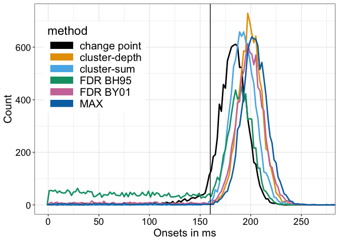
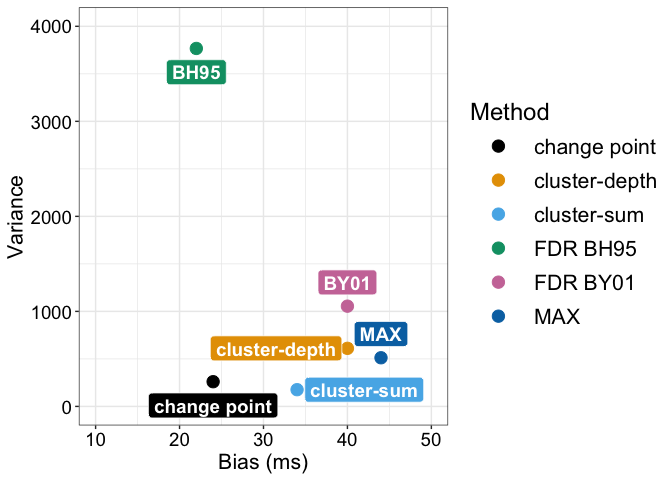
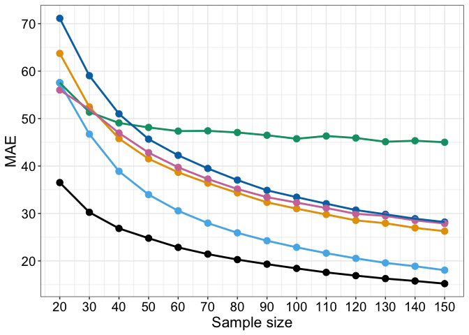
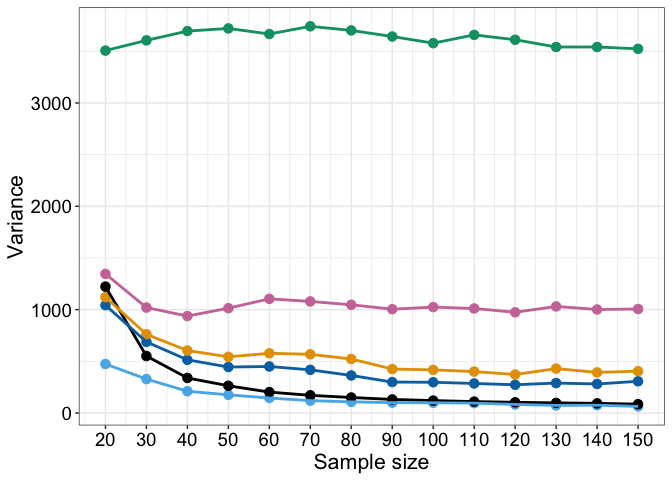
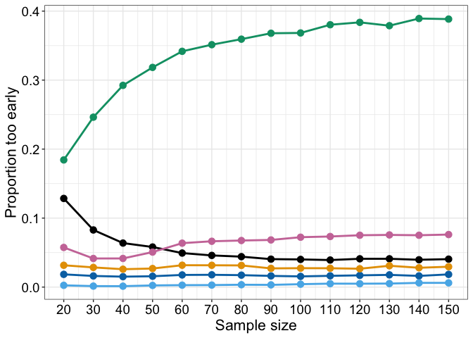
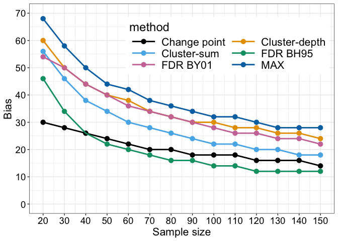

Estimating onsets using cluster statistics: simulation using EEG-like
noise
================
Guillaume A. Rousselet
2024-09-23

# Dependencies

``` r
library(ggplot2)
library(tibble)
library(changepoint)
# library(cowplot)
library(beepr)
library(Rfast)
source("./code/functions.R")
source("./code/theme_gar.txt")
# Load template: true onset = 160 ms, F=81, max at F=126
source("./code/erp_template.R")
# R version of Matlab code from Yeung et al. 2004
source("./code/eeg_noise.R")
# to use with eeg_noise function
meanpower <- unlist(read.table("./code/meanpower.txt"))
# Colour palette from http://www.cookbook-r.com/Graphs/Colors_(ggplot2)/
categ.palette <- c("#000000", "#E69F00", "#56B4E9", "#009E73", "#CC79A7", "#0072B2", "#D55E00", "#F0E442")
library(permuco) # to compute cluster depth statistics
```

Cluster-depth algorithm ([Frossard & Renaud,
2022](https://www.sciencedirect.com/science/article/pii/S1053811921010958))
from the [`permuco`
package](https://jaromilfrossard.github.io/permuco/).

Lesson in code sharing:  
I struggled to find the relevant `permuco` functions and to use them.
Even though Frossard & Renaud (2022) mention that the cluster-depth
algorithm is implemented in the `permuco` package, their article doesn’t
provide code. The package doesn’t mention the cluster-depth algorithm
either. On GitHub, in the R folder, I found lower level functions
written in Rcpp. They compiled ok but I could not understand the syntax.
Next, I looked for articles citing Frossard & Renaud (2023), and found a
study on head direction tracking ([Thom et
al. 2023](https://direct.mit.edu/jocn/article/35/5/856/114944)), with a
link to an [OSF repository](https://osf.io/24u9m/). There I discovered
that the `permuco::clusterlm` function has an option for the
cluster-depth correction, which is not mentioned in the help
documentation – the only way to find the option is to read the code. To
really understand how the function was working, I downloaded the data
and code from Thom et al. (2023), reproduced their results, and then
followed their example to adapt to my data. So this was a more difficult
process than it should have been. Openness is great, but we should not
forget transparency and user accessibility. I imagine a lot of my code
must be similarly opaque to some users. Got to do better.

Another aside:  
In their review of the literature on issues with cluster-sum,
Sassenhagen & Draschkow (2019) quoted Groppe et al. (2011):  
“if the p value for a cluster is 5%, one cannot be 95% certain that any
single member of that cluster is itself significant \[…\]. One is only
95% certain that there is some effect in the data.”  
This is a typical but unfortunately wrong interpretation of a *p* value.
For clear descriptions of what *p* values are and are not, see
[Greenland et al. (2016)](https://doi.org/10.1007/s10654-016-0149-3).

# Simulation: EEG noise

Using more realistic EEG noise (Yeung et al., 2004) than the 1/f noise
used in `onsetsim_1overf.Rmd`.

``` r
set.seed(666)
aath <- 0.05 # arbitrary alpha threshold
nsim <- 10000 # simulation iterations
nboot <- 2000 # number of permutation samples
inc.step <- 500 # console notification every inc.step iterations
srate <- 500 # sampling rate in Hz
simres.cp <- vector(mode = "numeric", length = nsim) * NA # change point
simres.bh95 <- vector(mode = "numeric", length = nsim) * NA # FDR BH95
simres.by01 <- vector(mode = "numeric", length = nsim) * NA # FDR BY01
simres.max <- vector(mode = "numeric", length = nsim) * NA # MAX
simres.cs <- vector(mode = "numeric", length = nsim) * NA # cluster sum
simres.cd <- vector(mode = "numeric", length = nsim) * NA # cluster depth

Nt <- 50 # number of trials
outvar <- 1 # noise variance of each trial
cond1 <- matrix(0, nrow = Nt, ncol = Nf)
cond2 <- matrix(0, nrow = Nt, ncol = Nf)

for(S in 1:nsim){
  
  sim.counter(S, nsim, inc = inc.step)
  
  for(T in 1:Nt){
    cond2[T,] <- temp2 + eeg_noise(frames = Nf, srate = srate, outvar = outvar, meanpower)
    cond1[T,] <- temp1 + eeg_noise(frames = Nf, srate = srate, outvar = outvar, meanpower) 
  }
  
  # t-tests
  ori.t2 <- vector(mode = "numeric", length = Nf)
  for(F in 1:Nf){
    ori.t2[F] <- t.test(cond1[,F], cond2[,F])$statistic^2
  }
  # fit change point model
  res <- cpt.meanvar(ori.t2, method = "BinSeg", Q=2)
  simres.cp[S] <- Xf[res@cpts[1]]
  
  # Make permutation table of t values 
  perm.t2 <- permtdist(cond1, cond2, Nt, Nf, nboot = nboot)^2
  perm.th <- apply(perm.t2, 2, quantile, probs = 1-aath)
  
  # FDR -----
  perm.pvals <- vector(mode = "numeric", length = Nf)
  for(F in 1:Nf){
    perm.pvals[F] <- (sum(perm.t2[,F] >= ori.t2[F]) + 1) / (nboot + 1)
  }
  fdr.pvals <- p.adjust(perm.pvals, method = "fdr")
  simres.bh95[S] <- find_onset(fdr.pvals <= aath, Xf)
  simres.by01[S] <- find_onset(p.adjust(perm.pvals, method = "BY") <= aath, Xf)
  
  # MAX -----
  max.th <- quantile(apply(perm.t2, 1, max), probs = 1-aath)
  simres.max[S] <- find_onset(ori.t2 >= max.th, Xf)
  
  # cluster-sum statistics -----
  cmap <- cluster.make(perm.pvals <= aath)
  perm.max.sums <- vector(mode = "numeric", length = nboot)
  perm.cmap <- matrix(0, nrow = nboot, ncol = Nf) # need to keep all cluster maps to compute cluster depth
  for(B in 1:nboot){
    # threshold permutation t2 values and form clusters
    perm.cmap[B,] <- cluster.make(perm.t2[B,] <= perm.th)  
    perm.max.sums[B] <- max(cluster.sum(values = perm.t2[B,], cmap = perm.cmap[B,]))
  }
  # cluster sum threshold
  cs.th <- quantile(perm.max.sums, probs = 1-aath)
  # cluster test
  cs.test <- cluster.test(values = ori.t2, cmap = cmap, cs.th)
  simres.cs[S] <- find_onset(cs.test, Xf)
  
  # cluster-depth statistics
  df <- as_tibble(rbind(cond1, cond2))
  df2 <- tibble(gp = rep(c("gp1", "gp2"), each = Nt),
                trial = c(1:Nt, 1:Nt))
  df <- cbind(df2, df)
  
  res <- permuco::clusterlm(formula = df[,3:ncol(df)] ~ gp, 
                            data = df[,-(3:ncol(df))],
                            multcomp = "clusterdepth_head",
                            test = "t",
                            np = nboot)
  
  cd.pval <- res$multiple_comparison$gpgp2$clusterdepth$main[,2]
  # cd.tval <- res$multiple_comparison$gpgp2$clusterdepth$main[,1]
  simres.cd[S] <- find_onset(cd.pval < aath, Xf)

}

save(simres.cs, simres.max, simres.bh95, simres.cp, simres.by01, simres.cd, 
     file = "./data/onsetsim_n50_eegnoise.RData")
```

## Plot onset distributions

``` r
load("./data/onsetsim_n50_eegnoise.RData")

df <- tibble(onsets = c(simres.cp, simres.cs, simres.bh95, simres.max, simres.cd, simres.by01),
             method = factor(c(rep("change point", length(simres.cp)),
                               rep("cluster-sum", length(simres.cs)),
                               rep("FDR BH95", length(simres.bh95)),
                               rep("MAX", length(simres.max)),
                               rep("cluster-depth", length(simres.cd)),
                               rep("FDR BY01", length(simres.by01))))
)

# df$method <- keeporder(df$method) 

ggplot(data = df, aes(x = onsets, colour = method)) + theme_gar +
  # stat_density(geom = "line") +
  geom_freqpoly(na.rm = TRUE, breaks = Xf, linewidth = 1) +
  geom_vline(xintercept = true_onset, linetype = "solid") +
  # geom_vline(xintercept = median(simres.cp, na.rm = TRUE))
  scale_colour_manual(values = categ.palette) +
  theme(legend.position = "inside", legend.position.inside = c(.2, .7)) +
  labs(x = "Onsets in ms", y = "Count") +
  coord_cartesian(xlim = c(0, 270)) +
  scale_x_continuous(breaks = seq(0, 300, 50)) + 
  guides(colour = guide_legend(override.aes = list(linewidth = 5)))
```

<!-- -->

``` r
ggsave(filename = "./figures/onsetsim_eeg_1.pdf", width = 10, height = 5)
```

Summary statistics reported in reported in Table 1.

## Mode

``` r
print("Mode:")
```

    ## [1] "Mode:"

``` r
print(paste("Cluster-depth =",find_mode(simres.cd)))
```

    ## [1] "Cluster-depth = 198"

``` r
print(paste("Change point =",find_mode(simres.cp)))
```

    ## [1] "Change point = 186"

``` r
print(paste("Cluster-sum =",find_mode(simres.cs)))
```

    ## [1] "Cluster-sum = 190" "Cluster-sum = 194"

``` r
print(paste("FDR BH95 =",find_mode(simres.bh95)))
```

    ## [1] "FDR BH95 = 192"

``` r
print(paste("FDR BY01 =",find_mode(simres.by01)))
```

    ## [1] "FDR BY01 = 198"

``` r
print(paste("MAX =",find_mode(simres.max)))
```

    ## [1] "MAX = 202"

## Bias

``` r
print("Bias:")
```

    ## [1] "Bias:"

``` r
print(paste("Change point =",median(simres.cp, na.rm = TRUE) - true_onset))
```

    ## [1] "Change point = 24"

``` r
print(paste("Cluster-depth =",median(simres.cd, na.rm = TRUE) - true_onset))
```

    ## [1] "Cluster-depth = 40"

``` r
print(paste("Cluster-sum =",median(simres.cs, na.rm = TRUE) - true_onset))
```

    ## [1] "Cluster-sum = 34"

``` r
print(paste("FDR BH95 =",median(simres.bh95, na.rm = TRUE) - true_onset))
```

    ## [1] "FDR BH95 = 22"

``` r
print(paste("FDR BY01 =",median(simres.by01, na.rm = TRUE) - true_onset))
```

    ## [1] "FDR BY01 = 40"

``` r
print(paste("MAX =",median(simres.max, na.rm = TRUE) - true_onset))
```

    ## [1] "MAX = 44"

## Mean absolute error

``` r
print("MAE:")
```

    ## [1] "MAE:"

``` r
print(paste("Change point =",round(mean(abs(simres.cp - true_onset), na.rm = TRUE), digits=1)))
```

    ## [1] "Change point = 24.6"

``` r
print(paste("Cluster-depth =",round(mean(abs(simres.cd - true_onset), na.rm = TRUE), digits=1)))
```

    ## [1] "Cluster-depth = 41.6"

``` r
print(paste("Cluster-sum =",round(mean(abs(simres.cs - true_onset), na.rm = TRUE), digits=1)))
```

    ## [1] "Cluster-sum = 33.9"

``` r
print(paste("FDR BH95 =",round(mean(abs(simres.bh95 - true_onset), na.rm = TRUE), digits=1)))
```

    ## [1] "FDR BH95 = 48.5"

``` r
print(paste("FDR BY01 =",round(mean(abs(simres.by01 - true_onset), na.rm = TRUE), digits=1)))
```

    ## [1] "FDR BY01 = 42.8"

``` r
print(paste("MAX =",round(mean(abs(simres.max - true_onset), na.rm = TRUE), digits=1)))
```

    ## [1] "MAX = 45.6"

## Variance

``` r
print("Variance:")
```

    ## [1] "Variance:"

``` r
print(paste("Change point =",round(var(simres.cp, na.rm = TRUE), digits=0)))
```

    ## [1] "Change point = 260"

``` r
print(paste("Cluster-depth =",round(var(simres.cd, na.rm = TRUE), digits=0)))
```

    ## [1] "Cluster-depth = 611"

``` r
print(paste("Cluster-sum =",round(var(simres.cs, na.rm = TRUE), digits=0)))
```

    ## [1] "Cluster-sum = 176"

``` r
print(paste("FDR BH95 =",round(var(simres.bh95, na.rm = TRUE), digits=0)))
```

    ## [1] "FDR BH95 = 3767"

``` r
print(paste("FDR BY01 =",round(var(simres.by01, na.rm = TRUE), digits=0)))
```

    ## [1] "FDR BY01 = 1055"

``` r
print(paste("MAX =",round(var(simres.max, na.rm = TRUE), digits=0)))
```

    ## [1] "MAX = 512"

## Proportion too early

``` r
print("Proportion too early:")
```

    ## [1] "Proportion too early:"

``` r
print(paste("Change point =",round(100*mean((simres.cp - true_onset) < 0, na.rm = TRUE), digits=1),"%"))
```

    ## [1] "Change point = 5.5 %"

``` r
print(paste("Cluster-depth =",round(100*mean((simres.cd - true_onset) < 0, na.rm = TRUE), digits=1),"%"))
```

    ## [1] "Cluster-depth = 3 %"

``` r
print(paste("Cluster-sum =",round(100*mean((simres.cs - true_onset) < 0, na.rm = TRUE), digits=1),"%"))
```

    ## [1] "Cluster-sum = 0.2 %"

``` r
print(paste("FDR BH95 =",round(100*mean((simres.bh95 - true_onset) < 0, na.rm = TRUE), digits=1),"%"))
```

    ## [1] "FDR BH95 = 32.4 %"

``` r
print(paste("FDR BY01 =",round(100*mean((simres.by01 - true_onset) < 0, na.rm = TRUE), digits=1),"%"))
```

    ## [1] "FDR BY01 = 5.4 %"

``` r
print(paste("MAX =",round(100*mean((simres.max - true_onset) < 0, na.rm = TRUE), digits=1),"%"))
```

    ## [1] "MAX = 1.8 %"

## Underestimations of at least 40 ms

``` r
print("Underestimations of at least 40 ms:")
```

    ## [1] "Underestimations of at least 40 ms:"

``` r
print(paste("Change point =",round(100*mean((simres.cp - true_onset) <= -40, na.rm = TRUE), digits=1),"%"))
```

    ## [1] "Change point = 0.8 %"

``` r
print(paste("Cluster-depth =",round(100*mean((simres.cd - true_onset) <= -40, na.rm = TRUE), digits=1),"%"))
```

    ## [1] "Cluster-depth = 2.4 %"

``` r
print(paste("Cluster-sum =",round(100*mean((simres.cs - true_onset) <= -40, na.rm = TRUE), digits=1),"%"))
```

    ## [1] "Cluster-sum = 0.1 %"

``` r
print(paste("FDR BH95 =",round(100*mean((simres.bh95 - true_onset) <= -40, na.rm = TRUE), digits=1),"%"))
```

    ## [1] "FDR BH95 = 25.9 %"

``` r
print(paste("FDR BY01 =",round(100*mean((simres.by01 - true_onset) <= -40, na.rm = TRUE), digits=1),"%"))
```

    ## [1] "FDR BY01 = 4.3 %"

``` r
print(paste("MAX =",round(100*mean((simres.max - true_onset) <= -40, na.rm = TRUE), digits=1),"%"))
```

    ## [1] "MAX = 1.6 %"

# Simulation: vary sample size

``` r
set.seed(666) 
aath <- 0.05 # arbitrary alpha threshold
nsim <- 10000 # simulation iterations
nboot <- 2000 # number of permutation samples
inc.step <- 100 # console notification every inc.step iterations
srate <- 500 # sampling rate in Hz
n_vec <- seq(20,150,10) 
n_length <- length(n_vec)
n_max <- max(n_vec)

simres.cp <- matrix(NA, nrow = n_length, ncol = nsim)
simres.bh95 <- matrix(NA, nrow = n_length, ncol = nsim)
simres.by01 <- matrix(NA, nrow = n_length, ncol = nsim)
simres.max <- matrix(NA, nrow = n_length, ncol = nsim)
simres.cs <- matrix(NA, nrow = n_length, ncol = nsim)
simres.cd <- matrix(NA, nrow = n_length, ncol = nsim)

outvar <- 1 # noise variance
cond1_all <- matrix(0, nrow = n_max, ncol = Nf)
cond2_all <- matrix(0, nrow = n_max, ncol = Nf)

for(S in 1:nsim){
  
  sim.counter(S, nsim, inc = inc.step)
  
  # Generate all trials
  for(T in 1:n_max){
    cond2_all[T,] <- temp2 + eeg_noise(frames = Nf, srate = srate, outvar = outvar, meanpower)
    cond1_all[T,] <- temp1 + eeg_noise(frames = Nf, srate = srate, outvar = outvar, meanpower) 
  }
  
  for(N in 1:n_length){
    
    Nt <- n_vec[N]
    
    # downsample to current size
    cond2 <- cond2_all[1:Nt,]
    cond1 <- cond1_all[1:Nt,]
    
    # t-tests
    ori.t2 <- vector(mode = "numeric", length = Nf)
    for(F in 1:Nf){
      ori.t2[F] <- t.test(cond1[,F], cond2[,F])$statistic^2
    }
    # fit change point model
    res <- cpt.meanvar(ori.t2, method = "BinSeg", Q=2)
    simres.cp[N,S] <- Xf[res@cpts[1]]
    
    # Make permutation table of t values 
    perm.t2 <- permtdist(cond1, cond2, Nt, Nf, nboot = nboot)^2
    perm.th <- apply(perm.t2, 2, quantile, probs = 1-aath)
    
    # FDR -----
    perm.pvals <- vector(mode = "numeric", length = Nf)
    for(F in 1:Nf){
      perm.pvals[F] <- (sum(perm.t2[,F] >= ori.t2[F]) + 1) / (nboot + 1)
    }
    simres.bh95[N,S] <- find_onset(p.adjust(perm.pvals, method = "BH") <= aath, Xf)
    simres.by01[N,S] <- find_onset(p.adjust(perm.pvals, method = "BY") <= aath, Xf)
    
    # MAX -----
    max.th <- quantile(apply(perm.t2, 1, max), probs = 1-aath)
    simres.max[N,S] <- find_onset(ori.t2 >= max.th, Xf)
    
    # cluster-sum statistics -----
    cmap <- cluster.make(perm.pvals <= aath)
    perm.max.sums <- vector(mode = "numeric", length = nboot)
    for(B in 1:nboot){
      # threshold permutation t2 values and form clusters
      perm.cmap <- cluster.make(perm.t2[B,] <= perm.th)  
      perm.max.sums[B] <- max(cluster.sum(values = perm.t2[B,], cmap = perm.cmap))
    }
    # cluster-sum threshold
    cs.th <- quantile(perm.max.sums, probs = 1-aath)
    # cluster test
    cs.test <- cluster.test(values = ori.t2, cmap = cmap, cs.th)
    simres.cs[N,S] <- find_onset(cs.test, Xf)
    
    # cluster-depth statistics
    df <- as_tibble(rbind(cond1, cond2))
    df2 <- tibble(gp = rep(c("gp1", "gp2"), each = Nt),
                  trial = c(1:Nt, 1:Nt))
    df <- cbind(df2, df)
    
    res <- permuco::clusterlm(formula = df[,3:ncol(df)] ~ gp, 
                              data = df[,-(3:ncol(df))],
                              multcomp = "clusterdepth_head",
                              test = "t",
                              np = nboot)
    
    cd.pval <- res$multiple_comparison$gpgp2$clusterdepth$main[,2]
    # cd.tval <- res$multiple_comparison$gpgp2$clusterdepth$main[,1]
    simres.cd[N,S] <- find_onset(cd.pval < aath, Xf)
  }
}

save(simres.cs, simres.max, simres.bh95, simres.cp, simres.by01, simres.cd, 
     file = "./data/onsetsim_varyn_eegnoise.RData")
```

## Results

Plot results as a function of sample size.

### Compute summary statistics

``` r
load(file = "./data/onsetsim_varyn_eegnoise.RData")

n_vec <- seq(20,150,10) 
n_length <- length(n_vec)

res.bias <- matrix(0, nrow = 6, ncol = n_length) 
res.mae <- matrix(0, nrow = 6, ncol = n_length)
res.var <- matrix(0, nrow = 6, ncol = n_length)
res.pte <- matrix(0, nrow = 6, ncol = n_length)
res.p40 <- matrix(0, nrow = 6, ncol = n_length)

for(N in 1:n_length){
  #Bias
  res.bias[1,N] <- median(simres.bh95[N,], na.rm = TRUE) - true_onset
  res.bias[2,N] <- median(simres.max[N,], na.rm = TRUE) - true_onset
  res.bias[3,N] <- median(simres.cs[N,], na.rm = TRUE) - true_onset
  res.bias[4,N] <- median(simres.cp[N,], na.rm = TRUE) - true_onset
  res.bias[5,N] <- median(simres.cd[N,], na.rm = TRUE) - true_onset
  res.bias[6,N] <- median(simres.by01[N,], na.rm = TRUE) - true_onset
  
  #Mean absolute error 
  res.mae[1,N] <- mean(abs(simres.bh95[N,] - true_onset), na.rm = TRUE)
  res.mae[2,N] <- mean(abs(simres.max[N,] - true_onset), na.rm = TRUE)
  res.mae[3,N] <- mean(abs(simres.cs[N,] - true_onset), na.rm = TRUE)
  res.mae[4,N] <- mean(abs(simres.cp[N,] - true_onset), na.rm = TRUE)
  res.mae[5,N] <- mean(abs(simres.cd[N,] - true_onset), na.rm = TRUE)
  res.mae[6,N] <- mean(abs(simres.by01[N,] - true_onset), na.rm = TRUE)
    
  #Variance
  res.var[1,N] <- var(simres.bh95[N,], na.rm = TRUE)
  res.var[2,N] <- var(simres.max[N,], na.rm = TRUE)
  res.var[3,N] <- var(simres.cs[N,], na.rm = TRUE)
  res.var[4,N] <- var(simres.cp[N,], na.rm = TRUE)
  res.var[5,N] <- var(simres.cd[N,], na.rm = TRUE)
  res.var[6,N] <- var(simres.by01[N,], na.rm = TRUE)
  
  #Proportion too early
  res.pte[1,N] <- mean((simres.bh95[N,] - true_onset) < 0, na.rm = TRUE)
  res.pte[2,N] <- mean((simres.max[N,] - true_onset) < 0, na.rm = TRUE)
  res.pte[3,N] <- mean((simres.cs[N,] - true_onset) < 0, na.rm = TRUE)
  res.pte[4,N] <- mean((simres.cp[N,] - true_onset) < 0, na.rm = TRUE)
  res.pte[5,N] <- mean((simres.cd[N,] - true_onset) < 0, na.rm = TRUE)
  res.pte[6,N] <- mean((simres.by01[N,] - true_onset) < 0, na.rm = TRUE)
  
  #Underestimations of at least 40 ms
  res.p40[1,N] <- mean((simres.bh95[N,] - true_onset) <= -40, na.rm = TRUE)
  res.p40[2,N] <- mean((simres.max[N,] - true_onset) <= -40, na.rm = TRUE)
  res.p40[3,N] <- mean((simres.cs[N,] - true_onset) <= -40, na.rm = TRUE)
  res.p40[4,N] <- mean((simres.cp[N,] - true_onset) <= -40, na.rm = TRUE)
  res.p40[5,N] <- mean((simres.cd[N,] - true_onset) <= -40, na.rm = TRUE)
  res.p40[6,N] <- mean((simres.by01[N,] - true_onset) <= -40, na.rm = TRUE)
}
```

### Make figures

#### Bias

``` r
df <- tibble(res = as.vector(res.bias),
             n = rep(n_vec, each = 6),
             method = rep(c("FDR BH95", "MAX", "Cluster-sum", "Change point", "Cluster-depth", "FDR BY01"), n_length)
)

p <- ggplot(df, aes(x = n, y = res, group = method, colour = method)) + theme_gar +
  geom_point(size = 3) +
  geom_line(linewidth = 1) +
  scale_colour_manual(values = categ.palette) +
  labs(x = "Sample size", y = "Bias") +
  theme(legend.position = c(.65, .8)) +
  guides(colour=guide_legend(nrow=3,byrow=TRUE)) +
  scale_x_continuous(breaks = n_vec) +
  scale_y_continuous(breaks = seq(0,70,10), limits = c(0, 70))
```

    ## Warning: A numeric `legend.position` argument in `theme()` was deprecated in ggplot2
    ## 3.5.0.
    ## ℹ Please use the `legend.position.inside` argument of `theme()` instead.
    ## This warning is displayed once every 8 hours.
    ## Call `lifecycle::last_lifecycle_warnings()` to see where this warning was
    ## generated.

``` r
p
```

<!-- -->

``` r
p.bias <- p

# ggsave(filename = "./figures/eeg_varyn_bias.pdf", width = 10, height = 5)
```

#### MAE

``` r
df <- tibble(res = as.vector(res.mae),
             n = rep(n_vec, each = 6),
             method = rep(c("FDR BH95", "MAX", "Cluster-sum", "Change point", "Cluster-depth", "FDR BY01"), n_length)
)

p <- ggplot(df, aes(x = n, y = res, group = method, colour = method)) + theme_gar +
  geom_point(size = 3, show.legend = FALSE) +
  geom_line(linewidth = 1, show.legend = FALSE) +
  scale_colour_manual(values = categ.palette) +
  labs(x = "Sample size", y = "MAE") +
  theme(legend.position = c(.8, .8)) +
  scale_x_continuous(breaks = n_vec) +
  scale_y_continuous(breaks = seq(0,70,10))
p
```

<!-- -->

``` r
p.mae <- p
# ggsave(filename = "./figures/eeg_varyn_mae.pdf", width = 10, height = 5)
```

#### Variance

``` r
df <- tibble(res = as.vector(res.var),
             n = rep(n_vec, each = 6),
             method = rep(c("FDR BH95", "MAX", "Cluster-sum", "Change point", "Cluster-depth", "FDR BY01"), n_length)
)

p <- ggplot(df, aes(x = n, y = res, group = method, colour = method)) + theme_gar +
  geom_point(size = 3, show.legend = FALSE) +
  geom_line(linewidth = 1, show.legend = FALSE) +
  scale_colour_manual(values = categ.palette) +
  labs(x = "Sample size", y = "Variance") +
  theme(legend.position = c(.8, .8)) +
  scale_x_continuous(breaks = n_vec) 
  # scale_y_continuous(breaks = seq(0,70,10))
p
```

<!-- -->

``` r
p.var <- p
# ggsave(filename = "./figures/eeg_varyn_var.pdf", width = 10, height = 5)
```

#### Proportion too early

``` r
df <- tibble(res = as.vector(res.pte),
             n = rep(n_vec, each = 6),
             method = rep(c("FDR BH95", "MAX", "Cluster-sum", "Change point", "Cluster-depth", "FDR BY01"), n_length)
)

p <- ggplot(df, aes(x = n, y = res, group = method, colour = method)) + theme_gar +
  geom_point(size = 3, show.legend = FALSE) +
  geom_line(linewidth = 1, show.legend = FALSE) +
  scale_colour_manual(values = categ.palette) +
  labs(x = "Sample size", y = "Proportion too early") +
    theme(legend.position = c(.8, .4)) +
  scale_x_continuous(breaks = n_vec) 
  # scale_y_continuous(breaks = seq(0,70,10))
p
```

<!-- -->

``` r
p.pte <- p

# ggsave(filename = "./figures/eeg_varyn_pte.pdf", width = 10, height = 5)
```

#### Proportion \< 40 ms

``` r
df <- tibble(res = as.vector(res.p40),
             n = rep(n_vec, each = 6),
             method = rep(c("FDR BH95", "MAX", "Cluster-sum", "Change point", "Cluster-depth", "FDR BY01"), n_length)
)

ggplot(df, aes(x = n, y = res, group = method, colour = method)) + theme_gar +
  geom_point(size = 3) +
  geom_line(linewidth = 1) +
  scale_colour_manual(values = categ.palette) +
  labs(x = "Sample size", y = "Proportion < 40 ms") +
    theme(legend.position = c(.8, .55)) +
  scale_x_continuous(breaks = n_vec) 
```

<!-- -->

``` r
  # scale_y_continuous(breaks = seq(0,70,10))
```

#### Combine panels

``` r
cowplot::plot_grid(p.bias, p.mae, p.var, p.pte,
                   nrow = 2,
                   labels = c("A", "B", "C", "D"),
                   label_size = 20)

ggsave(filename = "./figures/onsetsim_eeg_2.pdf", width = 15, height = 10)
```

# References

Yeung, N., Bogacz, R., Holroyd, C.B., & Cohen, J.D. (2004) Detection of
synchronized oscillations in the electroencephalogram: An evaluation of
methods. Psychophysiology, 41, 822–832.
