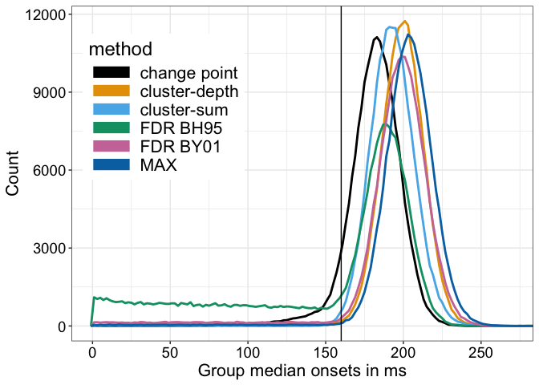
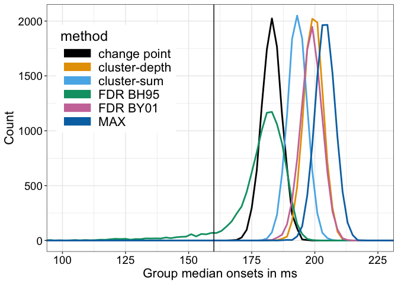
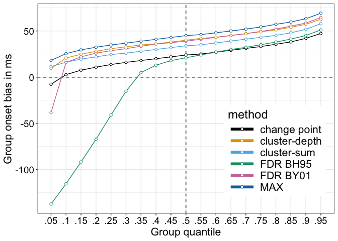
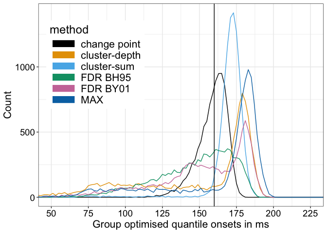

Estimating group onsets using cluster statistics: simulation using
EEG-like noise
================
Guillaume A. Rousselet
2024-09-12

# Dependencies

``` r
library(ggplot2)
library(tibble)
library(changepoint)
library(cowplot)
library(beepr)
library(Rfast)
source("./code/functions.R")
source("./code/theme_gar.txt")
# Load template: true onset = 160 ms, F=81, max at F=126
source("./code/erp_template.R")
# R version of Matlab code from Yeung et al. 2004
source("./code/eeg_noise.R")
# to use with eeg_noise function
meanpower <- unlist(read.table("./code/meanpower.txt"))
# Colour palette from http://www.cookbook-r.com/Graphs/Colors_(ggplot2)/
categ.palette <- c("#000000", "#E69F00", "#56B4E9", "#009E73", "#CC79A7", "#0072B2", "#D55E00", "#F0E442")
library(permuco) # to compute cluster depth statistics
```

# Simulate group estimates

20 participants. Group estimate = median of 20 onsets. On each
iteration, each participant has a random onset of 150-170 ms, drawn from
a uniform distribution.

``` r
set.seed(666)
aath <- 0.05 # arbitrary alpha threshold
nsim <- 10000 # simulation iterations
nboot <- 2000 # number of permutation samples
inc.step <- 500 # console notification every inc.step iterations
srate <- 500 # sampling rate in Hz
ronset <- seq(150, 170, 2) # random onset for each participant

Nt <- 50 # number of trials
Np <- 20 # number of participants
outvar <- 1 # noise variance

cond1 <- matrix(0, nrow = Nt, ncol = Nf)
cond2 <- matrix(0, nrow = Nt, ncol = Nf)

simres.cp <- matrix(NA, nrow = Np, ncol = nsim)
simres.bh95 <- matrix(NA, nrow = Np, ncol = nsim)
simres.by01 <- matrix(NA, nrow = Np, ncol = nsim)
simres.max <- matrix(NA, nrow = Np, ncol = nsim)
simres.cs <- matrix(NA, nrow = Np, ncol = nsim)
simres.cd <- matrix(NA, nrow = Np, ncol = nsim)

for(S in 1:nsim){
  
  sim.counter(S, nsim, inc = inc.step)
  
  for(P in 1:Np){ # participants
    
    ponset <- sample(ronset, 1) # get random onset
    st <- which(Xf==ponset) # find starting point
    temp2 <- c(rep(0, st-2), erp, rep(0, Nf-st-length(erp)+2)) # pad vector
    # plot(Xf, temp2)
    # abline(v = ponset)
    # Xf[which(temp2>0)[1]]
    
    for(T in 1:Nt){
      cond2[T,] <- temp2 + eeg_noise(frames = Nf, srate = srate, outvar = outvar, meanpower)
      cond1[T,] <- temp1 + eeg_noise(frames = Nf, srate = srate, outvar = outvar, meanpower)
    }
    
    # t-tests
    ori.t2 <- vector(mode = "numeric", length = Nf)
    for(F in 1:Nf){
      ori.t2[F] <- t.test(cond1[,F], cond2[,F])$statistic^2
    }
    # fit change point model
    res <- cpt.meanvar(ori.t2, method = "BinSeg", Q=2)
    simres.cp[P,S] <- Xf[res@cpts[1]]
    
    # Make permutation table of t values 
    perm.t2 <- permtdist(cond1, cond2, Nt, Nf, nboot = nboot)^2
    perm.th <- apply(perm.t2, 2, quantile, probs = 1-aath)
    
    # FDR -----
    perm.pvals <- vector(mode = "numeric", length = Nf)
    for(F in 1:Nf){
      perm.pvals[F] <- (sum(perm.t2[,F] >= ori.t2[F]) + 1) / (nboot + 1)
    }
    simres.bh95[P,S] <- find_onset(p.adjust(perm.pvals, method = "BH") <= aath, Xf)
    simres.by01[P,S] <- find_onset(p.adjust(perm.pvals, method = "BY") <= aath, Xf)
    
    # MAX -----
    max.th <- quantile(apply(perm.t2, 1, max), probs = 1-aath)
    simres.max[P,S] <- find_onset(ori.t2 >= max.th, Xf)
    
    # cluster-sum statistics -----
    cmap <- cluster.make(perm.pvals <= aath)
    perm.max.sums <- vector(mode = "numeric", length = nboot)
    for(B in 1:nboot){
      # threshold permutation t2 values and form clusters
      perm.cmap <- cluster.make(perm.t2[B,] <= perm.th)  
      perm.max.sums[B] <- max(cluster.sum(values = perm.t2[B,], cmap = perm.cmap))
    }
    # cluster sum threshold
    cs.th <- quantile(perm.max.sums, probs = 1-aath)
    # cluster test
    cs.test <- cluster.test(values = ori.t2, cmap = cmap, cs.th)
    simres.cs[P,S] <- find_onset(cs.test, Xf)
    
    # cluster-depth statistics
    df <- as_tibble(rbind(cond1, cond2))
    df2 <- tibble(gp = rep(c("gp1", "gp2"), each = Nt),
                  trial = c(1:Nt, 1:Nt))
    df <- cbind(df2, df)
    
    res <- permuco::clusterlm(formula = df[,3:ncol(df)] ~ gp, 
                              data = df[,-(3:ncol(df))],
                              multcomp = "clusterdepth_head",
                              test = "t",
                              np = nboot)
    
    cd.pval <- res$multiple_comparison$gpgp2$clusterdepth$main[,2]
    # cd.tval <- res$multiple_comparison$gpgp2$clusterdepth$main[,1]
    simres.cd[P,S] <- find_onset(cd.pval < aath, Xf)
  }
}

save(simres.cs, simres.max, simres.bh95, simres.by01, simres.cp, simres.cd,
     file = "./data/onsetsim_n50_eeg_group20.RData")
```

## Plot onset distributions: individual onsets

Check that results are similar to those in `onsetsim_eeg.Rmd`, now with
20 times more estimated onsets, but some uncertainty in the location of
the true onset.

``` r
load("./data/onsetsim_n50_eeg_group20.RData")

df <- tibble(onsets = c(simres.cp, simres.cs, simres.bh95, simres.max, simres.cd, simres.by01),
             method = factor(c(rep("change point", length(simres.cp)),
                               rep("cluster-sum", length(simres.cs)),
                               rep("FDR BH95", length(simres.bh95)),
                               rep("MAX", length(simres.max)),
                               rep("cluster-depth", length(simres.cd)),
                               rep("FDR BY01", length(simres.by01))
             ))
)

ggplot(data = df, aes(x = onsets, colour = method)) + theme_gar +
  # stat_density(geom = "line") +
  geom_freqpoly(fill = "white", na.rm = TRUE, breaks = Xf, linewidth = 1) +
  geom_vline(xintercept = true_onset, linetype = "solid") +
  # geom_vline(xintercept = median(simres.cp, na.rm = TRUE))
  scale_colour_manual(values = categ.palette) +
  theme(legend.position = c(.2, .70)) +
  labs(x = "Group median onsets in ms", y = "Count") +
  coord_cartesian(xlim = c(0, 270)) +
  scale_x_continuous(breaks = seq(0, 300, 50)) + 
  guides(colour = guide_legend(override.aes = list(linewidth = 5)))
```

<!-- -->

## Plot onset distributions: group medians

Group distributions are estimated using a summary statistics across
participants. Here we use the median as a robust measure of central
tendency. Using the 20% trimmed mean gives similar results.
Alternatively, we could use other quantiles of the distribution to
reduce the group bias. This is done systematically in the following
section.

``` r
load("./data/onsetsim_n50_eeg_group20.RData")
# load("./data/onsetsim_n50_eeg_group20_cd.RData")
# load("./data/onsetsim_n50_eeg_group20_fdr.RData")
# compute group medians
simres.cs <- apply(simres.cs, 2, median, na.rm = TRUE)
simres.cp <- apply(simres.cp, 2, median, na.rm = TRUE)
simres.max <- apply(simres.max, 2, median, na.rm = TRUE)
simres.bh95 <- apply(simres.bh95, 2, median, na.rm = TRUE)
simres.cd <- apply(simres.cd, 2, median, na.rm = TRUE)
simres.by01 <- apply(simres.by01, 2, median, na.rm = TRUE)

# compute group 20% trimmed means
# tp <- 0.2 # trimming percentage
# simres.cs <- apply(simres.cs, 2, mean, na.rm = TRUE, trim = tp)
# simres.cp <- apply(simres.cp, 2, mean, na.rm = TRUE, trim = tp)
# simres.max <- apply(simres.max, 2, mean, na.rm = TRUE, trim = tp)
# simres.bh95 <- apply(simres.bh95, 2, mean, na.rm = TRUE, trim = tp)
# simres.cd <- apply(simres.cd, 2, mean, na.rm = TRUE, trim = tp)
# simres.by01 <- apply(simres.by01, 2, mean, na.rm = TRUE, trim = tp)

df <- tibble(onsets = c(simres.cp, simres.cs, simres.bh95, simres.max, simres.cd, simres.by01),
             method = factor(c(rep("change point", length(simres.cp)),
                               rep("cluster-sum", length(simres.cs)),
                               rep("FDR BH95", length(simres.bh95)),
                               rep("MAX", length(simres.max)),
                               rep("cluster-depth", length(simres.cd)),
                               rep("FDR BY01", length(simres.by01))
             ))
)

ggplot(data = df, aes(x = onsets, colour = method)) + theme_gar +
  # stat_density(geom = "line") +
  geom_freqpoly(fill = "white", na.rm = TRUE, breaks = Xf, linewidth = 1) +
  geom_vline(xintercept = true_onset, linetype = "solid") +
  # geom_vline(xintercept = median(simres.cp, na.rm = TRUE))
  scale_colour_manual(values = categ.palette) +
  theme(legend.position = c(.2, .70)) +
  labs(x = "Group median onsets in ms", y = "Count") +
  coord_cartesian(xlim = c(100, 225)) +
  scale_x_continuous(breaks = seq(100, 250, 25)) + 
  guides(colour = guide_legend(override.aes = list(linewidth = 5)))
```

<!-- -->

``` r
ggsave(filename = "./figures/onsetsim_eeg_group_1.pdf", width = 10, height = 5)
```

## Mode

``` r
print("Mode:")
```

    ## [1] "Mode:"

``` r
print(paste("Cluster-depth =",find_mode(simres.cd)))
```

    ## [1] "Cluster-depth = 200"

``` r
print(paste("Change point =",find_mode(simres.cp)))
```

    ## [1] "Change point = 184"

``` r
print(paste("Cluster-sum =",find_mode(simres.cs)))
```

    ## [1] "Cluster-sum = 194"

``` r
print(paste("FDR BH95 =",find_mode(simres.bh95)))
```

    ## [1] "FDR BH95 = 182"

``` r
print(paste("FDR BY01 =",find_mode(simres.by01)))
```

    ## [1] "FDR BY01 = 200"

``` r
print(paste("MAX =",find_mode(simres.max)))
```

    ## [1] "MAX = 204"

## Bias

``` r
print("Bias:")
```

    ## [1] "Bias:"

``` r
print(paste("Change point =",median(simres.cp, na.rm = TRUE) - true_onset))
```

    ## [1] "Change point = 24"

``` r
print(paste("Cluster-depth =",median(simres.cd, na.rm = TRUE) - true_onset))
```

    ## [1] "Cluster-depth = 40"

``` r
print(paste("Cluster-sum =",median(simres.cs, na.rm = TRUE) - true_onset))
```

    ## [1] "Cluster-sum = 34"

``` r
print(paste("FDR BH95 =",median(simres.bh95, na.rm = TRUE) - true_onset))
```

    ## [1] "FDR BH95 = 21"

``` r
print(paste("FDR BY01 =",median(simres.by01, na.rm = TRUE) - true_onset))
```

    ## [1] "FDR BY01 = 39"

``` r
print(paste("MAX =",median(simres.max, na.rm = TRUE) - true_onset))
```

    ## [1] "MAX = 45"

## Mean absolute error

``` r
print("MAE:")
```

    ## [1] "MAE:"

``` r
print(paste("Change point =",round(mean(abs(simres.cp - true_onset), na.rm = TRUE), digits=1)))
```

    ## [1] "Change point = 23.5"

``` r
print(paste("Cluster-depth =",round(mean(abs(simres.cd - true_onset), na.rm = TRUE), digits=1)))
```

    ## [1] "Cluster-depth = 40"

``` r
print(paste("Cluster-sum =",round(mean(abs(simres.cs - true_onset), na.rm = TRUE), digits=1)))
```

    ## [1] "Cluster-sum = 33.6"

``` r
print(paste("FDR BH95 =",round(mean(abs(simres.bh95 - true_onset), na.rm = TRUE), digits=1)))
```

    ## [1] "FDR BH95 = 21"

``` r
print(paste("FDR BY01 =",round(mean(abs(simres.by01 - true_onset), na.rm = TRUE), digits=1)))
```

    ## [1] "FDR BY01 = 39.3"

``` r
print(paste("MAX =",round(mean(abs(simres.max - true_onset), na.rm = TRUE), digits=1)))
```

    ## [1] "MAX = 44.6"

## Variance

``` r
print("Variance:")
```

    ## [1] "Variance:"

``` r
print(paste("Change point =",round(var(simres.cp, na.rm = TRUE), digits=0)))
```

    ## [1] "Change point = 16"

``` r
print(paste("Cluster-depth =",round(var(simres.cd, na.rm = TRUE), digits=0)))
```

    ## [1] "Cluster-depth = 14"

``` r
print(paste("Cluster-sum =",round(var(simres.cs, na.rm = TRUE), digits=0)))
```

    ## [1] "Cluster-sum = 15"

``` r
print(paste("FDR BH95 =",round(var(simres.bh95, na.rm = TRUE), digits=0)))
```

    ## [1] "FDR BH95 = 143"

``` r
print(paste("FDR BY01 =",round(var(simres.by01, na.rm = TRUE), digits=0)))
```

    ## [1] "FDR BY01 = 18"

``` r
print(paste("MAX =",round(var(simres.max, na.rm = TRUE), digits=0)))
```

    ## [1] "MAX = 15"

## Proportion too early

``` r
print("Proportion too early:")
```

    ## [1] "Proportion too early:"

``` r
print(paste("Change point =",round(100*mean((simres.cp - true_onset) < 0, na.rm = TRUE), digits=1),"%"))
```

    ## [1] "Change point = 0 %"

``` r
print(paste("Cluster-depth =",round(100*mean((simres.cd - true_onset) < 0, na.rm = TRUE), digits=1),"%"))
```

    ## [1] "Cluster-depth = 0 %"

``` r
print(paste("Cluster-sum =",round(100*mean((simres.cs - true_onset) < 0, na.rm = TRUE), digits=1),"%"))
```

    ## [1] "Cluster-sum = 0 %"

``` r
print(paste("FDR BH95 =",round(100*mean((simres.bh95 - true_onset) < 0, na.rm = TRUE), digits=1),"%"))
```

    ## [1] "FDR BH95 = 5.9 %"

``` r
print(paste("FDR BY01 =",round(100*mean((simres.by01 - true_onset) < 0, na.rm = TRUE), digits=1),"%"))
```

    ## [1] "FDR BY01 = 0 %"

``` r
print(paste("MAX =",round(100*mean((simres.max - true_onset) < 0, na.rm = TRUE), digits=1),"%"))
```

    ## [1] "MAX = 0 %"

## Underestimations of at least 40 ms

``` r
print("Underestimations of at least 40 ms:")
```

    ## [1] "Underestimations of at least 40 ms:"

``` r
print(paste("Change point =",round(100*mean((simres.cp - true_onset) <= -40, na.rm = TRUE), digits=1),"%"))
```

    ## [1] "Change point = 0 %"

``` r
print(paste("Cluster-depth =",round(100*mean((simres.cd - true_onset) <= -40, na.rm = TRUE), digits=1),"%"))
```

    ## [1] "Cluster-depth = 0 %"

``` r
print(paste("Cluster-sum =",round(100*mean((simres.cs - true_onset) <= -40, na.rm = TRUE), digits=1),"%"))
```

    ## [1] "Cluster-sum = 0 %"

``` r
print(paste("FDR BH95 =",round(100*mean((simres.bh95 - true_onset) <= -40, na.rm = TRUE), digits=1),"%"))
```

    ## [1] "FDR BH95 = 0.5 %"

``` r
print(paste("FDR BY01 =",round(100*mean((simres.by01 - true_onset) <= -40, na.rm = TRUE), digits=1),"%"))
```

    ## [1] "FDR BY01 = 0 %"

``` r
print(paste("MAX =",round(100*mean((simres.max - true_onset) <= -40, na.rm = TRUE), digits=1),"%"))
```

    ## [1] "MAX = 0 %"

# Group estimates of bias at multiple quantiles

The distribution of group median onsets is less noisy than the
distribution of individual estimates, but remains positively biased. We
can try to reduce these group estimates by exploring bias as a function
of the quantiles of onsets. Here we use the median unbiased quantile
estimator recommended by Hyndman & Fan (1996), which is type = 8 in R.
However, to handle tied values, there might be advantages in using the
Harrell-Davis quantile estimator (Harrell & Davis, 1982; Wilcox &
Rousselet, 2023).

## Compute group quantiles

``` r
load("./data/onsetsim_n50_eeg_group20.RData")

qseq <- seq(0.05, 0.95, 0.05)
nq <- length(qseq)
nsim <- 10000

# compute group quantiles
qt.cs <- matrix(NA, nrow = nq, ncol = nsim)
qt.cp <- matrix(NA, nrow = nq, ncol = nsim)
qt.max <- matrix(NA, nrow = nq, ncol = nsim)
qt.bh95 <- matrix(NA, nrow = nq, ncol = nsim)
qt.by01 <- matrix(NA, nrow = nq, ncol = nsim)
qt.cd <- matrix(NA, nrow = nq, ncol = nsim)

for(Q in 1:nq){
  # Quantile type 8 -- median unbiased quantile estimator recommended by Hyndman & Fan (1996)
  qt.cs[Q,] <- apply(simres.cs, 2, quantile, na.rm = TRUE, probs = qseq[Q], type = 8)
  qt.cp[Q,] <- apply(simres.cp, 2, quantile, na.rm = TRUE, probs = qseq[Q], type = 8)
  qt.max[Q,] <- apply(simres.max, 2, quantile, na.rm = TRUE, probs = qseq[Q], type = 8)
  qt.bh95[Q,] <- apply(simres.bh95, 2, quantile, na.rm = TRUE, probs = qseq[Q], type = 8)
  qt.by01[Q,] <- apply(simres.by01, 2, quantile, na.rm = TRUE, probs = qseq[Q], type = 8)
  qt.cd[Q,] <- apply(simres.cd, 2, quantile, na.rm = TRUE, probs = qseq[Q], type = 8)
  
  # Harrell-Davis quantile estimator
  # qt.cs[Q,] <- apply(simres.cs, 2, hd, na.rm = TRUE, q = qseq[Q])
  # qt.cp[Q,] <- apply(simres.cp, 2, hd, na.rm = TRUE, q = qseq[Q])
  # qt.max[Q,] <- apply(simres.max, 2, hd, na.rm = TRUE, q = qseq[Q])
  # qt.bh95[Q,] <- apply(simres.bh95, 2, hd, na.rm = TRUE, q = qseq[Q])
  # qt.by01[Q,] <- apply(simres.by01, 2, hd, na.rm = TRUE, q = qseq[Q])
  # qt.cd[Q,] <- apply(simres.cd, 2, hd, na.rm = TRUE, q = qseq[Q])
}
```

## Compute group biases

Compute bias for each method and for each quantile.

``` r
bias.cs <- vector(mode = "numeric", length = nq)
bias.cp <- vector(mode = "numeric", length = nq)
bias.max <- vector(mode = "numeric", length = nq)
bias.bh95 <- vector(mode = "numeric", length = nq)
bias.by01 <- vector(mode = "numeric", length = nq)
bias.cd <- vector(mode = "numeric", length = nq)

for(Q in 1:nq){
  bias.cs[Q] <- median(qt.cs[Q,], na.rm = TRUE) - true_onset
  bias.cp[Q] <- median(qt.cp[Q,], na.rm = TRUE) - true_onset
  bias.max[Q] <- median(qt.max[Q,], na.rm = TRUE) - true_onset
  bias.bh95[Q] <- median(qt.bh95[Q,], na.rm = TRUE) - true_onset
  bias.by01[Q] <- median(qt.by01[Q,], na.rm = TRUE) - true_onset
  bias.cd[Q] <- median(qt.cd[Q,], na.rm = TRUE) - true_onset
}
```

## Plot results at multiple quantiles

``` r
df <- tibble(quantile = rep(qseq, 6),
             bias = c(bias.cp, bias.cs, bias.bh95, bias.max, bias.by01, bias.cd),
             method = factor(c(rep("change point", nq),
                               rep("cluster-sum", nq),
                               rep("FDR BH95", nq),
                               rep("MAX", nq),
                               rep("FDR BY01", nq),
                               rep("cluster-depth", nq)
             ))
)

pA <- ggplot(data = df, aes(x = quantile, y = bias, colour = method)) + theme_gar +
  geom_hline(yintercept = 0, linetype = "dashed") +
  geom_vline(xintercept = 0.5, linetype = "dashed") +
  # stat_density(geom = "line") +
  geom_line(breaks = qseq) +
  geom_point(fill = "white", shape = 21, breaks = qseq) +
  scale_colour_manual(values = categ.palette) +
  theme(legend.position = c(.8, .3)) +
  labs(x = "Group quantile", y = "Group onset bias in ms")  +
  scale_x_continuous(breaks = qseq,
                     label = c(".05", ".1", ".15", ".2", ".25", ".3", ".35", ".4", ".45", 
                               ".5", ".55", ".6", ".65", ".7", ".75", ".8", ".85", ".9", ".95"),
                     minor_breaks = qseq) +
  scale_y_continuous(minor_breaks = seq(-150, 100, 25)) +
  guides(colour = guide_legend(override.aes = list(linewidth = 2)))
# coord_cartesian(xlim = c(100, 300))
pA
```

<!-- -->

## Plot onset distributions at optimised quantile

Based on results in previous plot, use:  
- 0.1 quantile for BY01 and change point methods;  
- 0.35 quantile for BH95;  
- 0.05 quantile for other methods.

``` r
# get group quantiles
plot.bh95 <- apply(simres.bh95, 2, hd, na.rm = TRUE, q = 0.35)
plot.by01 <- apply(simres.by01, 2, hd, na.rm = TRUE, q = 0.1)
plot.cp <- apply(simres.cp, 2, hd, na.rm = TRUE, q = 0.1)
plot.max <- apply(simres.max, 2, hd, na.rm = TRUE, q = 0.05)
plot.cd <- apply(simres.cd, 2, hd, na.rm = TRUE, q = 0.05)
plot.cs <- apply(simres.cs, 2, hd, na.rm = TRUE, q = 0.05)
```

Plot results

``` r
df <- tibble(onsets = c(plot.cp, plot.cs, plot.bh95, plot.by01, plot.max, plot.cd),
             method = factor(c(rep("change point", length(plot.cp)),
                               rep("cluster-sum", length(plot.cs)),
                               rep("FDR BH95", length(plot.bh95)),
                               rep("FDR BY01", length(plot.by01)),
                               rep("MAX", length(plot.max)),
                               rep("cluster-depth", length(plot.cd))
             ))
)

pB <- ggplot(data = df, aes(x = onsets, colour = method)) + theme_gar +
  # stat_density(geom = "line") +
  geom_freqpoly(fill = "white", na.rm = TRUE, breaks = Xf) +
  geom_vline(xintercept = true_onset, linetype = "solid") +
  # geom_vline(xintercept = median(simres.cp, na.rm = TRUE))
  scale_colour_manual(values = categ.palette) +
  theme(legend.position = c(.2, .7)) +
  labs(x = "Group optimised quantile onsets in ms", y = "Count") +
  coord_cartesian(xlim = c(50, 225)) +
  scale_x_continuous(breaks = seq(50, 250, 25)) + 
  guides(colour = guide_legend(override.aes = list(linewidth = 5)))
pB
```

<!-- -->

A larger group size will ameliorate estimation of extreme quantiles,
which are inherently noisy.

### Merge panels

``` r
cowplot::plot_grid(pA, pB,
                   nrow = 2, ncol = 1,
                   labels = c("A", "B"),
                   label_size = 20)

ggsave(filename = "./figures/onsetsim_eeg_group_2.pdf", width = 8, height = 8)
```

# References

Harrell, F. E., & Davis, C. E. (1982). A new distribution-free quantile
estimator. Biometrika, 69(3), 635–640.
<https://doi.org/10.1093/biomet/69.3.635>

Hyndman, R. J. and Fan, Y. (1996) Sample quantiles in statistical
packages, American Statistician 50, 361–365. <doi:10.2307/2684934>.

Wilcox, R. R., & Rousselet, G. A. (2023, May 21). A Quantile Shift
Approach To Main Effects And Interactions In A 2-By-2 Design. arXiv.Org.
<https://arxiv.org/abs/2305.12366v1>
