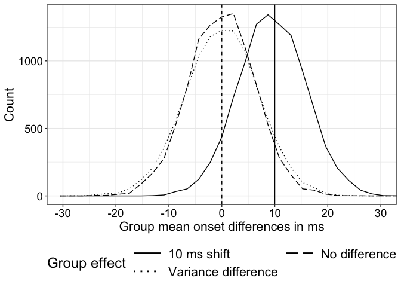

Comparing group onsets using change point estimation: simulation using
EEG-like noise
================
Guillaume A. Rousselet
2024-09-12

Test a two-step process to compare onsets between two independent
groups.  
Step 1 = estimate onsets using change point algorithm in each
participant.  
Step 2 = compare distributions of estimated onsets between groups using
a t-test on means.

For real ERP data, from experience, skewness and outliers are expected
in onset distributions ([Bieniek et al.,
2016](https://onlinelibrary.wiley.com/doi/abs/10.1111/ejn.13100)), so
using a robust method instead of a t-test on means is recommended
([Wilcox & Rousselet,
2023](https://onlinelibrary.wiley.com/doi/abs/10.1002/cpz1.719)).

# Dependencies

``` r
library(ggplot2)
library(tibble)
library(cowplot)
library(beepr)
library(Rfast)
source("./code/functions.R")
source("./code/sim_eeg_group_onset.R")
source("./code/theme_gar.txt")
# Load template: true onset = 160 ms, F=81, max at F=126
source("./code/erp_template.R")
# R version of Matlab code from Yeung et al. 2004
source("./code/eeg_noise.R")
# to use with eeg_noise function
meanpower <- unlist(read.table("./code/meanpower.txt"))
```

# Simulate group estimates

20 participants in each group. Two conditions, with 50 trials each. In
group 1, onsets vary uniformly \[140-180\].  
In group 2, we consider 3 situations:  
- Null 1 (no difference) = \[140-180\]; - Null 2 (variance difference) =
\[130-190\];  
- 10 ms shift = \[150-190\].  
Group estimate = means of 20 onsets. This means that the estimates will
be biased, but assuming constant bias between groups, this won’t be an
issue, as the bias will wash away in the comparison. We check type I
error rates and power. Will need more systematic validations but this is
a good proof of concept for now.

``` r
set.seed(666)
aath <- 0.05 # arbitrary alpha threshold
nsim <- 10000 # simulation iterations
inc.step <- 50 # console notification every inc.step iterations
srate <- 500 # sampling rate in Hz
g1.ronset <- seq(140, 180, 2) # random onset for each participant
g2.ronset.no <- seq(140, 180, 2) # random onset for each participant
g2.ronset.var <- seq(130, 190, 2) # random onset for each participant
g2.ronset.shift <- seq(150, 190, 2) # random onset for each participant

Nt <- 50 # number of trials
Np <- 20 # number of participants
outvar <- 1 # noise variance

simres.group_diff <- matrix(NA, nrow = 3, ncol = nsim)
simres.group_sig <- matrix(NA, nrow = 3, ncol = nsim)

for(S in 1:nsim){
  
  sim.counter(S, nsim, inc = inc.step)
  
  # group 1 onsets
  sim.g1.ronset <- sim_eeg_group_onset_cp(ronset = g1.ronset, Nt, Np)
  # group 2 onsets - no effect
  sim.g2.ronset.no <- sim_eeg_group_onset_cp(ronset = g2.ronset.no, Nt, Np)
  # group 2 onsets - variance difference
  sim.g2.ronset.var <- sim_eeg_group_onset_cp(ronset = g2.ronset.var, Nt, Np)
  # group 2 onsets - shift
  sim.g2.ronset.shift <- sim_eeg_group_onset_cp(ronset = g2.ronset.shift, Nt, Np)
  
  # group comparisons
  res <- t.test(sim.g1.ronset, sim.g2.ronset.no)
  simres.group_diff[1,S] <- res$estimate[2] - res$estimate[1]
  simres.group_sig[1,S] <- res$p.value <= aath
  
  res <- t.test(sim.g1.ronset, sim.g2.ronset.var)
  simres.group_diff[2,S] <- res$estimate[2] - res$estimate[1]
  simres.group_sig[2,S] <- res$p.value <= aath
  
  res <- t.test(sim.g1.ronset, sim.g2.ronset.shift)
  simres.group_diff[3,S] <- res$estimate[2] - res$estimate[1]
  simres.group_sig[3,S] <- res$p.value <= aath
}

save(simres.group_diff, simres.group_sig, 
     file = "./data/onsetsim_eeg_group_comp_cp.RData")
```

## Check error rates

``` r
load("./data/onsetsim_eeg_group_comp_cp.RData")
apply(simres.group_sig, 1, mean, na.rm = TRUE)
```

    ## [1] 0.0456 0.0494 0.3203

## Plot distributions of group onset differences

``` r
nsim <- 10000

df <- tibble(onsets = as.vector(simres.group_diff),
             comp = factor(rep(c("No difference", "Variance difference", "10 ms shift"), nsim))
             )

ggplot(data = df, aes(x = onsets, linetype = comp)) + theme_gar +
  # stat_density(geom = "line") +
  geom_freqpoly(fill = "white", na.rm = TRUE) +
  scale_linetype_manual(values=c("solid", "longdash", "dotted")) +
  geom_vline(xintercept = 10, linetype = "solid") +
  geom_vline(xintercept = 0, linetype = "dashed") +
  # theme(legend.position = c(.8, .8)) +
  theme(legend.position = "bottom") +
  labs(x = "Group mean onset differences in ms", 
       y = "Count",
       linetype = "Group effect") +
  coord_cartesian(xlim = c(-30, 30)) +
  scale_x_continuous(breaks = seq(-30, 30, 10)) +
  guides(linetype = guide_legend(nrow=2, byrow=TRUE, 
                                 override.aes = list(linewidth = 1)))
```

<!-- -->

``` r
ggsave(filename = "./figures/onsetsim_eeg_group_comp.pdf", width = 10, height = 5)
```

## Bias

``` r
print("Bias:")
```

    ## [1] "Bias:"

``` r
print(paste("No difference =",round(median(simres.group_diff[1,], na.rm = TRUE) - 0,digits=2)))
```

    ## [1] "No difference = 0"

``` r
print(paste("Variance difference =",round(median(simres.group_diff[2,], na.rm = TRUE) - 0,digits=2)))
```

    ## [1] "Variance difference = 0"

``` r
print(paste("10 ms shift =",round(median(simres.group_diff[3,], na.rm = TRUE) - 10,digits=2)))
```

    ## [1] "10 ms shift = -0.5"

For practical purposes, there is no bias, as expected.

## Mean absolute error

``` r
print("MAE:")
```

    ## [1] "MAE:"

``` r
print(paste("No difference =",round(mean(abs(simres.group_diff[1,] - 0), na.rm = TRUE), digits=1)))
```

    ## [1] "No difference = 5"

``` r
print(paste("Variance difference =",round(mean(abs(simres.group_diff[2,] - 0), na.rm = TRUE), digits=1)))
```

    ## [1] "Variance difference = 5.5"

``` r
print(paste("10 ms shift =",round(mean(abs(simres.group_diff[3,] - 10), na.rm = TRUE), digits=1)))
```

    ## [1] "10 ms shift = 5.1"

MAE is small, less than half of the population effect.

## Variance

``` r
print("Variance:")
```

    ## [1] "Variance:"

``` r
print(paste("No difference =",round(var(simres.group_diff[1,], na.rm = TRUE), digits=1)))
```

    ## [1] "No difference = 39.1"

``` r
print(paste("Variance difference =",round(var(simres.group_diff[2,], na.rm = TRUE), digits=1)))
```

    ## [1] "Variance difference = 47.7"

``` r
print(paste("10 ms shift =",round(var(simres.group_diff[3,], na.rm = TRUE), digits=1)))
```

    ## [1] "10 ms shift = 39.8"
