Estimating group onsets using change point detection and hierarchical
bootstrap: an example
================
Guillaume A. Rousselet
2024-09-12

# Dependencies

``` r
library(ggplot2)
library(tibble)
library(changepoint)
library(cowplot)
library(beepr)
library(Rfast)
# library(HDInterval)
source("./code/functions.R")
source("./code/theme_gar.txt")
# Load template: true onset = 160 ms, F=81, max at F=126
source("./code/erp_template.R")
# R version of Matlab code from Yeung et al. 2004
source("./code/eeg_noise.R")
# to use with eeg_noise function
meanpower <- unlist(read.table("./code/meanpower.txt"))
```

# Group inferences using hierarchical bootstrap: 50 participants, 100 trials

Consider a sample of 50 participants, 2 conditions, n=100 trials per
condition. Onsets vary across participants following a uniform
distribution \[130-190 ms\], such that on average, the typical group
onset should be 160 ms. We also vary the maximum amplitude of the effect
from 0.5 to 1, following a uniform distribution.

Onsets are estimated using the same change point detection algorithm
used in previous notebooks.

The hierarchical bootstrap is used to make group inferences, integrating
uncertainty across trials and participants: sample participants with
replacement; for each sampled participant, sample trials with
replacement (Rousselet et al. 2023).

Typical mass-univariate ERP group analyses forfeit individual
differences by only reporting statistical significance at the group
level, leading to only a single onset being reported, without any
measure of uncertainty. That practice would be considered unacceptable
for behavioural data, such as reaction times or percent correct data.
Why it is deemed acceptable for ERP effects is unclear.

## Create individual and group data

Sample participants’ onsets and maximum signal amplitudes from uniform
distributions.  
Make individual ERPs and group averages.  
Estimate onsets using change point method.

``` r
set.seed(6666)
aath <- 0.05 # arbitrary alpha threshold
nboot <- 2000 # number of permutation samples
srate <- 500 # sampling rate in Hz

Nt <- 100 # number of trials
Np <- 50 # number of participants
outvar <- 1 # noise variance

ronset <- seq(130, 190, 2) # onset sequence
# re-sample onsets
ronset <- sample(ronset, size = Np, replace = TRUE) 
# median(ronset) = 160 ms

ind.onset <- vector(mode = "numeric", length = Np) # save individual onsets
ind.erp <- array(data = 0, dim = c(Np, 2, Nt, Nf)) # save individual trials

cond1 <- array(0, dim = c(Nt, Nf))
cond2 <- array(0, dim = c(Nt, Nf))
ind.diff <- array(0, dim = c(Np, Nf))

for(P in 1:Np){ # participants
  
  # make signal template
  ponset <- ronset[P] # get random onset
  st <- which(Xf==ponset) # find starting point
  temp2 <- c(rep(0, st-2), erp*runif(1, min = 0.5, max = 1), rep(0, Nf-st-length(erp)+2)) # pad vector
  
  for(T in 1:Nt){ # add noise
    cond2[T,] <- temp2 + eeg_noise(frames = Nf, srate = srate, outvar = outvar, meanpower)
    cond1[T,] <- temp1 + eeg_noise(frames = Nf, srate = srate, outvar = outvar, meanpower)
  }
  ind.diff[P,] <- colMeans(cond2) - colMeans(cond1)
  ind.erp[P, 1, ,] <- cond1
  ind.erp[P, 2, ,] <- cond2
  
  # two-sample t-test at every time-point:
  ori.t2 <- Rfast::ttests(cond2, cond1, paired = FALSE, logged = FALSE)[,1]^2
  res <- cpt.meanvar(ori.t2, method = "BinSeg", Q=2)
  ind.onset[P] <- Xf[res@cpts[1]]
  
}

gp.diff <- colMeans(ind.diff)

# Estimate group onset as the deciles of the onset distribution
qt.onset <- quantile(ind.onset, probs = seq(0.1, 0.9, 0.1), type = 8)

# Group one-sample t-test on the ERP differences:
gp.t2 <- Rfast::ttest(ind.diff, 0)[,1]^2
# Group onset
res <- cpt.meanvar(gp.t2, method = "BinSeg", Q=2)
gp.onset <- Xf[res@cpts[1]]
```

### Plot group t2 + onset

``` r
plot(Xf, gp.t2, type = "l")
abline(v = gp.onset, lty = "aa")
```

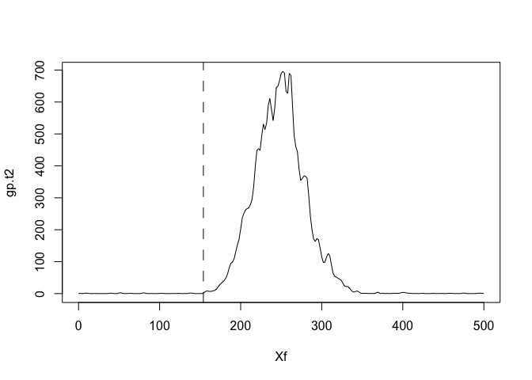<!-- -->

### Plot estimated onsets as a function of real onsets

``` r
plot(ronset, ind.onset, xlab = "Real onsets", ylab = "Estimated onsets", asp = 1)
#xlim = c(140, 200), ylim = c(140, 200)
abline(a = 0, b = 1)
```

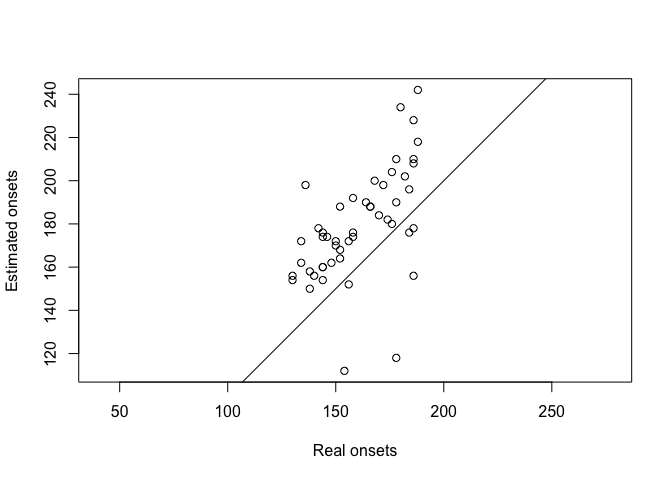<!-- -->

### Illustrate individual + group data

``` r
df <- tibble(x = rep(Xf, each = Np),
             y = as.vector(ind.diff),
             Participants = factor(rep(1:Np, Nf))
)

df2 <- tibble(x = Xf,
              y = gp.diff,
              Participants = factor(Np+1)) 

p <- ggplot(df, aes(x=x, y=y, group=Participants)) + theme_gar +
  geom_hline(yintercept = 0) +
  geom_line(colour = "grey") +
  # population median onset = true onset = dotted vertical line
  # geom_vline(xintercept = true_onset, linetype = "dotted") +
  # Group onset estimated from group t2 time-course = dot-dash vertical line
  # geom_vline(xintercept = gp.onset, linewidth = 1, linetype = "dotdash") +
  # Group 0.2 quantile = plain vertical line
  geom_vline(xintercept = qt.onset[2], linewidth = 1) +
  # group median onset = dashed vertical line
  geom_vline(xintercept = qt.onset[5], linewidth = 1, colour = "black", linetype = "dashed") +
  geom_line(data = df2, aes(x=x, y=y), colour = "black", linewidth = 2) +
  scale_x_continuous(breaks = seq(0, 500, 50)) +
  labs(x = "Time in ms", y = "Signal in arbitrary units") 
p
```

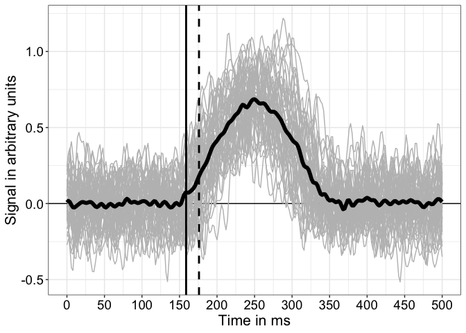<!-- -->

``` r
p.ERP1 <- p
```

Individual ERP differences in grey.  
Group average in black.  
not plotted (Vertical dotted line = population onset = 160 ms).  
not plotted (Vertical dot-dash line = onset estimated from group t^2
time-course = 154 ms).  
Vertical thick black line = 0.2 quantile of distribution of individual
onset estimates = 158.8 ms.  
Vertical thick black dashed line = median of distribution of individual
onset estimates = 176 ms.

## Group + individual onsets

Group onset is estimated as the 0.2 quantile of the onset distribution
(thick black line).

Median appears as thick black dashed line.

not plotted (True onset is marked with dotted line.)

not plotted (The dot-dash line indicates the onset estimated from the
group t^2 time-course.)

``` r
set.seed(666)

df <- tibble(x = ind.onset, y = rep(1, Np))

p <- ggplot(df, aes(x = x, y = y)) + theme_gar +
  # geom_vline(xintercept = gp.onset, linewidth = 1, linetype = "dotdash") +
  geom_vline(xintercept = qt.onset[2], linewidth = 1) +
  # geom_vline(xintercept = true_onset, linetype = "dotted") +
  geom_vline(xintercept = qt.onset[5], linewidth = 1, colour = "black", linetype = "dashed") +
  geom_jitter(height = 0.4, colour = "black", alpha = 0.5, size = 2) +
  labs(x = "Estimated individual onsets in ms") +
  # coord_cartesian(xlim = c(100, 250), ylim = c(0, 2)) +
  theme(axis.title.y = element_blank(),
        axis.ticks.y = element_blank(),
        axis.text.y = element_text(colour = "white"),
        panel.grid.major.y = element_blank(),
        panel.grid.minor.y = element_blank())
p
```

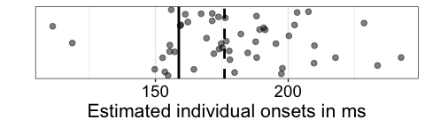<!-- -->

``` r
p.onsets1 <- p
```

## Hierarchical bootstrap

Add measure of uncertainty with percentile bootstrap confidence
intervals (hierarchical bootstrap): sample participants with
replacement; for each sampled participant and condition, sample trials
with replacement, then compute individual onsets + group quantile; also
compute group onset using group t^2 time-course.

``` r
set.seed(666)
nboot <- 2000
boot.onset <- matrix(0, nrow = nboot, ncol = Np)
gp.boot.onset <- vector(mode = "numeric", length = nboot)
boot.ind.diff <- matrix(0, nrow = Np, Nf)

for(B in 1:nboot){
  
  sim.counter(B, nboot, inc = 200)
  
  # sample participants with replacement
  boot.Np <- sample(1:Np, Np, replace = TRUE)

  # non-hierarchical bootstrap
  boot.diff <- ind.diff[boot.Np, ]
  res <- cpt.meanvar(Rfast::ttest(boot.diff, 0)[,1]^2, method = "BinSeg", Q=2)
  boot.onset[B] <- Xf[res@cpts[1]]

  # hierarchical bootstrap: sample trials with replacement
  for(P in 1:Np){
    
    boot.cond1 <- ind.erp[boot.Np[P], 1, sample(1:Nt,Nt,replace=TRUE),]
    boot.cond2 <- ind.erp[boot.Np[P], 2, sample(1:Nt,Nt,replace=TRUE),]
    ori.t2 <- Rfast::ttests(boot.cond2, boot.cond1, paired = FALSE, logged = FALSE)[,1]^2
    res <- cpt.meanvar(ori.t2, method = "BinSeg", Q=2)
    boot.onset[B,P] <- Xf[res@cpts[1]]
    boot.ind.diff[P,] <- apply(ind.erp[boot.Np[P], 1, sample(1:Nt,Nt,replace=TRUE),], 2, mean) - apply(ind.erp[boot.Np[P], 2, sample(1:Nt,Nt,replace=TRUE),], 2, mean)
    
  }
  
  # group onset
  res <- cpt.meanvar(Rfast::ttest(boot.ind.diff, 0)[,1]^2, method = "BinSeg", Q=2)
  gp.boot.onset[B] <- Xf[res@cpts[1]]
}

# quantile of individual onsets for each bootstrap
q.boot.onset <- apply(boot.onset, 1, quantile, seq(0.1,0.9,0.1), type = 8)

save(nboot, boot.onset, gp.boot.onset, q.boot.onset, file = "./data/onsetsim_eeg_group_hb_p50_t100.RData")
```

### Illustration of hierarchical bootstrap group quantile onset estimates

Quantile onset + bootstrap distribution

``` r
load(file = "./data/onsetsim_eeg_group_hb_p50_t100.RData")

alpha.val <- 0.03 # get a 97% CI
ci <- quantile(q.boot.onset[2,], probs = c(alpha.val/2, 1-alpha.val/2), type = 6)
# credMass <- 1- alpha.val # 0.97
# ci <- HDInterval::hdi(q.boot.onset, credMass = credMass)

df <- as_tibble(with(density(q.boot.onset[2,]),data.frame(x,y)))

p <- ggplot(df, aes(x = x, y = y)) + theme_gar +
  geom_vline(xintercept = true_onset, linetype = "dotted") +
  geom_vline(xintercept = qt.onset[2], colour = "black", linewidth = 1) +
  geom_line(size = 2) +
  annotate(geom = "label", x = qt.onset[2]-2, y = 0.25*max(df$y), size = 7,
           colour = "white", fill = "black", fontface = "bold",
           label = paste0(round(qt.onset[2], digits = 0), " ms")) +
  labs(x = "Hierarchical bootstrap group onsets in ms", y = "Density") +
  # confidence interval ----------------------
geom_segment(x = ci[1], xend = ci[2],
             y = 0, yend = 0,
             lineend = "round", linewidth = 3, colour = "orange") +
  annotate(geom = "label", x = ci[1], y = 0.1*max(df$y), size = 7,
           colour = "white", fill = "orange", fontface = "bold",
           label = round(ci[1], digits = 0)) +
  annotate(geom = "label", x = ci[2], y = 0.1*max(df$y), size = 7,
           colour = "white", fill = "orange", fontface = "bold",
           label = round(ci[2], digits = 0)) + 
  theme(axis.text.y = element_blank(),
        axis.ticks.y = element_blank())
```

    ## Warning: Using `size` aesthetic for lines was deprecated in ggplot2 3.4.0.
    ## ℹ Please use `linewidth` instead.
    ## This warning is displayed once every 8 hours.
    ## Call `lifecycle::last_lifecycle_warnings()` to see where this warning was
    ## generated.

``` r
p
```

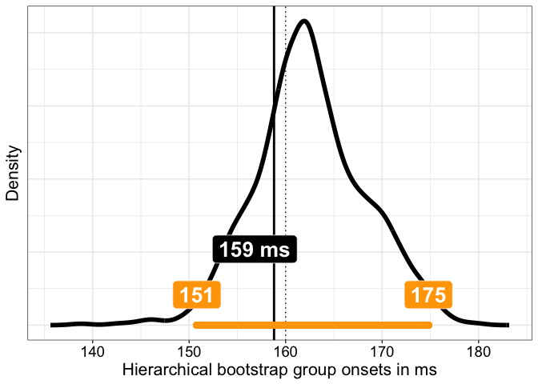<!-- -->

``` r
p.boot1 <- p
```

The offset between the bootstrap distribution and the sample estimate of
0.2 quantile of onsets reflect that this quantity is biased (Rousselet &
Wilcox, 2020). A bootstrap estimate of that bias is given by the
difference between the estimate computed using the original sample and
the mean (or the median) of the bootstrap estimates: Here the mean bias
is 26.1799444 ms.  
Whereas the median bias is 26.2 ms.

### Illustration of hierarchical bootstrap group onset estimates

Group onset + bootstrap distribution

``` r
alpha.val <- 0.03 # get a 97% CI
ci <- quantile(gp.boot.onset, probs = c(alpha.val/2, 1-alpha.val/2), type = 6)
# credMass <- 1- alpha.val # 0.97
# ci <- HDInterval::hdi(boot.onset, credMass = credMass)

df <- as_tibble(with(density(gp.boot.onset),data.frame(x,y)))

p <- ggplot(df, aes(x = x, y = y)) + theme_gar +
  geom_vline(xintercept = true_onset, linetype = "dotted") +
  geom_vline(xintercept = gp.onset, colour = "black", linewidth = 1) +
  geom_line(size = 2) +
  annotate(geom = "label", x = gp.onset-2, y = 0.25*max(df$y), size = 7,
           colour = "white", fill = "black", fontface = "bold",
           label = paste0(round(gp.onset, digits = 0), " ms")) +
  labs(x = "Bootstrap group onsets in ms", y = "Density") +
  # confidence interval ----------------------
geom_segment(x = ci[1], xend = ci[2],
             y = 0, yend = 0,
             lineend = "round", size = 3, colour = "orange") +
  annotate(geom = "label", x = ci[1]-0, y = 0.1*max(df$y), size = 7,
           colour = "white", fill = "orange", fontface = "bold",
           label = round(ci[1], digits = 0)) +
  annotate(geom = "label", x = ci[2]+0, y = 0.1*max(df$y), size = 7,
           colour = "white", fill = "orange", fontface = "bold",
           label = round(ci[2], digits = 0)) + 
  theme(axis.text.y = element_blank(),
        axis.ticks.y = element_blank())
p
```

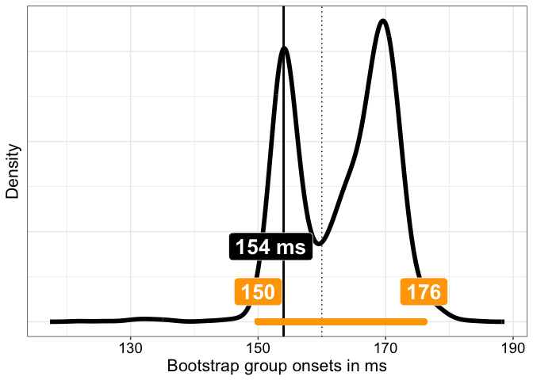<!-- -->

``` r
# p.boot.gp
```

Similar results to the hierarchical approach, but the bootstrap
distribution behaves poorly, with two peaks. Better stick with the
hierarchical approach for now.

# Group inferences using hierarchical bootstrap: 50 participants, 50 trials

Same as above, except with only 50 trials per participant.

## Create individual and group data

``` r
set.seed(6666)
aath <- 0.05 # arbitrary alpha threshold
nboot <- 2000 # number of permutation samples
srate <- 500 # sampling rate in Hz

Nt <- 50 # number of trials
Np <- 50 # number of participants
outvar <- 1 # noise variance

ronset <- seq(130, 190, 2) # onset sequence
# re-sample onsets
ronset <- sample(ronset, size = Np, replace = TRUE) 
# median(ronset) = 160 ms

ind.onset <- vector(mode = "numeric", length = Np) # save individual onsets
ind.erp <- array(data = 0, dim = c(Np, 2, Nt, Nf)) # save individual trials

cond1 <- array(0, dim = c(Nt, Nf))
cond2 <- array(0, dim = c(Nt, Nf))
ind.diff <- array(0, dim = c(Np, Nf))

for(P in 1:Np){ # participants
  
  # make signal template
  ponset <- ronset[P] # get random onset
  st <- which(Xf==ponset) # find starting point
  temp2 <- c(rep(0, st-2), erp*runif(1, min = 0.5, max = 1), rep(0, Nf-st-length(erp)+2)) # pad vector
  
  for(T in 1:Nt){ # add noise
    cond2[T,] <- temp2 + eeg_noise(frames = Nf, srate = srate, outvar = outvar, meanpower)
    cond1[T,] <- temp1 + eeg_noise(frames = Nf, srate = srate, outvar = outvar, meanpower)
  }
  ind.diff[P,] <- colMeans(cond2) - colMeans(cond1)
  ind.erp[P, 1, ,] <- cond1
  ind.erp[P, 2, ,] <- cond2
  
  # two-sample t-test at every time-point:
  ori.t2 <- Rfast::ttests(cond2, cond1, paired = FALSE, logged = FALSE)[,1]^2
  res <- cpt.meanvar(ori.t2, method = "BinSeg", Q=2)
  ind.onset[P] <- Xf[res@cpts[1]]
  
}

gp.diff <- colMeans(ind.diff)

# Estimate group onset as the deciles of the onset distribution
qt.onset <- quantile(ind.onset, probs = seq(0.1, 0.9, 0.1), type = 8)

# Group one-sample t-test on the ERP differences:
gp.t2 <- Rfast::ttest(ind.diff, 0)[,1]^2
# Group onset
res <- cpt.meanvar(gp.t2, method = "BinSeg", Q=2)
gp.onset <- Xf[res@cpts[1]]
```

### Illustrate individual + group data

``` r
df <- tibble(x = rep(Xf, each = Np),
             y = as.vector(ind.diff),
             Participants = factor(rep(1:Np, Nf))
)

df2 <- tibble(x = Xf,
              y = gp.diff,
              Participants = factor(Np+1)) 

p <- ggplot(df, aes(x=x, y=y, group=Participants)) + theme_gar +
  geom_hline(yintercept = 0) +
  geom_line(colour = "grey") +
  # population median onset = true onset = dotted vertical line
  # geom_vline(xintercept = true_onset, linetype = "dotted") +
  # Group onset estimated from group t2 time-course = dot-dash vertical line
  # geom_vline(xintercept = gp.onset, linewidth = 1, linetype = "dotdash") +
  # Group 0.2 quantile = plain vertical line
  geom_vline(xintercept = qt.onset[2], linewidth = 1) +
  # group median onset = dashed vertical line
  geom_vline(xintercept = qt.onset[5], linewidth = 1, colour = "black", linetype = "dashed") +
  geom_line(data = df2, aes(x=x, y=y), colour = "black", linewidth = 2) +
  scale_x_continuous(breaks = seq(0, 500, 50)) +
  labs(x = "Time in ms", y = "Signal in arbitrary units") 
p
```

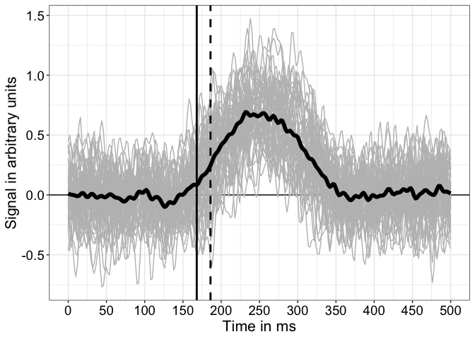<!-- -->

``` r
p.ERP2 <- p
```

Individual ERP differences in grey.  
Group average in black.  
not plotted (Vertical dotted line = population onset = 160 ms).  
not plotted (Vertical dot-dash line = onset estimated from group t^2
time-course = 170 ms).  
Vertical thick black line = 0.2 quantile of distribution of individual
onset estimates = 168 ms.  
Vertical thick black dashed line = median of distribution of individual
onset estimates = 186 ms.

## Group + individual onsets

Group onset is estimated as the 0.2 quantile of the onset distribution
(thick black line).

Median appears as thick black dashed line.

not plotted (True onset is marked with dotted line.)

not plotted (The dot-dash line indicates the onset estimated from the
group t^2 time-course.)

``` r
set.seed(666)

df <- tibble(x = ind.onset, y = rep(1, Np))

p <- ggplot(df, aes(x = x, y = y)) + theme_gar +
  # geom_vline(xintercept = gp.onset, linewidth = 1, linetype = "dotdash") +
  geom_vline(xintercept = qt.onset[2], linewidth = 1) +
  # geom_vline(xintercept = true_onset, linetype = "dotted") +
  geom_vline(xintercept = qt.onset[5], linewidth = 1, colour = "black", linetype = "dashed") +
  geom_jitter(height = 0.4, colour = "black", alpha = 0.5, size = 2) +
  labs(x = "Estimated individual onsets in ms") +
  # coord_cartesian(xlim = c(100, 250), ylim = c(0, 2)) +
  theme(axis.title.y = element_blank(),
        axis.ticks.y = element_blank(),
        axis.text.y = element_text(colour = "white"),
        panel.grid.major.y = element_blank(),
        panel.grid.minor.y = element_blank())
p
```

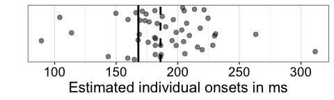<!-- -->

``` r
p.onsets2 <- p
```

## Hierarchical bootstrap

``` r
set.seed(666)
nboot <- 2000
boot.onset <- matrix(0, nrow = nboot, ncol = Np)
gp.boot.onset <- vector(mode = "numeric", length = nboot)
boot.ind.diff <- matrix(0, nrow = Np, Nf)

for(B in 1:nboot){
  
  sim.counter(B, nboot, inc = 200)
  
  # sample participants with replacement
  boot.Np <- sample(1:Np, Np, replace = TRUE)

  # non-hierarchical bootstrap
  boot.diff <- ind.diff[boot.Np, ]
  res <- cpt.meanvar(Rfast::ttest(boot.diff, 0)[,1]^2, method = "BinSeg", Q=2)
  boot.onset[B] <- Xf[res@cpts[1]]

  # hierarchical bootstrap: sample trials with replacement
  for(P in 1:Np){
    
    boot.cond1 <- ind.erp[boot.Np[P], 1, sample(1:Nt,Nt,replace=TRUE),]
    boot.cond2 <- ind.erp[boot.Np[P], 2, sample(1:Nt,Nt,replace=TRUE),]
    ori.t2 <- Rfast::ttests(boot.cond2, boot.cond1, paired = FALSE, logged = FALSE)[,1]^2
    res <- cpt.meanvar(ori.t2, method = "BinSeg", Q=2)
    boot.onset[B,P] <- Xf[res@cpts[1]]
    boot.ind.diff[P,] <- apply(ind.erp[boot.Np[P], 1, sample(1:Nt,Nt,replace=TRUE),], 2, mean) - apply(ind.erp[boot.Np[P], 2, sample(1:Nt,Nt,replace=TRUE),], 2, mean)
    
  }
  
  # group onset
  res <- cpt.meanvar(Rfast::ttest(boot.ind.diff, 0)[,1]^2, method = "BinSeg", Q=2)
  gp.boot.onset[B] <- Xf[res@cpts[1]]
}

# quantile of individual onsets for each bootstrap
q.boot.onset <- apply(boot.onset, 1, quantile, seq(0.1,0.9,0.1), type = 8)

save(nboot, boot.onset, gp.boot.onset, q.boot.onset, file = "./data/onsetsim_eeg_group_hb_p50_t50.RData")
```

### Illustration of hierarchical bootstrap group quantile onset estimates

Quantile onset + bootstrap distribution

``` r
load(file = "./data/onsetsim_eeg_group_hb_p50_t50.RData")

alpha.val <- 0.03 # get a 97% CI
ci <- quantile(q.boot.onset[2,], probs = c(alpha.val/2, 1-alpha.val/2), type = 6)
# credMass <- 1- alpha.val # 0.97
# ci <- HDInterval::hdi(q.boot.onset, credMass = credMass)

df <- as_tibble(with(density(q.boot.onset[2,]),data.frame(x,y)))

p <- ggplot(df, aes(x = x, y = y)) + theme_gar +
  geom_vline(xintercept = true_onset, linetype = "dotted") +
  geom_vline(xintercept = qt.onset[2], colour = "black", linewidth = 1) +
  geom_line(size = 2) +
  annotate(geom = "label", x = qt.onset[2]-2, y = 0.25*max(df$y), size = 7,
           colour = "white", fill = "black", fontface = "bold",
           label = paste0(round(qt.onset[2], digits = 0), " ms")) +
  labs(x = "Hierarchical bootstrap group onsets in ms", y = "Density") +
  # confidence interval ----------------------
geom_segment(x = ci[1], xend = ci[2],
             y = 0, yend = 0,
             lineend = "round", linewidth = 3, colour = "orange") +
  annotate(geom = "label", x = ci[1]+0.15, y = 0.1*max(df$y), size = 7,
           colour = "white", fill = "orange", fontface = "bold",
           label = round(ci[1], digits = 0)) +
  annotate(geom = "label", x = ci[2]-0.15, y = 0.1*max(df$y), size = 7,
           colour = "white", fill = "orange", fontface = "bold",
           label = round(ci[2], digits = 0)) + 
  theme(axis.text.y = element_blank(),
        axis.ticks.y = element_blank())
p
```

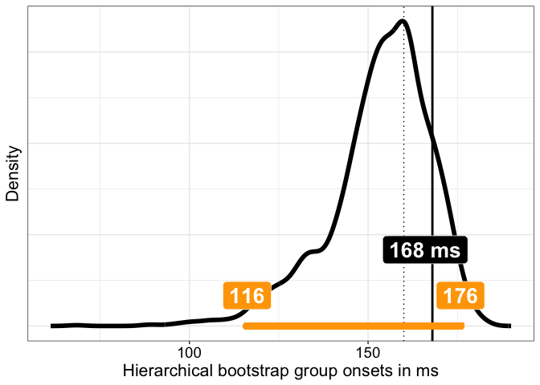<!-- -->

``` r
p.boot2 <- p
```

# Group inferences using hierarchical bootstrap: 50 participants, 30 trials

## Create individual and group data

``` r
set.seed(6666)
aath <- 0.05 # arbitrary alpha threshold
nboot <- 2000 # number of permutation samples
srate <- 500 # sampling rate in Hz

Nt <- 30 # number of trials
Np <- 50 # number of participants
outvar <- 1 # noise variance

ronset <- seq(130, 190, 2) # onset sequence
# re-sample onsets
ronset <- sample(ronset, size = Np, replace = TRUE) 
# median(ronset) = 160 ms

ind.onset <- vector(mode = "numeric", length = Np) # save individual onsets
ind.erp <- array(data = 0, dim = c(Np, 2, Nt, Nf)) # save individual trials

cond1 <- array(0, dim = c(Nt, Nf))
cond2 <- array(0, dim = c(Nt, Nf))
ind.diff <- array(0, dim = c(Np, Nf))

for(P in 1:Np){ # participants
  
  # make signal template
  ponset <- ronset[P] # get random onset
  st <- which(Xf==ponset) # find starting point
  temp2 <- c(rep(0, st-2), erp*runif(1, min = 0.5, max = 1), rep(0, Nf-st-length(erp)+2)) # pad vector
  
  for(T in 1:Nt){ # add noise
    cond2[T,] <- temp2 + eeg_noise(frames = Nf, srate = srate, outvar = outvar, meanpower)
    cond1[T,] <- temp1 + eeg_noise(frames = Nf, srate = srate, outvar = outvar, meanpower)
  }
  ind.diff[P,] <- colMeans(cond2) - colMeans(cond1)
  ind.erp[P, 1, ,] <- cond1
  ind.erp[P, 2, ,] <- cond2
  
  # two-sample t-test at every time-point:
  ori.t2 <- Rfast::ttests(cond2, cond1, paired = FALSE, logged = FALSE)[,1]^2
  res <- cpt.meanvar(ori.t2, method = "BinSeg", Q=2)
  ind.onset[P] <- Xf[res@cpts[1]]
  
}

gp.diff <- colMeans(ind.diff)

# Estimate group onset as the deciles of the onset distribution
qt.onset <- quantile(ind.onset, probs = seq(0.1, 0.9, 0.1), type = 8)

# Group one-sample t-test on the ERP differences:
gp.t2 <- Rfast::ttest(ind.diff, 0)[,1]^2
# Group onset
res <- cpt.meanvar(gp.t2, method = "BinSeg", Q=2)
gp.onset <- Xf[res@cpts[1]]
```

### Illustrate individual + group data

``` r
df <- tibble(x = rep(Xf, each = Np),
             y = as.vector(ind.diff),
             Participants = factor(rep(1:Np, Nf))
)

df2 <- tibble(x = Xf,
              y = gp.diff,
              Participants = factor(Np+1)) 

p <- ggplot(df, aes(x=x, y=y, group=Participants)) + theme_gar +
  geom_hline(yintercept = 0) +
  geom_line(colour = "grey") +
  # population median onset = true onset = dotted vertical line
  # geom_vline(xintercept = true_onset, linetype = "dotted") +
  # Group onset estimated from group t2 time-course = dot-dash vertical line
  # geom_vline(xintercept = gp.onset, linewidth = 1, linetype = "dotdash") +
  # Group 0.2 quantile = plain vertical line
  geom_vline(xintercept = qt.onset[2], linewidth = 1) +
  # group median onset = dashed vertical line
  geom_vline(xintercept = qt.onset[5], linewidth = 1, colour = "black", linetype = "dashed") +
  geom_line(data = df2, aes(x=x, y=y), colour = "black", linewidth = 2) +
  scale_x_continuous(breaks = seq(0, 500, 50)) +
  labs(x = "Time in ms", y = "Signal in arbitrary units") 
p
```

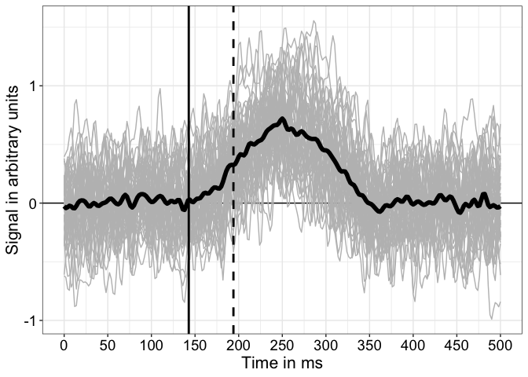<!-- -->

``` r
p.ERP3 <- p
```

Individual ERP differences in grey.  
Group average in black.  
not plotted (Vertical dotted line = population onset = 160 ms).  
not plotted (Vertical dot-dash line = onset estimated from group t^2
time-course = 166 ms).  
Vertical thick black line = 0.2 quantile of distribution of individual
onset estimates = 142.8 ms.  
Vertical thick black dashed line = median of distribution of individual
onset estimates = 194 ms.

## Group + individual onsets

Group onset is estimated as the 0.2 quantile of the onset distribution
(thick black line).

Median appears as thick black dashed line.

not plotted (True onset is marked with dotted line.)

not plotted (The dot-dash line indicates the onset estimated from the
group t^2 time-course.)

``` r
set.seed(666)

df <- tibble(x = ind.onset, y = rep(1, Np))

p <- ggplot(df, aes(x = x, y = y)) + theme_gar +
  # geom_vline(xintercept = gp.onset, linewidth = 1, linetype = "dotdash") +
  geom_vline(xintercept = qt.onset[2], linewidth = 1) +
  # geom_vline(xintercept = true_onset, linetype = "dotted") +
  geom_vline(xintercept = qt.onset[5], linewidth = 1, colour = "black", linetype = "dashed") +
  geom_jitter(height = 0.4, colour = "black", alpha = 0.5, size = 2) +
  labs(x = "Estimated individual onsets in ms") +
  # coord_cartesian(xlim = c(100, 250), ylim = c(0, 2)) +
  theme(axis.title.y = element_blank(),
        axis.ticks.y = element_blank(),
        axis.text.y = element_text(colour = "white"),
        panel.grid.major.y = element_blank(),
        panel.grid.minor.y = element_blank())
p
```

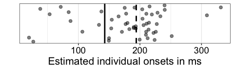<!-- -->

``` r
p.onsets3 <- p
```

## Hierarchical bootstrap

``` r
set.seed(666)
nboot <- 2000
boot.onset <- matrix(0, nrow = nboot, ncol = Np)
gp.boot.onset <- vector(mode = "numeric", length = nboot)
boot.ind.diff <- matrix(0, nrow = Np, Nf)

for(B in 1:nboot){
  
  sim.counter(B, nboot, inc = 200)
  
  # sample participants with replacement
  boot.Np <- sample(1:Np, Np, replace = TRUE)

  # non-hierarchical bootstrap
  boot.diff <- ind.diff[boot.Np, ]
  res <- cpt.meanvar(Rfast::ttest(boot.diff, 0)[,1]^2, method = "BinSeg", Q=2)
  boot.onset[B] <- Xf[res@cpts[1]]

  # hierarchical bootstrap: sample trials with replacement
  for(P in 1:Np){
    
    boot.cond1 <- ind.erp[boot.Np[P], 1, sample(1:Nt,Nt,replace=TRUE),]
    boot.cond2 <- ind.erp[boot.Np[P], 2, sample(1:Nt,Nt,replace=TRUE),]
    ori.t2 <- Rfast::ttests(boot.cond2, boot.cond1, paired = FALSE, logged = FALSE)[,1]^2
    res <- cpt.meanvar(ori.t2, method = "BinSeg", Q=2)
    boot.onset[B,P] <- Xf[res@cpts[1]]
    boot.ind.diff[P,] <- apply(ind.erp[boot.Np[P], 1, sample(1:Nt,Nt,replace=TRUE),], 2, mean) - apply(ind.erp[boot.Np[P], 2, sample(1:Nt,Nt,replace=TRUE),], 2, mean)
    
  }
  
  # group onset
  res <- cpt.meanvar(Rfast::ttest(boot.ind.diff, 0)[,1]^2, method = "BinSeg", Q=2)
  gp.boot.onset[B] <- Xf[res@cpts[1]]
}

# quantile of individual onsets for each bootstrap
q.boot.onset <- apply(boot.onset, 1, quantile, seq(0.1,0.9,0.1), type = 8)

save(nboot, boot.onset, gp.boot.onset, q.boot.onset, file = "./data/onsetsim_eeg_group_hb_p50_t30.RData")
```

### Illustration of hierarchical bootstrap group quantile onset estimates

Quantile onset + bootstrap distribution

``` r
load(file = "./data/onsetsim_eeg_group_hb_p50_t30.RData")

alpha.val <- 0.03 # get a 97% CI
ci <- quantile(q.boot.onset[2,], probs = c(alpha.val/2, 1-alpha.val/2), type = 6)
# credMass <- 1- alpha.val # 0.97
# ci <- HDInterval::hdi(q.boot.onset, credMass = credMass)

df <- as_tibble(with(density(q.boot.onset[2,]),data.frame(x,y)))

p <- ggplot(df, aes(x = x, y = y)) + theme_gar +
  geom_vline(xintercept = true_onset, linetype = "dotted") +
  geom_vline(xintercept = qt.onset[2], colour = "black", linewidth = 1) +
  geom_line(size = 2) +
  annotate(geom = "label", x = qt.onset[2]-2, y = 0.25*max(df$y), size = 7,
           colour = "white", fill = "black", fontface = "bold",
           label = paste0(round(qt.onset[2], digits = 0), " ms")) +
  labs(x = "Hierarchical bootstrap group onsets in ms", y = "Density") +
  # confidence interval ----------------------
  geom_segment(x = ci[1], xend = ci[2],
             y = 0, yend = 0,
             lineend = "round", linewidth = 3, colour = "orange") +
  annotate(geom = "label", x = ci[1]+0.15, y = 0.1*max(df$y), size = 7,
           colour = "white", fill = "orange", fontface = "bold",
           label = round(ci[1], digits = 0)) +
  annotate(geom = "label", x = ci[2]-0.15, y = 0.1*max(df$y), size = 7,
           colour = "white", fill = "orange", fontface = "bold",
           label = round(ci[2], digits = 0)) + 
  theme(axis.text.y = element_blank(),
        axis.ticks.y = element_blank())
p
```

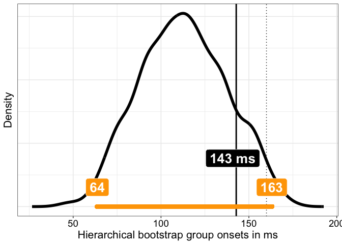<!-- -->

``` r
p.boot3 <- p
```

# Combine panels

A = 50 participants, 100 trials.  
B = 50 participants, 50 trials.  
C = 50 participants, 30 trials.

``` r
cowplot::plot_grid(p.ERP1, p.ERP2, p.ERP3,
                   p.onsets1 + coord_cartesian(xlim = c(0, 350), expand=TRUE), 
                   p.onsets2 + coord_cartesian(xlim = c(0, 350), expand=TRUE), 
                   p.onsets3 + coord_cartesian(xlim = c(0, 350), expand=TRUE),
                   p.boot1 + coord_cartesian(xlim = c(25, 200), expand=TRUE), 
                   p.boot2 + coord_cartesian(xlim = c(25, 200), expand=TRUE), 
                   p.boot3 + coord_cartesian(xlim = c(25, 200), expand=TRUE),
                   nrow = 3,
                   ncol = 3, 
                   labels = c("A", "B", "C", 
                              " ", " ", " ",
                              " ", " ", " "),
                   rel_heights = c(1, 0.3, 1, 1, 0.3, 1, 1, 0.3, 1),
                   label_size = 20)

ggsave(filename = "./figures/onsetsim_eeg_group_hb.pdf", width = 20, height = 12)
```

# Group inferences using hierarchical bootstrap: 100 participants, 50 trials

Same approach as in `onsetsim_eeg_group.hb.Rmd`, but instead of varying
the number of trials, we vary the number of participants, keeping n=50
trials constant.

## Create individual and group data

``` r
set.seed(6666)
aath <- 0.05 # arbitrary alpha threshold
nboot <- 2000 # number of permutation samples
srate <- 500 # sampling rate in Hz

Nt <- 50 # number of trials
Np <- 100 # number of participants
outvar <- 1 # noise variance

ronset <- seq(130, 190, 2) # onset sequence
# re-sample onsets
ronset <- sample(ronset, size = Np, replace = TRUE) 
# median(ronset) = 160 ms

ind.onset <- vector(mode = "numeric", length = Np) # save individual onsets
ind.erp <- array(data = 0, dim = c(Np, 2, Nt, Nf)) # save individual trials

cond1 <- array(0, dim = c(Nt, Nf))
cond2 <- array(0, dim = c(Nt, Nf))
ind.diff <- array(0, dim = c(Np, Nf))

for(P in 1:Np){ # participants
  
  # make signal template
  ponset <- ronset[P] # get random onset
  st <- which(Xf==ponset) # find starting point
  temp2 <- c(rep(0, st-2), erp*runif(1, min = 0.5, max = 1), rep(0, Nf-st-length(erp)+2)) # pad vector
  
  for(T in 1:Nt){ # add noise
    cond2[T,] <- temp2 + eeg_noise(frames = Nf, srate = srate, outvar = outvar, meanpower)
    cond1[T,] <- temp1 + eeg_noise(frames = Nf, srate = srate, outvar = outvar, meanpower)
  }
  ind.diff[P,] <- colMeans(cond2) - colMeans(cond1)
  ind.erp[P, 1, ,] <- cond1
  ind.erp[P, 2, ,] <- cond2
  
  # two-sample t-test at every time-point:
  ori.t2 <- Rfast::ttests(cond2, cond1, paired = FALSE, logged = FALSE)[,1]^2
  res <- cpt.meanvar(ori.t2, method = "BinSeg", Q=2)
  ind.onset[P] <- Xf[res@cpts[1]]
  
}

gp.diff <- colMeans(ind.diff)

# Estimate group onset as the deciles of the onset distribution
qt.onset <- quantile(ind.onset, probs = seq(0.1, 0.9, 0.1), type = 8)

# Group one-sample t-test on the ERP differences:
gp.t2 <- Rfast::ttest(ind.diff, 0)[,1]^2
# Group onset
res <- cpt.meanvar(gp.t2, method = "BinSeg", Q=2)
gp.onset <- Xf[res@cpts[1]]
```

### Illustrate individual + group data

``` r
df <- tibble(x = rep(Xf, each = Np),
             y = as.vector(ind.diff),
             Participants = factor(rep(1:Np, Nf))
)

df2 <- tibble(x = Xf,
              y = gp.diff,
              Participants = factor(Np+1)) 

p <- ggplot(df, aes(x=x, y=y, group=Participants)) + theme_gar +
  geom_hline(yintercept = 0) +
  geom_line(colour = "grey") +
  # population median onset = true onset = dotted vertical line
  # geom_vline(xintercept = true_onset, linetype = "dotted") +
  # Group onset estimated from group t2 time-course = dot-dash vertical line
  # geom_vline(xintercept = gp.onset, linewidth = 1, linetype = "dotdash") +
  # Group 0.2 quantile = plain vertical line
  geom_vline(xintercept = qt.onset[2], linewidth = 1) +
  # group median onset = dashed vertical line
  geom_vline(xintercept = qt.onset[5], linewidth = 1, colour = "black", linetype = "dashed") +
  geom_line(data = df2, aes(x=x, y=y), colour = "black", linewidth = 2) +
  scale_x_continuous(breaks = seq(0, 500, 50)) +
  labs(x = "Time in ms", y = "Signal in arbitrary units") 
p
```

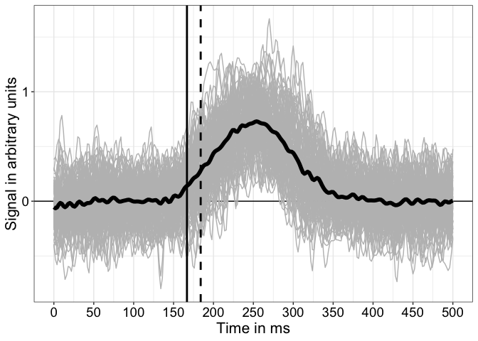<!-- -->

``` r
p.ERP4 <- p
```

Individual ERP differences in grey.  
Group average in black.  
not plotted (Vertical dotted line = population onset = 160 ms).  
not plotted (Vertical dot-dash line = onset estimated from group t^2
time-course = 158 ms).  
Vertical thick black line = 0.2 quantile of distribution of individual
onset estimates = 166.8 ms.  
Vertical thick black dashed line = median of distribution of individual
onset estimates = 184 ms.

## Group + individual onsets

Group onset is estimated as the 0.2 quantile of the onset distribution
(thick black line).

Median appears as thick black dashed line.

not plotted (True onset is marked with dotted line.)

not plotted (The dot-dash line indicates the onset estimated from the
group t^2 time-course.)

``` r
set.seed(666)

df <- tibble(x = ind.onset, y = rep(1, Np))

p <- ggplot(df, aes(x = x, y = y)) + theme_gar +
  # geom_vline(xintercept = gp.onset, linewidth = 1, linetype = "dotdash") +
  geom_vline(xintercept = qt.onset[2], linewidth = 1) +
  # geom_vline(xintercept = true_onset, linetype = "dotted") +
  geom_vline(xintercept = qt.onset[5], linewidth = 1, colour = "black", linetype = "dashed") +
  geom_jitter(height = 0.4, colour = "black", alpha = 0.5, size = 2) +
  labs(x = "Estimated individual onsets in ms") +
  # coord_cartesian(xlim = c(100, 250), ylim = c(0, 2)) +
  theme(axis.title.y = element_blank(),
        axis.ticks.y = element_blank(),
        axis.text.y = element_text(colour = "white"),
        panel.grid.major.y = element_blank(),
        panel.grid.minor.y = element_blank())
p
```

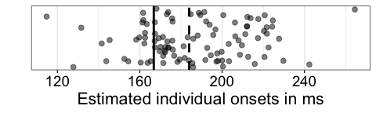<!-- -->

``` r
p.onsets4 <- p
```

## Hierarchical bootstrap

Add measure of uncertainty with percentile bootstrap confidence
intervals (hierarchical bootstrap): sample participants with
replacement; for each sampled participant and condition, sample trials
with replacement, then compute individual onsets + group quantile; also
compute group onset using group t^2 time-course.

``` r
set.seed(666)
nboot <- 2000
boot.onset <- matrix(0, nrow = nboot, ncol = Np)
gp.boot.onset <- vector(mode = "numeric", length = nboot)
boot.ind.diff <- matrix(0, nrow = Np, Nf)

for(B in 1:nboot){
  
  sim.counter(B, nboot, inc = 200)
  
  # sample participants with replacement
  boot.Np <- sample(1:Np, Np, replace = TRUE)

  # non-hierarchical bootstrap
  boot.diff <- ind.diff[boot.Np, ]
  res <- cpt.meanvar(Rfast::ttest(boot.diff, 0)[,1]^2, method = "BinSeg", Q=2)
  boot.onset[B] <- Xf[res@cpts[1]]

  # hierarchical bootstrap: sample trials with replacement
  for(P in 1:Np){
    
    boot.cond1 <- ind.erp[boot.Np[P], 1, sample(1:Nt,Nt,replace=TRUE),]
    boot.cond2 <- ind.erp[boot.Np[P], 2, sample(1:Nt,Nt,replace=TRUE),]
    ori.t2 <- Rfast::ttests(boot.cond2, boot.cond1, paired = FALSE, logged = FALSE)[,1]^2
    res <- cpt.meanvar(ori.t2, method = "BinSeg", Q=2)
    boot.onset[B,P] <- Xf[res@cpts[1]]
    boot.ind.diff[P,] <- apply(ind.erp[boot.Np[P], 1, sample(1:Nt,Nt,replace=TRUE),], 2, mean) - apply(ind.erp[boot.Np[P], 2, sample(1:Nt,Nt,replace=TRUE),], 2, mean)
    
  }
  
  # group onset
  res <- cpt.meanvar(Rfast::ttest(boot.ind.diff, 0)[,1]^2, method = "BinSeg", Q=2)
  gp.boot.onset[B] <- Xf[res@cpts[1]]
}

# quantile of individual onsets for each bootstrap
q.boot.onset <- apply(boot.onset, 1, quantile, seq(0.1,0.9,0.1), type = 8)

save(nboot, boot.onset, gp.boot.onset, q.boot.onset, file = "./data/onsetsim_eeg_group_hb_p100_t50.RData")
```

### Illustration of hierarchical bootstrap group quantile onset estimates

Quantile onset + bootstrap distribution

``` r
load(file = "./data/onsetsim_eeg_group_hb_p100_t50.RData")

alpha.val <- 0.03 # get a 97% CI
ci <- quantile(q.boot.onset[2,], probs = c(alpha.val/2, 1-alpha.val/2), type = 6)
# credMass <- 1- alpha.val # 0.97
# ci <- HDInterval::hdi(q.boot.onset, credMass = credMass)

df <- as_tibble(with(density(q.boot.onset[2,]),data.frame(x,y)))

p <- ggplot(df, aes(x = x, y = y)) + theme_gar +
  geom_vline(xintercept = true_onset, linetype = "dotted") +
  geom_vline(xintercept = qt.onset[2], colour = "black", linewidth = 1) +
  geom_line(size = 2) +
  annotate(geom = "label", x = qt.onset[2]-2, y = 0.25*max(df$y), size = 7,
           colour = "white", fill = "black", fontface = "bold",
           label = paste0(round(qt.onset[2], digits = 0), " ms")) +
  labs(x = "Hierarchical bootstrap group onsets in ms", y = "Density") +
  # confidence interval ----------------------
geom_segment(x = ci[1], xend = ci[2],
             y = 0, yend = 0,
             lineend = "round", linewidth = 3, colour = "orange") +
  annotate(geom = "label", x = ci[1]+0.15, y = 0.1*max(df$y), size = 7,
           colour = "white", fill = "orange", fontface = "bold",
           label = round(ci[1], digits = 0)) +
  annotate(geom = "label", x = ci[2]-0.15, y = 0.1*max(df$y), size = 7,
           colour = "white", fill = "orange", fontface = "bold",
           label = round(ci[2], digits = 0)) + 
  theme(axis.text.y = element_blank(),
        axis.ticks.y = element_blank())
p
```

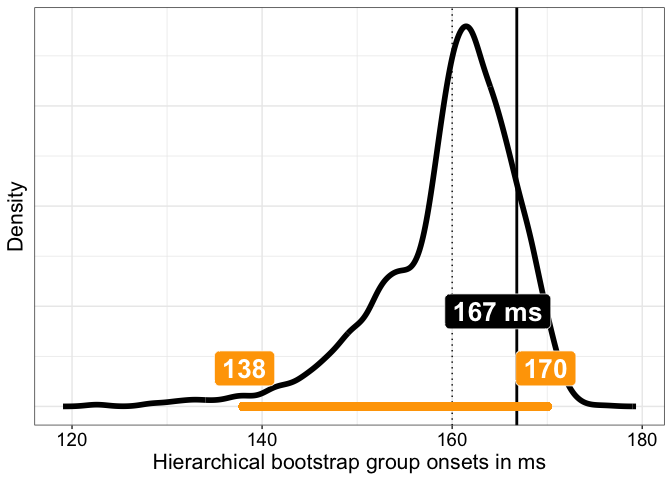<!-- -->

``` r
p.boot4 <- p
```

# Group inferences using hierarchical bootstrap: 50 participants, 50 trials

Same as above, except with only 50 trials per participant.

## Create individual and group data

``` r
set.seed(6666)
aath <- 0.05 # arbitrary alpha threshold
nboot <- 2000 # number of permutation samples
srate <- 500 # sampling rate in Hz

Nt <- 50 # number of trials
Np <- 50 # number of participants
outvar <- 1 # noise variance

ronset <- seq(130, 190, 2) # onset sequence
# re-sample onsets
ronset <- sample(ronset, size = Np, replace = TRUE) 
# median(ronset) = 160 ms

ind.onset <- vector(mode = "numeric", length = Np) # save individual onsets
ind.erp <- array(data = 0, dim = c(Np, 2, Nt, Nf)) # save individual trials

cond1 <- array(0, dim = c(Nt, Nf))
cond2 <- array(0, dim = c(Nt, Nf))
ind.diff <- array(0, dim = c(Np, Nf))

for(P in 1:Np){ # participants
  
  # make signal template
  ponset <- ronset[P] # get random onset
  st <- which(Xf==ponset) # find starting point
  temp2 <- c(rep(0, st-2), erp*runif(1, min = 0.5, max = 1), rep(0, Nf-st-length(erp)+2)) # pad vector
  
  for(T in 1:Nt){ # add noise
    cond2[T,] <- temp2 + eeg_noise(frames = Nf, srate = srate, outvar = outvar, meanpower)
    cond1[T,] <- temp1 + eeg_noise(frames = Nf, srate = srate, outvar = outvar, meanpower)
  }
  ind.diff[P,] <- colMeans(cond2) - colMeans(cond1)
  ind.erp[P, 1, ,] <- cond1
  ind.erp[P, 2, ,] <- cond2
  
  # two-sample t-test at every time-point:
  ori.t2 <- Rfast::ttests(cond2, cond1, paired = FALSE, logged = FALSE)[,1]^2
  res <- cpt.meanvar(ori.t2, method = "BinSeg", Q=2)
  ind.onset[P] <- Xf[res@cpts[1]]
  
}

gp.diff <- colMeans(ind.diff)

# Estimate group onset as the deciles of the onset distribution
qt.onset <- quantile(ind.onset, probs = seq(0.1, 0.9, 0.1), type = 8)

# Group one-sample t-test on the ERP differences:
gp.t2 <- Rfast::ttest(ind.diff, 0)[,1]^2
# Group onset
res <- cpt.meanvar(gp.t2, method = "BinSeg", Q=2)
gp.onset <- Xf[res@cpts[1]]
```

### Illustrate individual + group data

``` r
df <- tibble(x = rep(Xf, each = Np),
             y = as.vector(ind.diff),
             Participants = factor(rep(1:Np, Nf))
)

df2 <- tibble(x = Xf,
              y = gp.diff,
              Participants = factor(Np+1)) 

p <- ggplot(df, aes(x=x, y=y, group=Participants)) + theme_gar +
  geom_hline(yintercept = 0) +
  geom_line(colour = "grey") +
  # population median onset = true onset = dotted vertical line
  # geom_vline(xintercept = true_onset, linetype = "dotted") +
  # Group onset estimated from group t2 time-course = dot-dash vertical line
  # geom_vline(xintercept = gp.onset, linewidth = 1, linetype = "dotdash") +
  # Group 0.2 quantile = plain vertical line
  geom_vline(xintercept = qt.onset[2], linewidth = 1) +
  # group median onset = dashed vertical line
  geom_vline(xintercept = qt.onset[5], linewidth = 1, colour = "black", linetype = "dashed") +
  geom_line(data = df2, aes(x=x, y=y), colour = "black", linewidth = 2) +
  scale_x_continuous(breaks = seq(0, 500, 50)) +
  labs(x = "Time in ms", y = "Signal in arbitrary units") 
p
```

<!-- -->

``` r
p.ERP5 <- p
```

Individual ERP differences in grey.  
Group average in black.  
not plotted (Vertical dotted line = population onset = 160 ms).  
not plotted (Vertical dot-dash line = onset estimated from group t^2
time-course = 170 ms).  
Vertical thick black line = 0.2 quantile of distribution of individual
onset estimates = 168 ms.  
Vertical thick black dashed line = median of distribution of individual
onset estimates = 186 ms.

## Group + individual onsets

Group onset is estimated as the 0.2 quantile of the onset distribution
(thick black line).

Median appears as thick black dashed line.

not plotted (True onset is marked with dotted line.)

not plotted (The dot-dash line indicates the onset estimated from the
group t^2 time-course.)

``` r
set.seed(666)

df <- tibble(x = ind.onset, y = rep(1, Np))

p <- ggplot(df, aes(x = x, y = y)) + theme_gar +
  # geom_vline(xintercept = gp.onset, linewidth = 1, linetype = "dotdash") +
  geom_vline(xintercept = qt.onset[2], linewidth = 1) +
  # geom_vline(xintercept = true_onset, linetype = "dotted") +
  geom_vline(xintercept = qt.onset[5], linewidth = 1, colour = "black", linetype = "dashed") +
  geom_jitter(height = 0.4, colour = "black", alpha = 0.5, size = 2) +
  labs(x = "Estimated individual onsets in ms") +
  # coord_cartesian(xlim = c(100, 250), ylim = c(0, 2)) +
  theme(axis.title.y = element_blank(),
        axis.ticks.y = element_blank(),
        axis.text.y = element_text(colour = "white"),
        panel.grid.major.y = element_blank(),
        panel.grid.minor.y = element_blank())
p
```

<!-- -->

``` r
p.onsets5 <- p
```

## Hierarchical bootstrap

Done in `onsetsim_eeg_group_hb2.Rmd`.

### Illustration of hierarchical bootstrap group quantile onset estimates

Quantile onset + bootstrap distribution

``` r
load(file = "./data/onsetsim_eeg_group_hb_p50_t50.RData")

alpha.val <- 0.03 # get a 97% CI
ci <- quantile(q.boot.onset[2,], probs = c(alpha.val/2, 1-alpha.val/2), type = 6)
# credMass <- 1- alpha.val # 0.97
# ci <- HDInterval::hdi(q.boot.onset, credMass = credMass)

df <- as_tibble(with(density(q.boot.onset[2,]),data.frame(x,y)))

p <- ggplot(df, aes(x = x, y = y)) + theme_gar +
  geom_vline(xintercept = true_onset, linetype = "dotted") +
  geom_vline(xintercept = qt.onset[2], colour = "black", linewidth = 1) +
  geom_line(size = 2) +
  annotate(geom = "label", x = qt.onset[2]-2, y = 0.25*max(df$y), size = 7,
           colour = "white", fill = "black", fontface = "bold",
           label = paste0(round(qt.onset[2], digits = 0), " ms")) +
  labs(x = "Hierarchical bootstrap group onsets in ms", y = "Density") +
  # confidence interval ----------------------
geom_segment(x = ci[1], xend = ci[2],
             y = 0, yend = 0,
             lineend = "round", linewidth = 3, colour = "orange") +
  annotate(geom = "label", x = ci[1]+0.15, y = 0.1*max(df$y), size = 7,
           colour = "white", fill = "orange", fontface = "bold",
           label = round(ci[1], digits = 0)) +
  annotate(geom = "label", x = ci[2]-0.15, y = 0.1*max(df$y), size = 7,
           colour = "white", fill = "orange", fontface = "bold",
           label = round(ci[2], digits = 0)) + 
  theme(axis.text.y = element_blank(),
        axis.ticks.y = element_blank())
p
```

<!-- -->

``` r
p.boot5 <- p
```

# Group inferences using hierarchical bootstrap: 30 participants, 50 trials

## Create individual and group data

``` r
set.seed(6666)
aath <- 0.05 # arbitrary alpha threshold
nboot <- 2000 # number of permutation samples
srate <- 500 # sampling rate in Hz

Nt <- 50 # number of trials
Np <- 30 # number of participants
outvar <- 1 # noise variance

ronset <- seq(130, 190, 2) # onset sequence
# re-sample onsets
ronset <- sample(ronset, size = Np, replace = TRUE) 
# median(ronset) = 160 ms

ind.onset <- vector(mode = "numeric", length = Np) # save individual onsets
ind.erp <- array(data = 0, dim = c(Np, 2, Nt, Nf)) # save individual trials

cond1 <- array(0, dim = c(Nt, Nf))
cond2 <- array(0, dim = c(Nt, Nf))
ind.diff <- array(0, dim = c(Np, Nf))

for(P in 1:Np){ # participants
  
  # make signal template
  ponset <- ronset[P] # get random onset
  st <- which(Xf==ponset) # find starting point
  temp2 <- c(rep(0, st-2), erp*runif(1, min = 0.5, max = 1), rep(0, Nf-st-length(erp)+2)) # pad vector
  
  for(T in 1:Nt){ # add noise
    cond2[T,] <- temp2 + eeg_noise(frames = Nf, srate = srate, outvar = outvar, meanpower)
    cond1[T,] <- temp1 + eeg_noise(frames = Nf, srate = srate, outvar = outvar, meanpower)
  }
  ind.diff[P,] <- colMeans(cond2) - colMeans(cond1)
  ind.erp[P, 1, ,] <- cond1
  ind.erp[P, 2, ,] <- cond2
  
  # two-sample t-test at every time-point:
  ori.t2 <- Rfast::ttests(cond2, cond1, paired = FALSE, logged = FALSE)[,1]^2
  res <- cpt.meanvar(ori.t2, method = "BinSeg", Q=2)
  ind.onset[P] <- Xf[res@cpts[1]]
  
}

gp.diff <- colMeans(ind.diff)

# Estimate group onset as the deciles of the onset distribution
qt.onset <- quantile(ind.onset, probs = seq(0.1, 0.9, 0.1), type = 8)

# Group one-sample t-test on the ERP differences:
gp.t2 <- Rfast::ttest(ind.diff, 0)[,1]^2
# Group onset
res <- cpt.meanvar(gp.t2, method = "BinSeg", Q=2)
gp.onset <- Xf[res@cpts[1]]
```

### Illustrate individual + group data

``` r
df <- tibble(x = rep(Xf, each = Np),
             y = as.vector(ind.diff),
             Participants = factor(rep(1:Np, Nf))
)

df2 <- tibble(x = Xf,
              y = gp.diff,
              Participants = factor(Np+1)) 

p <- ggplot(df, aes(x=x, y=y, group=Participants)) + theme_gar +
  geom_hline(yintercept = 0) +
  geom_line(colour = "grey") +
  # population median onset = true onset = dotted vertical line
  # geom_vline(xintercept = true_onset, linetype = "dotted") +
  # Group onset estimated from group t2 time-course = dot-dash vertical line
  # geom_vline(xintercept = gp.onset, linewidth = 1, linetype = "dotdash") +
  # Group 0.2 quantile = plain vertical line
  geom_vline(xintercept = qt.onset[2], linewidth = 1) +
  # group median onset = dashed vertical line
  geom_vline(xintercept = qt.onset[5], linewidth = 1, colour = "black", linetype = "dashed") +
  geom_line(data = df2, aes(x=x, y=y), colour = "black", linewidth = 2) +
  scale_x_continuous(breaks = seq(0, 500, 50)) +
  labs(x = "Time in ms", y = "Signal in arbitrary units") 
p
```

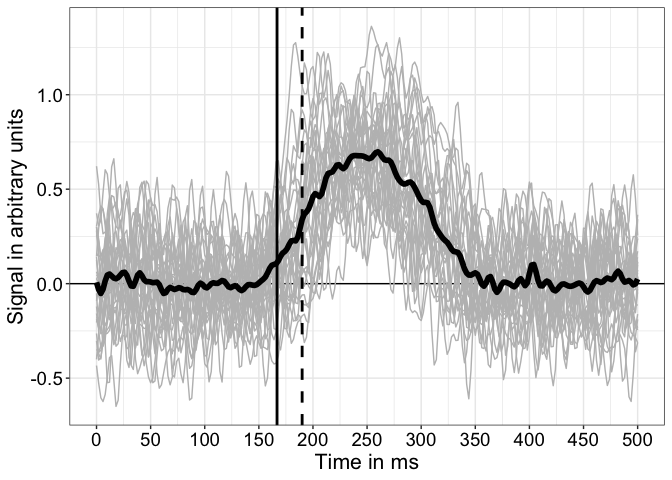<!-- -->

``` r
p.ERP6 <- p
```

Individual ERP differences in grey.  
Group average in black.  
not plotted (Vertical dotted line = population onset = 160 ms).  
not plotted (Vertical dot-dash line = onset estimated from group t^2
time-course = 158 ms).  
Vertical thick black line = 0.2 quantile of distribution of individual
onset estimates = 166.8 ms.  
Vertical thick black dashed line = median of distribution of individual
onset estimates = 190 ms.

## Group + individual onsets

Group onset is estimated as the 0.2 quantile of the onset distribution
(thick black line).

Median appears as thick black dashed line.

not plotted (True onset is marked with dotted line.)

not plotted (The dot-dash line indicates the onset estimated from the
group t^2 time-course.)

``` r
set.seed(666)

df <- tibble(x = ind.onset, y = rep(1, Np))

p <- ggplot(df, aes(x = x, y = y)) + theme_gar +
  # geom_vline(xintercept = gp.onset, linewidth = 1, linetype = "dotdash") +
  geom_vline(xintercept = qt.onset[2], linewidth = 1) +
  # geom_vline(xintercept = true_onset, linetype = "dotted") +
  geom_vline(xintercept = qt.onset[5], linewidth = 1, colour = "black", linetype = "dashed") +
  geom_jitter(height = 0.4, colour = "black", alpha = 0.5, size = 2) +
  labs(x = "Estimated individual onsets in ms") +
  # coord_cartesian(xlim = c(100, 250), ylim = c(0, 2)) +
  theme(axis.title.y = element_blank(),
        axis.ticks.y = element_blank(),
        axis.text.y = element_text(colour = "white"),
        panel.grid.major.y = element_blank(),
        panel.grid.minor.y = element_blank())
p
```

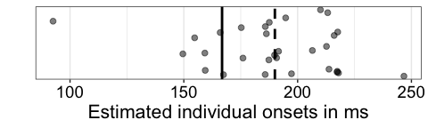<!-- -->

``` r
p.onsets6 <- p
```

## Hierarchical bootstrap

``` r
set.seed(666)
nboot <- 2000
boot.onset <- matrix(0, nrow = nboot, ncol = Np)
gp.boot.onset <- vector(mode = "numeric", length = nboot)
boot.ind.diff <- matrix(0, nrow = Np, Nf)

for(B in 1:nboot){
  
  sim.counter(B, nboot, inc = 200)
  
  # sample participants with replacement
  boot.Np <- sample(1:Np, Np, replace = TRUE)

  # non-hierarchical bootstrap
  boot.diff <- ind.diff[boot.Np, ]
  res <- cpt.meanvar(Rfast::ttest(boot.diff, 0)[,1]^2, method = "BinSeg", Q=2)
  boot.onset[B] <- Xf[res@cpts[1]]

  # hierarchical bootstrap: sample trials with replacement
  for(P in 1:Np){
    
    boot.cond1 <- ind.erp[boot.Np[P], 1, sample(1:Nt,Nt,replace=TRUE),]
    boot.cond2 <- ind.erp[boot.Np[P], 2, sample(1:Nt,Nt,replace=TRUE),]
    ori.t2 <- Rfast::ttests(boot.cond2, boot.cond1, paired = FALSE, logged = FALSE)[,1]^2
    res <- cpt.meanvar(ori.t2, method = "BinSeg", Q=2)
    boot.onset[B,P] <- Xf[res@cpts[1]]
    boot.ind.diff[P,] <- apply(ind.erp[boot.Np[P], 1, sample(1:Nt,Nt,replace=TRUE),], 2, mean) - apply(ind.erp[boot.Np[P], 2, sample(1:Nt,Nt,replace=TRUE),], 2, mean)
    
  }
  
  # group onset
  res <- cpt.meanvar(Rfast::ttest(boot.ind.diff, 0)[,1]^2, method = "BinSeg", Q=2)
  gp.boot.onset[B] <- Xf[res@cpts[1]]
}

# quantile of individual onsets for each bootstrap
q.boot.onset <- apply(boot.onset, 1, quantile, seq(0.1,0.9,0.1), type = 8)

save(nboot, boot.onset, gp.boot.onset, q.boot.onset, file = "./data/onsetsim_eeg_group_hb_p30_t50.RData")
```

### Illustration of hierarchical bootstrap group quantile onset estimates

Quantile onset + bootstrap distribution

``` r
load(file = "./data/onsetsim_eeg_group_hb_p30_t50.RData")

alpha.val <- 0.03 # get a 97% CI
ci <- quantile(q.boot.onset[2,], probs = c(alpha.val/2, 1-alpha.val/2), type = 6)
# credMass <- 1- alpha.val # 0.97
# ci <- HDInterval::hdi(q.boot.onset, credMass = credMass)

df <- as_tibble(with(density(q.boot.onset[2,]),data.frame(x,y)))

p <- ggplot(df, aes(x = x, y = y)) + theme_gar +
  geom_vline(xintercept = true_onset, linetype = "dotted") +
  geom_vline(xintercept = qt.onset[2], colour = "black", linewidth = 1) +
  geom_line(size = 2) +
  annotate(geom = "label", x = qt.onset[2]-2, y = 0.25*max(df$y), size = 7,
           colour = "white", fill = "black", fontface = "bold",
           label = paste0(round(qt.onset[2], digits = 0), " ms")) +
  labs(x = "Hierarchical bootstrap group onsets in ms", y = "Density") +
  # confidence interval ----------------------
geom_segment(x = ci[1], xend = ci[2],
             y = 0, yend = 0,
             lineend = "round", linewidth = 3, colour = "orange") +
  annotate(geom = "label", x = ci[1]+0.15, y = 0.1*max(df$y), size = 7,
           colour = "white", fill = "orange", fontface = "bold",
           label = round(ci[1], digits = 0)) +
  annotate(geom = "label", x = ci[2]-0.15, y = 0.1*max(df$y), size = 7,
           colour = "white", fill = "orange", fontface = "bold",
           label = round(ci[2], digits = 0)) + 
  theme(axis.text.y = element_blank(),
        axis.ticks.y = element_blank())
p
```

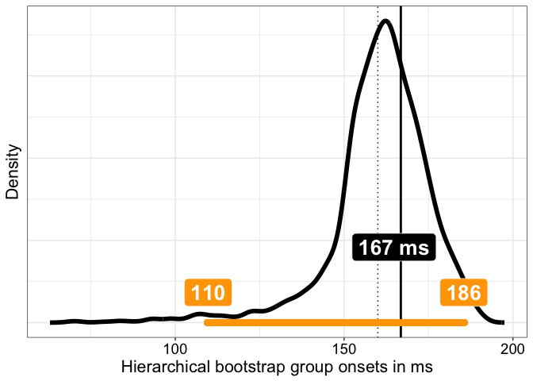<!-- -->

``` r
p.boot6 <- p
```

# Combine panels

A = 100 participants, 50 trials.  
B = 50 participants, 50 trials.  
C = 30 participants, 50 trials.

``` r
cowplot::plot_grid(p.ERP4, p.ERP5, p.ERP6,
                   p.onsets4 + coord_cartesian(xlim = c(80, 320)), 
                   p.onsets5 + coord_cartesian(xlim = c(80, 320)), 
                   p.onsets6 + coord_cartesian(xlim = c(80, 320)),
                   p.boot4 + coord_cartesian(xlim = c(65, 200)), 
                   p.boot5 + coord_cartesian(xlim = c(65, 200)), 
                   p.boot6 + coord_cartesian(xlim = c(65, 200)),
                   nrow = 3,
                   ncol = 3, 
                   labels = c("A", "B", "C", 
                              " ", " ", " ",
                              " ", " ", " "),
                   rel_heights = c(1, 0.3, 1, 1, 0.3, 1, 1, 0.3, 1),
                   label_size = 20)

ggsave(filename = "./figures/onsetsim_eeg_group_hb2.pdf", width = 20, height = 12)
```

# References

Rousselet, G. A., Pernet, C. R., & Wilcox, R. R. (2023). An introduction
to the bootstrap: A versatile method to make inferences by using
data-driven simulations. Meta-Psychology, 7.
<https://doi.org/10.15626/MP.2019.2058>

Rousselet, G. A., & Wilcox, R. R. (2020). Reaction Times and other
Skewed Distributions: Problems with the Mean and the Median.
Meta-Psychology, 4. <https://doi.org/10.15626/MP.2019.1630>
