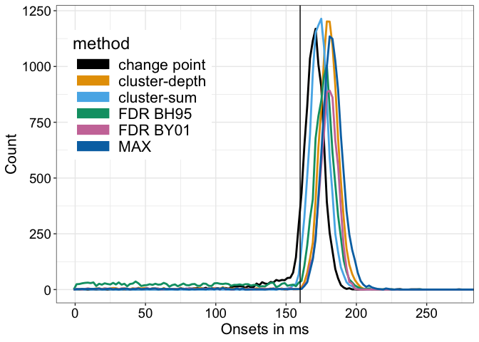

Estimating onsets using cluster statistics: simulation using EEG-like
noise
================
Guillaume A. Rousselet
2024-09-12

Same as `onsetsim_eeg.Rmd` but with an ERP effect half in duration.  
Results were very similar, with the same ranking of methods.

# Dependencies

``` r
library(ggplot2)
library(tibble)
library(changepoint)
# library(cowplot)
library(beepr)
library(Rfast)
source("./code/functions.R")
source("./code/theme_gar.txt")
# Load template: true onset = 160 ms, F=81, max at F=126
source("./code/erp_template_half.R")
# R version of Matlab code from Yeung et al. 2004
source("./code/eeg_noise.R")
# to use with eeg_noise function
meanpower <- unlist(read.table("./code/meanpower.txt"))
# Colour palette from http://www.cookbook-r.com/Graphs/Colors_(ggplot2)/
categ.palette <- c("#000000", "#E69F00", "#56B4E9", "#009E73", "#CC79A7", "#0072B2", "#D55E00", "#F0E442")
library(permuco) # to compute cluster depth statistics
```

# Simulation: EEG noise

Using more realistic EEG noise from Yeung et al. (2004).

``` r
set.seed(666)
aath <- 0.05 # arbitrary alpha threshold
nsim <- 10000 # simulation iterations
nboot <- 2000 # number of permutation samples
inc.step <- 200 # console notification every inc.step iterations
srate <- 500 # sampling rate in Hz
simres.cp <- vector(mode = "numeric", length = nsim) * NA # change point
simres.bh95 <- vector(mode = "numeric", length = nsim) * NA # FDR
simres.by01 <- vector(mode = "numeric", length = nsim) * NA # FDR
simres.max <- vector(mode = "numeric", length = nsim) * NA # MAX
simres.cs <- vector(mode = "numeric", length = nsim) * NA # cluster sum
simres.cd <- vector(mode = "numeric", length = nsim) * NA # cluster depth

Nt <- 50 # number of trials
outvar <- 1 # noise variance of each trial
cond1 <- matrix(0, nrow = Nt, ncol = Nf)
cond2 <- matrix(0, nrow = Nt, ncol = Nf)

for(S in 1:nsim){
  
  sim.counter(S, nsim, inc = inc.step)
  
  for(T in 1:Nt){
    cond2[T,] <- temp2.half + eeg_noise(frames = Nf, srate = srate, outvar = outvar, meanpower)
    cond1[T,] <- temp1 + eeg_noise(frames = Nf, srate = srate, outvar = outvar, meanpower) 
  }
  
  # t-tests
  ori.t2 <- vector(mode = "numeric", length = Nf)
  for(F in 1:Nf){
    ori.t2[F] <- t.test(cond1[,F], cond2[,F])$statistic^2
  }
  # fit change point model
  res <- cpt.meanvar(ori.t2, method = "BinSeg", Q=2)
  simres.cp[S] <- Xf[res@cpts[1]]
  
  # Make permutation table of t values 
  perm.t2 <- permtdist(cond1, cond2, Nt, Nf, nboot = nboot)^2
  perm.th <- apply(perm.t2, 2, quantile, probs = 1-aath)
  
  # FDR -----
  perm.pvals <- vector(mode = "numeric", length = Nf)
  for(F in 1:Nf){
    perm.pvals[F] <- (sum(perm.t2[,F] >= ori.t2[F]) + 1) / (nboot + 1)
  }
  fdr.pvals <- p.adjust(perm.pvals, method = "fdr")
  simres.bh95[S] <- find_onset(fdr.pvals <= aath, Xf)
  fdr.pvals <- p.adjust(perm.pvals, method = "BY")
  simres.by01[S] <- find_onset(fdr.pvals <= aath, Xf)
  
  # MAX -----
  max.th <- quantile(apply(perm.t2, 1, max), probs = 1-aath)
  simres.max[S] <- find_onset(ori.t2 >= max.th, Xf)
  
  # cluster-sum statistics -----
  cmap <- cluster.make(perm.pvals <= aath)
  perm.max.sums <- vector(mode = "numeric", length = nboot)
  perm.cmap <- matrix(0, nrow = nboot, ncol = Nf) # need to keep all cluster maps to compute cluster depth
  for(B in 1:nboot){
    # threshold permutation t2 values and form clusters
    perm.cmap[B,] <- cluster.make(perm.t2[B,] <= perm.th)  
    perm.max.sums[B] <- max(cluster.sum(values = perm.t2[B,], cmap = perm.cmap[B,]))
  }
  # cluster sum threshold
  cs.th <- quantile(perm.max.sums, probs = 1-aath)
  # cluster test
  cs.test <- cluster.test(values = ori.t2, cmap = cmap, cs.th)
  simres.cs[S] <- find_onset(cs.test, Xf)
  
  # cluster-depth statistics
  df <- as_tibble(rbind(cond1, cond2))
  df2 <- tibble(gp = rep(c("gp1", "gp2"), each = Nt),
                trial = c(1:Nt, 1:Nt))
  df <- cbind(df2, df)
  
  res <- permuco::clusterlm(formula = df[,3:ncol(df)] ~ gp, 
                            data = df[,-(3:ncol(df))],
                            multcomp = "clusterdepth_head",
                            test = "t",
                            np = nboot)
  
  cd.pval <- res$multiple_comparison$gpgp2$clusterdepth$main[,2]
  # cd.tval <- res$multiple_comparison$gpgp2$clusterdepth$main[,1]
  simres.cd[S] <- find_onset(cd.pval < aath, Xf)

}

save(simres.cs, simres.max, simres.bh95, simres.cp, simres.cd, simres.by01,
     file = "./data/onsetsim_n50_eegnoise_half.RData")
```

## Plot onset distributions

``` r
load("./data/onsetsim_n50_eegnoise_half.RData")

df <- tibble(onsets = c(simres.cp, simres.cs, simres.bh95, simres.max, simres.cd, simres.by01),
             method = factor(c(rep("change point", length(simres.cp)),
                               rep("cluster-sum", length(simres.cs)),
                               rep("FDR BH95", length(simres.bh95)),
                               rep("MAX", length(simres.max)),
                               rep("cluster-depth", length(simres.cd)),
                               rep("FDR BY01", length(simres.by01))))
)

# df$method <- keeporder(df$method) 

ggplot(data = df, aes(x = onsets, colour = method)) + theme_gar +
  # stat_density(geom = "line") +
  geom_freqpoly(na.rm = TRUE, breaks = Xf, linewidth = 1) +
  geom_vline(xintercept = true_onset, linetype = "solid") +
  # geom_vline(xintercept = median(simres.cp, na.rm = TRUE))
  scale_colour_manual(values = categ.palette) +
  theme(legend.position = c(.2, .7)) +
  labs(x = "Onsets in ms", y = "Count") +
  coord_cartesian(xlim = c(0, 270)) +
  scale_x_continuous(breaks = seq(0, 300, 50)) + 
  guides(colour = guide_legend(override.aes = list(linewidth = 5)))
```

    ## Warning: A numeric `legend.position` argument in `theme()` was deprecated in ggplot2
    ## 3.5.0.
    ## ℹ Please use the `legend.position.inside` argument of `theme()` instead.
    ## This warning is displayed once every 8 hours.
    ## Call `lifecycle::last_lifecycle_warnings()` to see where this warning was
    ## generated.

<!-- -->

``` r
# ggsave(filename = "./figures/eeg_onset_dist.pdf", width = 10, height = 5)
```

Summary statistics.

## Mode

``` r
print("Mode:")
```

    ## [1] "Mode:"

``` r
print(paste("Cluster-depth =",find_mode(simres.cd)))
```

    ## [1] "Cluster-depth = 180"

``` r
print(paste("Change point =",find_mode(simres.cp)))
```

    ## [1] "Change point = 172"

``` r
print(paste("Cluster-sum =",find_mode(simres.cs)))
```

    ## [1] "Cluster-sum = 176"

``` r
print(paste("FDR BH95 =",find_mode(simres.bh95)))
```

    ## [1] "FDR BH95 = 180"

``` r
print(paste("FDR BY01 =",find_mode(simres.by01)))
```

    ## [1] "FDR BY01 = 182"

``` r
print(paste("MAX =",find_mode(simres.max)))
```

    ## [1] "MAX = 182"

## Bias

``` r
print("Bias:")
```

    ## [1] "Bias:"

``` r
print(paste("Change point =",median(simres.cp, na.rm = TRUE) - true_onset))
```

    ## [1] "Change point = 10"

``` r
print(paste("Cluster-depth =",median(simres.cd, na.rm = TRUE) - true_onset))
```

    ## [1] "Cluster-depth = 22"

``` r
print(paste("Cluster-sum =",median(simres.cs, na.rm = TRUE) - true_onset))
```

    ## [1] "Cluster-sum = 14"

``` r
print(paste("FDR BH95 =",median(simres.bh95, na.rm = TRUE) - true_onset))
```

    ## [1] "FDR BH95 = 16"

``` r
print(paste("FDR BY01 =",median(simres.by01, na.rm = TRUE) - true_onset))
```

    ## [1] "FDR BY01 = 22"

``` r
print(paste("MAX =",median(simres.max, na.rm = TRUE) - true_onset))
```

    ## [1] "MAX = 24"

## Mean absolute error

``` r
print("MAE:")
```

    ## [1] "MAE:"

``` r
print(paste("Change point =",round(mean(abs(simres.cp - true_onset), na.rm = TRUE), digits=1)))
```

    ## [1] "Change point = 12.6"

``` r
print(paste("Cluster-depth =",round(mean(abs(simres.cd - true_onset), na.rm = TRUE), digits=1)))
```

    ## [1] "Cluster-depth = 23.4"

``` r
print(paste("Cluster-sum =",round(mean(abs(simres.cs - true_onset), na.rm = TRUE), digits=1)))
```

    ## [1] "Cluster-sum = 15"

``` r
print(paste("FDR BH95 =",round(mean(abs(simres.bh95 - true_onset), na.rm = TRUE), digits=1)))
```

    ## [1] "FDR BH95 = 30.4"

``` r
print(paste("FDR BY01 =",round(mean(abs(simres.by01 - true_onset), na.rm = TRUE), digits=1)))
```

    ## [1] "FDR BY01 = 23.7"

``` r
print(paste("MAX =",round(mean(abs(simres.max - true_onset), na.rm = TRUE), digits=1)))
```

    ## [1] "MAX = 25.4"

## Variance

``` r
print("Variance:")
```

    ## [1] "Variance:"

``` r
print(paste("Change point =",round(var(simres.cp, na.rm = TRUE), digits=0)))
```

    ## [1] "Change point = 176"

``` r
print(paste("Cluster-depth =",round(var(simres.cd, na.rm = TRUE), digits=0)))
```

    ## [1] "Cluster-depth = 408"

``` r
print(paste("Cluster-sum =",round(var(simres.cs, na.rm = TRUE), digits=0)))
```

    ## [1] "Cluster-sum = 66"

``` r
print(paste("FDR BH95 =",round(var(simres.bh95, na.rm = TRUE), digits=0)))
```

    ## [1] "FDR BH95 = 1987"

``` r
print(paste("FDR BY01 =",round(var(simres.by01, na.rm = TRUE), digits=0)))
```

    ## [1] "FDR BY01 = 471"

``` r
print(paste("MAX =",round(var(simres.max, na.rm = TRUE), digits=0)))
```

    ## [1] "MAX = 315"

## Proportion too early

``` r
print("Proportion too early:")
```

    ## [1] "Proportion too early:"

``` r
print(paste("Change point =",round(100*mean((simres.cp - true_onset) < 0, na.rm = TRUE), digits=1),"%"))
```

    ## [1] "Change point = 9 %"

``` r
print(paste("Cluster-depth =",round(100*mean((simres.cd - true_onset) < 0, na.rm = TRUE), digits=1),"%"))
```

    ## [1] "Cluster-depth = 3 %"

``` r
print(paste("Cluster-sum =",round(100*mean((simres.cs - true_onset) < 0, na.rm = TRUE), digits=1),"%"))
```

    ## [1] "Cluster-sum = 0.7 %"

``` r
print(paste("FDR BH95 =",round(100*mean((simres.bh95 - true_onset) < 0, na.rm = TRUE), digits=1),"%"))
```

    ## [1] "FDR BH95 = 18.1 %"

``` r
print(paste("FDR BY01 =",round(100*mean((simres.by01 - true_onset) < 0, na.rm = TRUE), digits=1),"%"))
```

    ## [1] "FDR BY01 = 3.5 %"

``` r
print(paste("MAX =",round(100*mean((simres.max - true_onset) < 0, na.rm = TRUE), digits=1),"%"))
```

    ## [1] "MAX = 1.8 %"

## Underestimations of at least 40 ms

``` r
print("Underestimations of at least 40 ms:")
```

    ## [1] "Underestimations of at least 40 ms:"

``` r
print(paste("Change point =",round(100*mean((simres.cp - true_onset) <= -40, na.rm = TRUE), digits=1),"%"))
```

    ## [1] "Change point = 1.7 %"

``` r
print(paste("Cluster-depth =",round(100*mean((simres.cd - true_onset) <= -40, na.rm = TRUE), digits=1),"%"))
```

    ## [1] "Cluster-depth = 2.4 %"

``` r
print(paste("Cluster-sum =",round(100*mean((simres.cs - true_onset) <= -40, na.rm = TRUE), digits=1),"%"))
```

    ## [1] "Cluster-sum = 0.1 %"

``` r
print(paste("FDR BH95 =",round(100*mean((simres.bh95 - true_onset) <= -40, na.rm = TRUE), digits=1),"%"))
```

    ## [1] "FDR BH95 = 14.2 %"

``` r
print(paste("FDR BY01 =",round(100*mean((simres.by01 - true_onset) <= -40, na.rm = TRUE), digits=1),"%"))
```

    ## [1] "FDR BY01 = 2.8 %"

``` r
print(paste("MAX =",round(100*mean((simres.max - true_onset) <= -40, na.rm = TRUE), digits=1),"%"))
```

    ## [1] "MAX = 1.5 %"

# References

Yeung, N., Bogacz, R., Holroyd, C.B., & Cohen, J.D. (2004) Detection of
synchronized oscillations in the electroencephalogram: An evaluation of
methods. Psychophysiology, 41, 822–832.
