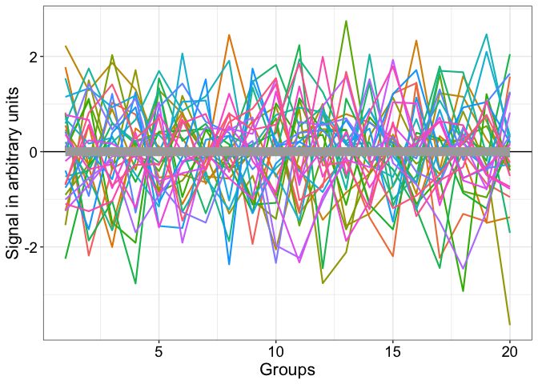
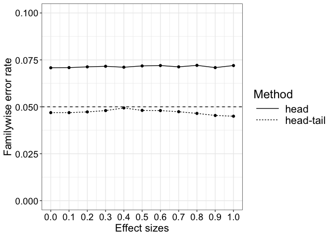
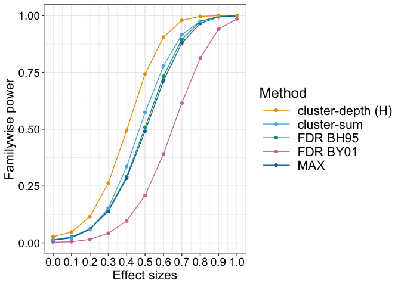
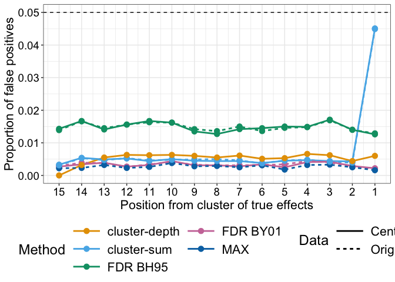
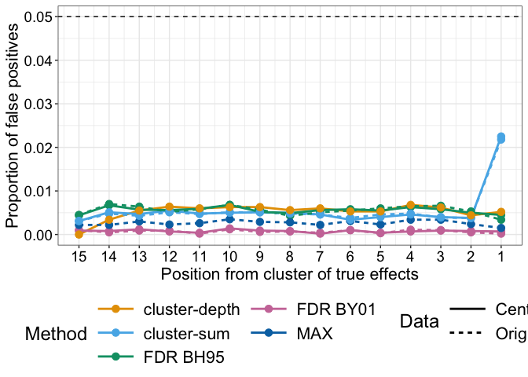

Weak and strong FWER correction
================
Guillaume A. Rousselet
2024-09-12

Extension of the `fdr_demo.Rmd` notebook, now considering permutation
based methods:  
- cluster-sum using original permuted data (CS);  
- cluster-sum using centred permuted data, as in cluster-depth (CSc);  
- cluster-depth, which uses centred permuted data (CD);  
- MAX + permutation (MAX).

BH95 = Benjamini-Hochberg (1995).  
BY01 = Benjamini-Yekutieli (2001).

BH95c = BH95 with centred data.  
BY01c = BY01 with centred data.

Frossard & Renaud (2022, section 4.2) wrote that to achieve strong FWER
control, it is required to remove the average from each group of
observations, so as to obtain stationary residuals. However, it is
important to clarify that this subtraction procedure is not necessary to
obtain strong control (the MAX method achieves strong control without
it), and it is not sufficient (the FDR method applied to data after mean
subtraction still provides weak control).

# Dependencies

``` r
library(Rfast)
library(tibble)
library(ggplot2)
library(cowplot)
library(beepr)
source("./code/theme_gar.txt")
source("./code/functions.R")
# Colour palette from http://www.cookbook-r.com/Graphs/Colors_(ggplot2)/
categ.palette <- c("#E69F00", "#56B4E9", "#009E73", "#CC79A7", "#0072B2", "#D55E00", "#F0E442", "#000000")
```

# Simulation: FWER as a function of effect size

20 time points are considered: at each time point two independent groups
are compared. At the first 15 time points, the two groups are sampled
from the same population. In the last 5 time points, the two groups are
sampled from different populations. All populations are normal with
standard deviation 1. Each group is composed of 30 trials. All groups
are sampled from a population with mean zero, except the 5 groups from
the last 5 time points, which were sampled from populations with means
varying from 0 to 1, in steps of 0.1. So Cohen’s $d$ varied from 0 to 1.

## Check trials with effects

``` r
set.seed(21)

nt <- 30 # number of trials
ng.h0 <- 15 # number of groups without effect
ng.h1 <- 5 # number of groups with effects
ng <- ng.h0 + ng.h1 # total number of groups
es.vec <- seq(0, 1, 0.1) # effect size in ng.h1 groups

# Use same random numbers for all effect sizes
cond1_all <- matrix(rnorm(nt * ng, mean = 0, sd = 1), nrow = nt, ncol = ng)

ES <- 11 # Cohen's d = 1
# Create matrix of effect: es.vec[ES] in groups 16-20 of each simulation, 
# Effect is zero for groups 1-15. 
effect.mat <- matrix(c(rep(0, nt*ng.h0), rep(es.vec[ES], nt*ng.h1)), nrow = nt)
# add effects to random data
cond1 <- cond1_all + effect.mat

df <- tibble(x = rep(1:ng,each=nt),
             y = as.vector(cond1), 
             trials = factor(rep(1:nt,ng)))

df2 <- tibble(x = 1:ng,
              y = apply(cond1, 2, mean),
              trials = factor(rep(nt+1,ng)))

p <-ggplot(df, aes(x, y, group = trials, colour = trials)) + theme_gar +
  geom_hline(yintercept = 0) +
  geom_line(linewidth = 0.75, show.legend = FALSE) +
  labs(x = "Groups", y = "Signal in arbitrary units") +
  geom_line(data=df2, aes(x,y), linewidth = 4, colour = "darkgrey", show.legend = FALSE)
# scale_colour_manual(values = c("grey", "black"))
p
```

<!-- -->

``` r
# plot(cond1[21,], type = "l")
```

## Check participants/trials of cond1 with centred data

``` r
cond1.c <- cond1
for(G in 1:ng){
  cond1.c[,G] <- cond1[,G] - mean(cond1[,G])
}

df <- tibble(x = rep(1:ng,each=nt),
             y = as.vector(cond1.c), 
             trials = factor(rep(1:nt,ng)))

df2 <- tibble(x = 1:ng,
              y = apply(cond1.c, 2, mean),
              trials = factor(rep(nt+1,ng)))

p <-ggplot(df, aes(x, y, group = trials, colour = trials)) + theme_gar +
  geom_hline(yintercept = 0) +
  geom_line(linewidth = 0.75, show.legend = FALSE) +
  labs(x = "Groups", y = "Signal in arbitrary units") +
  geom_line(data=df2, aes(x,y), linewidth = 4, colour = "darkgrey", show.legend = FALSE)
# scale_colour_manual(values = c("grey", "black"))
p
```

<!-- -->

## Run simulation

No need to run simulation, results are loaded in the following chunk.

Simulation has 10,000 iterations. Permutations with 2,000 iterations. 30
trials per group. Two-sample t-tests applied 20 times: in 15 cases, the
two groups have no effect; in 5 cases, one group has no effect while the
other group is drawn from a population with effect sizes ranging from 0
to 1. Standard deviation is 1 in all groups. All populations are
normally distributed.

``` r
set.seed(21)

nsim <- 10000 # number of simulation iterations
inc.step <- 500 # console update every inc.step
nboot <- 2000
nt <- 30 # number of trials
ng.h0 <- 15 # number of groups without effect
ng.h1 <- 5 # number of groups with effects
ng <- ng.h0 + ng.h1 # total number of groups
m <- 0 # hypothesis
aath <- 0.05 # arbitrary alpha threshold 
es.vec <- seq(0, 1, 0.1) # effect size in ng.h1 groups
nes <- length(es.vec)

# false positives at 15 null
fp.bh95 <- matrix(0, nrow = ng.h0, ncol = nes)
fp.bh95.c <- matrix(0, nrow = ng.h0, ncol = nes)
fp.by01 <- matrix(0, nrow = ng.h0, ncol = nes)
fp.by01.c <- matrix(0, nrow = ng.h0, ncol = nes)
fp.max <- matrix(0, nrow = ng.h0, ncol = nes)
fp.cs <- matrix(0, nrow = ng.h0, ncol = nes)
fp.cs.c <- matrix(0, nrow = ng.h0, ncol = nes)
fp.cd <- matrix(0, nrow = ng.h0, ncol = nes)

# FWER = P(at least one false positive)
fwer.bh95 <- vector(mode = "numeric", length = nes)
fwer.bh95.c <- vector(mode = "numeric", length = nes)
fwer.by01 <- vector(mode = "numeric", length = nes)
fwer.by01.c <- vector(mode = "numeric", length = nes)
fwer.max <- vector(mode = "numeric", length = nes)
fwer.cs <- vector(mode = "numeric", length = nes)
fwer.cs.c <- vector(mode = "numeric", length = nes)
fwer.cd <- vector(mode = "numeric", length = nes)

# familywise power = P(at least one true positive)
fpwr.bh95 <- vector(mode = "numeric", length = nes)
fpwr.by01 <- vector(mode = "numeric", length = nes)
fpwr.max <- vector(mode = "numeric", length = nes)
fpwr.cs <- vector(mode = "numeric", length = nes)
fpwr.cd <- vector(mode = "numeric", length = nes)

print("weakstrongfwer_demo sim 1:")

for(S in 1:nsim){
  
  sim.counter(S, nsim, inc = inc.step)
  
  # Use same random numbers for all effect sizes
  cond1_all <- matrix(rnorm(nt * ng, mean = 0, sd = 1), nrow = nt, ncol = ng)
  cond2 <- matrix(rnorm(nt * ng, mean = 0, sd = 1), nrow = nt, ncol = ng)
  
  for(ES in 1:nes){
    # Create matrix of effect: es.vec[ES] in groups 16-20 of each simulation, 
    # Effect is zero for groups 1-15. 
    effect.mat <- matrix(c(rep(0, nt*ng.h0), rep(es.vec[ES], nt*ng.h1)), nrow = nt)
    # add effects to random data
    cond1 <- cond1_all + effect.mat
    
    # Two-sample t-tests ===============================
    out <- Rfast::ttests(cond1,cond2, paired=FALSE,logged=FALSE)
    # pval <- matrix(out[,2], nrow = ng)
    ori.t2 <- matrix(out[,1], nrow = ng)^2
    
    # Permutation tests ================================
    
    # Make permutation table of t values 
    perm.t2 <- permtdist(cond1, cond2, nt, ng, nboot = nboot)^2
    perm.pvals <- vector(mode = "numeric", length = ng)
    for(G in 1:ng){
      perm.pvals[G] <- (sum(perm.t2[,G] >= ori.t2[G]) + 1) / (nboot + 1)
    }
    perm.th <- apply(perm.t2, 2, quantile, probs = 1-aath)
    
    # Make permutation table of t values for cluster-depth method
    # Each condition is centred first, following Frossard & Renaud (2022)
    cond1.c <- cond1
    cond2.c <- cond1
    for(G in 1:ng){
      cond1.c[,G] <- cond1[,G] - mean(cond1[,G])
      cond2.c[,G] <- cond2[,G] - mean(cond2[,G])
    }
    perm.t2c <- permtdist(cond1.c, cond2.c, nt, ng, nboot = nboot)^2
    
    perm.pvals.c <- vector(mode = "numeric", length = ng)
    for(G in 1:ng){
      perm.pvals.c[G] <- (sum(perm.t2c[,G] >= ori.t2[G]) + 1) / (nboot + 1)
    }
    perm.th.c <- apply(perm.t2c, 2, quantile, probs = 1-aath)
    
    # Adjust p values using BH95 =====
    pval.adj <- p.adjust(perm.pvals, method = "BH")
    # False positives after correction
    fp.bh95[,ES] <- fp.bh95[,ES] + (pval.adj[1:ng.h0] <= aath)
    # FWER
    if(sum(pval.adj[1:ng.h0] <= aath)>0){
      fwer.bh95[ES] <- fwer.bh95[ES] + 1 
    }
    # Family-wise power after correction
    if(sum(pval.adj[(ng.h0+1):ng] <= aath)>0){
      fpwr.bh95[ES] <- fpwr.bh95[ES] + 1   
    }
    
    # Adjust p values using BY01 =====
    pval.adj <- p.adjust(perm.pvals, method = "BY")
    # False positives after correction
    fp.by01[,ES] <- fp.by01[,ES] + (pval.adj[1:ng.h0] <= aath)
    # FWER
    if(sum(pval.adj[1:ng.h0] <= aath)>0){
      fwer.by01[ES] <- fwer.by01[ES] + 1 
    }
    # Family-wise power after correction
    if(sum(pval.adj[(ng.h0+1):ng] <= aath)>0){
      fpwr.by01[ES] <- fpwr.by01[ES] + 1   
    }
    
    # Adjust p values using BH95 with centred data =====
    pval.adj <- p.adjust(perm.pvals.c, method = "BH")
    # FWER
    if(sum(pval.adj[1:ng.h0] <= aath)>0){
      fwer.bh95.c[ES] <- fwer.bh95.c[ES] + 1 
    }
    # False positives after correction
    fp.bh95.c[,ES] <- fp.bh95.c[,ES] + (pval.adj[1:ng.h0] <= aath)
    
    # Adjust p values using BY01 with centred data =====
    pval.adj <- p.adjust(perm.pvals.c, method = "BY")
     # FWER
    if(sum(pval.adj[1:ng.h0] <= aath)>0){
      fwer.by01.c[ES] <- fwer.by01.c[ES] + 1 
    }
    # False positives after correction
    fp.by01.c[,ES] <- fp.by01.c[,ES] + (pval.adj[1:ng.h0] <= aath)
    
    # MAX -----
    # false positives
    max.th <- quantile(apply(perm.t2, 1, max), probs = 1-aath)
    fp.max[,ES] <- fp.max[,ES] + (ori.t2[1:ng.h0] >= max.th)   
    # FWER
    if(sum(ori.t2[1:ng.h0] >= max.th)>0){
      fwer.max[ES] <- fwer.max[ES] + 1 
    }
    # familywise power
    if(sum(ori.t2[(ng.h0+1):ng] >= max.th)>0){ 
      fpwr.max[ES] <- fpwr.max[ES] + 1    
    }
    
    # cluster-sum statistics: raw data -----
    cmap <- cluster.make(perm.pvals <= aath)
    perm.max.sums <- vector(mode = "numeric", length = nboot)
    for(B in 1:nboot){
      # threshold permutation t2 values and form clusters
      perm.cmap <- cluster.make(perm.t2[B,] <= perm.th)  
      perm.max.sums[B] <- max(cluster.sum(values = perm.t2[B,], cmap = perm.cmap))
    }
    # cluster-sum threshold
    cs.th <- quantile(perm.max.sums, probs = 1-aath)
    # cluster test
    cs.test <- cluster.test(values = perm.t2, cmap = cmap, cs.th)
    # false positives
    fp.cs[,ES] <- fp.cs[,ES] + cs.test[1:ng.h0]
    # FWER
    if(sum(cs.test[1:ng.h0])>0){
      fwer.cs[ES] <- fwer.cs[ES] + 1 
    }
    # familywise power
    if(sum(cs.test[(ng.h0+1):ng])>0){ 
      fpwr.cs[ES] <- fpwr.cs[ES] + 1    
    }
    
    # cluster-sum statistics: centred data -----
    cmap <- cluster.make(perm.pvals.c <= aath)
    perm.max.sums <- vector(mode = "numeric", length = nboot)
    for(B in 1:nboot){
      # threshold permutation t2 values and form clusters
      perm.cmap <- cluster.make(perm.t2c[B,] <= perm.th.c)  
      perm.max.sums[B] <- max(cluster.sum(values = perm.t2c[B,], cmap = perm.cmap))
    }
    # cluster-sum threshold
    cs.th <- quantile(perm.max.sums, probs = 1-aath)
    # cluster test
    cs.test <- cluster.test(values = perm.t2c, cmap = cmap, cs.th)
    # false positives
    fp.cs.c[,ES] <- fp.cs.c[,ES] + cs.test[1:ng.h0]
    # FWER
    if(sum(cs.test[1:ng.h0])>0){
      fwer.cs.c[ES] <- fwer.cs.c[ES] + 1 
    }
    
    # Cluster-depth -----
    df <- as_tibble(rbind(cond1, cond2))
    df2 <- tibble(gp = rep(c("gp1", "gp2"), each = nt),
                  trial = c(1:nt, 1:nt))
    df <- cbind(df2, df)
    
    res <- permuco::clusterlm(formula = df[,3:ncol(df)] ~ gp, 
                              data = df[,-(3:ncol(df))],
                              multcomp = c("clusterdepth_head"),
                              test = "t",
                              nt = nboot)
    
    cd.pval <- res$multiple_comparison$gpgp2$clusterdepth$main[,2]
    cd.pval[is.na(cd.pval)] <- 1
    # false positives
    fp.cd[,ES] <- fp.cd[,ES] + (cd.pval[1:ng.h0] <= aath)
    # FWER
    if(sum(cd.pval[1:ng.h0] <= aath)>0){
      fwer.cd[ES] <- fwer.cd[ES] + 1 
    }
    # familywise power
    if(sum(cd.pval[(ng.h0+1):ng] <= aath, na.rm = TRUE)>0){ 
      fpwr.cd[ES] <- fpwr.cd[ES] + 1    
    }
  }
}

save(fp.bh95, fp.bh95.c, fp.by01, fp.by01.c, 
     fp.max, fp.cs, fp.cs.c, fp.cd,
     fwer.bh95, fwer.bh95.c, fwer.by01, fwer.by01.c, 
     fwer.max, fwer.cs, fwer.cs.c, fwer.cd,
     fpwr.bh95, fpwr.by01, fpwr.max, fpwr.cs, fpwr.cd, 
     nsim, nes, es.vec, ng.h0,
     file = "./data/weakstrongfwer_demo1.RData")
```

### Cluster-depth: head + tail correction

Previous code used p values from the head. Here we use p = max(head,
tail), which is the default in permuco.

``` r
set.seed(21)

nsim <- 10000 # number of simulation iterations
inc.step <- 500 # console update every inc.step
nboot <- 2000
nt <- 30 # number of trials
ng.h0 <- 15 # number of groups without effect
ng.h1 <- 5 # number of groups with effects
ng <- ng.h0 + ng.h1 # total number of groups
m <- 0 # hypothesis
aath <- 0.05 # arbitrary alpha threshold 
es.vec <- seq(0, 1, 0.1) # effect size in ng.h1 groups
nes <- length(es.vec)

# false positives at 15 null
fp.cd.ht <- matrix(0, nrow = ng.h0, ncol = nes)

# FWER = P(at least one false positive)
fwer.cd.ht <- vector(mode = "numeric", length = nes)

# familywise power = P(at least one true positive)
fpwr.cd.ht <- vector(mode = "numeric", length = nes)

print("weakstrongfwer_demo sim 1:")

for(S in 1:nsim){
  
  sim.counter(S, nsim, inc = inc.step)
  
  # Use same random numbers for all effect sizes
  cond1_all <- matrix(rnorm(nt * ng, mean = 0, sd = 1), nrow = nt, ncol = ng)
  cond2 <- matrix(rnorm(nt * ng, mean = 0, sd = 1), nrow = nt, ncol = ng)
  
  for(ES in 1:nes){
    # Create matrix of effect: es.vec[ES] in groups 16-20 of each simulation, 
    # Effect is zero for groups 1-15. 
    effect.mat <- matrix(c(rep(0, nt*ng.h0), rep(es.vec[ES], nt*ng.h1)), nrow = nt)
    # add effects to random data
    cond1 <- cond1_all + effect.mat
    
    # Cluster-depth -----
    df <- as_tibble(rbind(cond1, cond2))
    df2 <- tibble(gp = rep(c("gp1", "gp2"), each = nt),
                  trial = c(1:nt, 1:nt))
    df <- cbind(df2, df)
    
    res <- permuco::clusterlm(formula = df[,3:ncol(df)] ~ gp, 
                              data = df[,-(3:ncol(df))],
                              multcomp = c("clusterdepth"),
                              test = "t",
                              nt = nboot)
    
    cd.pval <- res$multiple_comparison$gpgp2$clusterdepth$main[,2]
    cd.pval[is.na(cd.pval)] <- 1
    # false positives
    fp.cd.ht[,ES] <- fp.cd.ht[,ES] + (cd.pval[1:ng.h0] <= aath)
    # FWER
    if(sum(cd.pval[1:ng.h0] <= aath)>0){
      fwer.cd.ht[ES] <- fwer.cd.ht[ES] + 1 
    }
    # familywise power
    if(sum(cd.pval[(ng.h0+1):ng] <= aath, na.rm = TRUE)>0){ 
      fpwr.cd.ht[ES] <- fpwr.cd.ht[ES] + 1    
    }
  }
}

save(fp.cd.ht, fwer.cd.ht, fpwr.cd.ht, 
     file = "./data/weakstrongfwer_demo1_cdht.RData")
```

## Plot results

### Check cluster-depth head vs head-tail results

``` r
load(file = "./data/weakstrongfwer_demo1.RData")
load(file = "./data/weakstrongfwer_demo1_cdht.RData")
fwer.cd/nsim
```

    ##  [1] 0.0708 0.0709 0.0713 0.0716 0.0711 0.0718 0.0720 0.0713 0.0721 0.0709
    ## [11] 0.0720

``` r
fwer.cd.ht/nsim
```

    ##  [1] 0.0469 0.0469 0.0473 0.0480 0.0494 0.0481 0.0480 0.0474 0.0465 0.0454
    ## [11] 0.0450

``` r
df <- tibble(x = rep(es.vec, 2),
             y= c(fwer.cd/nsim, fwer.cd.ht/nsim),
             Method = rep(c("head", "head-tail"), each = nes)
             )

ggplot(df, aes(x=x, y=y, linetype = Method)) + theme_gar +
  geom_hline(yintercept = 0.05, linetype = "dashed") +
  geom_line() +
  geom_point() +
  labs(x = "Effect sizes", y = "Familywise error rate") +
  scale_x_continuous(breaks = es.vec) +
  coord_cartesian(ylim = c(0, 0.1))
```

<!-- -->

### Power = sanity check

Cluster-depth (with from the head p values) leads to higher power than
cluster sum, a feature to be exploited in the main simulations, to check
if that leads to less biased onsets.

``` r
load(file = "./data/weakstrongfwer_demo1.RData")
load(file = "./data/weakstrongfwer_demo1_cdht.RData")

df <- tibble(x = rep(es.vec,5), 
             y = c(fpwr.bh95/nsim,fpwr.by01/nsim,
                   fpwr.max/nsim,fpwr.cs/nsim, fpwr.cd/nsim),
             Method = factor(rep(c("FDR BH95", "FDR BY01", "MAX", "cluster-sum",  
                                   "cluster-depth (H)"), each = nes))
)

ggplot(df, aes(x = x, y = y, colour = Method)) + theme_gar +
  geom_line() +
  geom_point() +
  labs(x = "Effect sizes", y = "Familywise power") +
  scale_x_continuous(breaks = es.vec) +
  scale_colour_manual(values=categ.palette)
```

<!-- -->

Most powerful = cluster-depth \> cluster-sum \> BH95 \> MAX \> BY01.

### FWER

FWER = probability of at least one false positive among the 15 null
conditions.

``` r
load(file = "./data/weakstrongfwer_demo1.RData")
load(file = "./data/weakstrongfwer_demo1_cdht.RData")
aath <- 0.05

# Compute FWER = P(at least one false positive among ng.h0 groups)
fwer.bh95 <- fwer.bh95 / nsim
fwer.bh95.c <- fwer.bh95.c / nsim
fwer.by01 <- fwer.by01 / nsim
fwer.by01.c <- fwer.by01.c / nsim
fwer.max <- fwer.max / nsim
fwer.cs <- fwer.cs / nsim
fwer.cs.c <- fwer.cs.c / nsim
fwer.cd <- fwer.cd / nsim
fwer.cd.ht <- fwer.cd.ht / nsim

df <- tibble(x = rep(es.vec,8), 
             y = c(fwer.bh95, fwer.bh95.c, fwer.by01, fwer.by01.c,
                   fwer.max, fwer.cs, fwer.cs.c, fwer.cd.ht),
             Method = factor(rep(c("FDR BH95", "FDR BH95", "FDR BY01", "FDR BY01", 
                                   "MAX", "cluster-sum", "cluster-sum", 
                                   "cluster-depth"), each = nes)),
             Data = factor(c(rep("Original", nes), rep("Centred", nes),
                             rep("Original", nes), rep("Centred", nes),
                             rep("Original", nes*2), rep("Centred", nes*2)))
)

pA <- ggplot(df, aes(x = x, y = y, colour = Method, linetype = Data)) + theme_gar +
  geom_line(linewidth = 1) +
  geom_point(size = 3) +
  # scale_colour_discrete() +
  geom_hline(yintercept = aath, linetype = "dashed") +
  labs(x = "Effect sizes", y = "Familywise error rate") +
  scale_x_continuous(breaks = es.vec) + 
  scale_y_continuous(breaks = c(0, 0.05, 0.1, 0.15, 0.2)) +
  theme(legend.position = "bottom") + #c(.2, .7)
  guides(colour = guide_legend(nrow = 3)) +
  guides(linetype = guide_legend(nrow = 2)) +
  scale_colour_manual(values = categ.palette) 
pA
```

<!-- -->

Centring the data has no impact on the results.

With cluster-sum and FDR methods, the FWER increases with the effect
size in the cluster of true effects – these methods provide weak FWER
control. In contract, cluster-depth and MAX methods offer strong control
of the FWER, because it is invariant with effect size.

Frossard & Renaud (2022) wrote that centring is required to achieve
strong FWER control, because it ensures that the residuals are
stationary. However, the results demonstrate that centring is not
sufficient, as FDR methods perform very similarly with or without it;
centring is also not necessary, because the MAX method achieves strong
control without it.

### False positives as a function of proximity to effect cluster

#### For max effect size

``` r
ES <- 11

df <- tibble(x = rep(1:ng.h0,8), 
             y = c(fp.bh95[,ES] / nsim, fp.bh95.c[,ES] / nsim, 
                   fp.by01[,ES] / nsim, fp.by01.c[,ES] / nsim,
                   fp.max[,ES] / nsim, fp.cs[,ES] / nsim, 
                   fp.cs.c[,ES] / nsim, fp.cd[,ES] / nsim),
             Method = factor(rep(c("FDR BH95", "FDR BH95", "FDR BY01", "FDR BY01", 
                                   "MAX", "cluster-sum", "cluster-sum", 
                                   "cluster-depth"), each = ng.h0)),
             Data = factor(c(rep("Original", ng.h0), rep("Centred", ng.h0),
                             rep("Original", ng.h0), rep("Centred", ng.h0),
                             rep("Original", ng.h0*2), rep("Centred", ng.h0*2)))
)

pB <- ggplot(df, aes(x = x, y = y, colour = Method, linetype = Data)) + theme_gar +
  geom_line(linewidth = 1) +
  geom_point(size = 3) +
  # scale_colour_discrete() +
  geom_hline(yintercept = aath, linetype = "dashed") +
  labs(x = "Position from cluster of true effects", y = "Proportion of false positives") +
  scale_x_continuous(breaks = 1:ng.h0, labels = seq(ng.h0,1,-1)) + 
  # scale_y_continuous(breaks = c(0, 0.05, 0.1, 0.15, 0.2)) +
  theme(legend.position = "bottom") + #c(.2, .7)
  guides(colour = guide_legend(nrow = 3)) +
  guides(linetype = guide_legend(nrow = 2)) +
  scale_colour_manual(values=categ.palette)
pB
```

<!-- -->

The proportion of false positives remains constant across locations,
except for the location adjacent to the cluster of true effects, and
only when using cluster-sum. This result fits with the intuition that
noise can be lumped together with signal inside a cluster. Here, the
effect is limited to one time point because white noise was used.
Auto-correlated noise, typical of physiological recordings, could
potentially lead to positions further away from the cluster to be
affected. However, adding jitter to stimulus onset and using a
sufficient number of trials should reduce this problem. In the case of
FDR BH95, the increase in false positives is not position specific,
because it only depends on the ranking of $p$ values, not on their
absolute positions.

#### For medium effect size

``` r
ES <- 6

df <- tibble(x = rep(1:ng.h0,8), 
             y = c(fp.bh95[,ES] / nsim, fp.bh95.c[,ES] / nsim, 
                   fp.by01[,ES] / nsim, fp.by01.c[,ES] / nsim,
                   fp.max[,ES] / nsim, fp.cs[,ES] / nsim, 
                   fp.cs.c[,ES] / nsim, fp.cd[,ES] / nsim),
             Method = factor(rep(c("FDR BH95", "FDR BH95", "FDR BY01", "FDR BY01", 
                                   "MAX", "cluster-sum", "cluster-sum", 
                                   "cluster-depth"), each = ng.h0)),
             Data = factor(c(rep("Original", ng.h0), rep("Centred", ng.h0),
                             rep("Original", ng.h0), rep("Centred", ng.h0),
                             rep("Original", ng.h0*2), rep("Centred", ng.h0*2)))
)

p <- ggplot(df, aes(x = x, y = y, colour = Method, linetype = Data)) + theme_gar +
  geom_line(linewidth = 1) +
  geom_point(size = 3) +
  # scale_colour_discrete() +
  geom_hline(yintercept = aath, linetype = "dashed") +
  labs(x = "Position from cluster of true effects", y = "Proportion of false positives") +
  scale_x_continuous(breaks = 1:ng.h0, labels = seq(ng.h0,1,-1)) + 
  # scale_y_continuous(breaks = c(0, 0.05, 0.1, 0.15, 0.2)) +
  theme(legend.position = "bottom") + #c(.2, .7)
  guides(colour = guide_legend(nrow = 3)) +
  guides(linetype = guide_legend(nrow = 2)) +
  scale_colour_manual(values=categ.palette)
p
```

<!-- -->

# Combine panels

``` r
# extract legend
legend_pA <- get_legend(pA)

p.row <- cowplot::plot_grid(pA + theme(legend.position="none"), 
                            pB + theme(legend.position="none"),
                            ncol = 2,
                            labels = c("A", "B"),
                            label_size = 20)

# add legend underneath
cowplot::plot_grid(p.row, legend_pA, ncol = 1, rel_heights = c(1, .2))

ggsave(filename = "./figures/weakstrongfwer_demo.pdf", width = 16, height = 5)
```

# References

Benjamini, Yoav, and Yosef Hochberg. ‘Controlling the False Discovery
Rate: A Practical and Powerful Approach to Multiple Testing’. Journal of
the Royal Statistical Society: Series B (Methodological) 57, no. 1
(1995): 289–300. <https://doi.org/10.1111/j.2517-6161.1995.tb02031.x>.

Benjamini, Yoav, and Daniel Yekutieli. ‘The Control of the False
Discovery Rate in Multiple Testing under Dependency’. The Annals of
Statistics 29, no. 4 (August 2001): 1165–88.
<https://doi.org/10.1214/aos/1013699998>.

Frossard, Jaromil, and Olivier Renaud. ‘The Cluster Depth Tests: Toward
Point-Wise Strong Control of the Family-Wise Error Rate in Massively
Univariate Tests with Application to M/EEG’. NeuroImage 247 (15 February
2022): 118824. <https://doi.org/10.1016/j.neuroimage.2021.118824>.

Holmes, A. P., R. C. Blair, J. D. Watson, and I. Ford. ‘Nonparametric
Analysis of Statistic Images from Functional Mapping Experiments’.
Journal of Cerebral Blood Flow and Metabolism: Official Journal of the
International Society of Cerebral Blood Flow and Metabolism 16, no. 1
(January 1996): 7–22.
<https://doi.org/10.1097/00004647-199601000-00002>.
