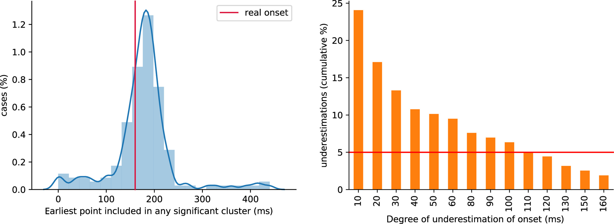

# Dependencies
```{r, message=FALSE}
library(ggplot2)
library(tibble)
library(cowplot)
library(beepr)
library(Rfast)
library(changepoint)
source("./code/functions.R")
source("./code/theme_gar.txt")
# Edit `one_over_f` function from `primer` package to control variance (Stevens, 2009). 
# Original function is available on [GitHub](https://github.com/HankStevens/primer).
# Copyright Hank Stevens.
source("./code/one_over_f.R")
# Load template: true onset = 160 ms, F=81, max at F=126
source("./code/erp_template.R")
source("./code/erp_template_half.R")
# R version of Matlab code from Yeung et al. 2004
source("./code/eeg_noise.R")
# to use with eeg_noise function
meanpower <- unlist(read.table("./code/meanpower.txt"))
```

# Results from Sassenhagen & Draschkow (2019) 

```{r}

```

"As shown in Figure 1, in general, the test tended to overestimate the latency of the effect. Underestimations of 40 ms and longer occurred in many more than 5% of runs (see Figure 1, right). Specifically, on >20% of runs, the effect onset was estimated too early; divergences of 40 ms or more were found at >10% of runs."

# Illustrate template
```{r}
df <- tibble(x = Xf,
             y = temp2)
p <- ggplot(df, aes(x, y)) + theme_gar +
  geom_line() + 
  labs(x = "Time in ms", y = "Signal in arbitrary units")
p
p.template <- p
# ggsave(filename = "./figures/template.pdf", width = 10, height = 5) 
```

## Half duration template

Template used in `onsetsim_eeg_half.Rmd`.

```{r}
df <- tibble(x = Xf,
             y = temp2.half)
p <- ggplot(df, aes(x, y)) + theme_gar +
  geom_line() + 
  labs(x = "Time in ms", y = "Signal in arbitrary units")
p
p.template <- p
# ggsave(filename = "./figures/template.pdf", width = 10, height = 5) 
```

# Generate noise using `one_over_f` function

## For one gamma value 

```{r}
set.seed(666)
Nt <- 10 # number of trials
gsp <- 1 # gamma spectral power -- 0 = white noise, 1 = pink noise
outvar <- 1 # noise variance of each trial
resmat <- matrix(data = 0, nrow = Nt, ncol = Nf)
for(T in 1:Nt){
  resmat[T,] <- one_over_f(gamma = gsp, Nf, outvar = outvar)
}

df <- tibble(x = rep(Xf, each = Nt),
             y = as.vector(resmat),
             trials = factor(rep(seq(1,Nt), Nf)))

ggplot(df, aes(x, y, group = trials, colour = trials)) + theme_gar + 
  geom_line(show.legend = FALSE) +
  labs(x = "Time in ms", y = "Signal in arbitrary units") +
  scale_colour_viridis_d()
```

## For multiple gamma values
```{r}
gsp <- seq(0, 2, 0.25) # gamma spectral power
outvar <- 1 # single-trial noise variance
Nt <- length(gsp)
resmat <- matrix(data = 0, nrow = Nt, ncol = Nf)
for(T in 1:Nt){
  set.seed(1) # same random seed to better compare trials
  resmat[T,] <- one_over_f(gamma = gsp[T], Nf, outvar = outvar)
}

df <- tibble(x = rep(Xf, each = Nt),
             y = as.vector(resmat),
             gamma = factor(rep(gsp, Nf)))

ggplot(df, aes(x, y, group = gamma)) + theme_gar +
  geom_line(linewidth = 1) + 
  # scale_colour_viridis_d(end = 0.95)
  facet_wrap(vars(gamma)) +
  labs(x = "Time in ms", y = "Signal in arbitrary units")

# ggsave(filename = "./figures/gamma_noise.pdf", width = 10, height = 5)
```

### Superimposed
```{r}
gsp <- seq(0, 2, 0.2) # gamma spectral power
outvar <- 1 # single-trial noise variance
Nt <- length(gsp)
resmat <- matrix(data = 0, nrow = Nt, ncol = Nf)
for(T in 1:Nt){
  set.seed(1) # same random seed to better compare trials
  resmat[T,] <- one_over_f(gamma = gsp[T], Nf, outvar = outvar)
}

df <- tibble(x = rep(Xf, each = Nt),
             y = as.vector(resmat),
             gamma = factor(rep(gsp, Nf)))
ggplot(df, aes(x, y, group = gamma, colour = gamma)) + theme_gar +
  geom_line(linewidth = 1) + 
  scale_colour_viridis_d(end = 0.95) +
  labs(x = "Time in ms", y = "Signal in arbitrary units")
```

## Illustrate signal + noise

```{r}
set.seed(666)
gsp <- 1 # gamma spectral power
outvar <- 1 # noise variance
Nt <- 50
cond <- matrix(data = 0, nrow = Nt, ncol = Nf)
for(T in 1:Nt){
  cond[T,] <- temp2 + one_over_f(gamma = gsp, Nf, outvar = outvar)
}

df <- tibble(x = rep(Xf, each = Nt),
             y = as.vector(cond),
             trials = factor(rep(1:Nt, Nf))
             )

df2 <- tibble(x = Xf,
              y = apply(cond, 2, mean),
              trials = factor(rep(200, Nf))
              )

ggplot(df, aes(x, y, group = trials)) + theme_gar +
  geom_line(colour = "grey") +
  geom_hline(yintercept = 0) +
  geom_vline(xintercept = true_onset) +
  geom_line(data = df2, aes(x, y), linewidth = 2, colour = "black") + 
  labs(x = "Time in ms", y = "Signal in arbitrary units")

# ggsave(filename = "./figures/gamma_noise_trials_mean.pdf", width = 10, height = 5) 
```

## Illustrate averages

```{r}
# set.seed(666)
Nt <- 50 # number of trials
gsp <- 1 # gamma spectral power
outvar <- 1 # noise variance
cond1 <- matrix(0, nrow = Nt, ncol = Nf)
cond2 <- matrix(0, nrow = Nt, ncol = Nf)
for(T in 1:Nt){
  cond2[T,] <- temp2 + one_over_f(gamma = gsp, Nf, outvar = outvar)
  cond1[T,] <- temp1 + one_over_f(gamma = gsp, Nf, outvar = outvar)
}
cond1 <- apply(cond1, 2, mean)
cond2 <- apply(cond2, 2, mean)

df <- tibble(x = rep(Xf,2),
             y = c(cond1, cond2),
             conds = factor(rep(c("Condition 1", "Condition 2"), each = Nf)))
ggplot(df, aes(x, y, colour = conds)) + theme_gar +
  geom_hline(yintercept = 0) +
  geom_line(linewidth = 2, show.legend = FALSE) +
  geom_vline(xintercept = true_onset) +
  labs(x = "Time in ms", y = "Signal in arbitrary units") +
  scale_colour_manual(values = c("grey", "black"))
  
# ggsave(filename = "./figures/gamma_noise_mean.pdf", width = 10, height = 5)
```

# Generate noise using `eeg_noise` function

Use more realistic noise generated by mixing noise at different frequencies.

## Multiple trials

```{r}
set.seed(666)
Nt <- 10 # number of trials
outvar <- 1
srate <- 500 # sampling rate in Hz
resmat <- matrix(data = 0, nrow = Nt, ncol = Nf)
for(T in 1:Nt){
  resmat[T,] <- eeg_noise(frames = Nf, srate = srate, outvar = outvar, meanpower)
}

df <- tibble(x = rep(Xf, each = Nt),
             y = as.vector(resmat),
             trials = factor(rep(seq(1,Nt), Nf)))

ggplot(df, aes(x, y, group = trials, colour = trials)) + theme_gar + 
  geom_line(show.legend = FALSE) +
  labs(x = "Time in ms", y = "Signal in arbitrary units") +
  scale_colour_viridis_d()

# ggsave(filename = "./figures/eeg_noise_trials.pdf", width = 10, height = 5)
```

### Separate plots: 10 example trials

```{r}
set.seed(666)
Nt <- 10 # number of trials
outvar <- 1
resmat <- matrix(data = 0, nrow = Nt, ncol = Nf)
for(T in 1:Nt){
  resmat[T,] <- eeg_noise(frames = Nf, srate = srate, outvar = outvar, meanpower)
}

df <- tibble(x = rep(Xf, each = Nt),
             y = as.vector(resmat),
             trials = factor(rep(seq(1,Nt), Nf)))

ggplot(df, aes(x, y, group = trials, colour = trials)) + theme_gar + 
  geom_line(show.legend = FALSE) +
  labs(x = "Time in ms", y = "Signal in arbitrary units") +
  facet_wrap(vars(trials), nrow = 2)
```

### Separate plots: 4 example trials

```{r}
set.seed(666)
Nt <- 4 # number of trials
outvar <- 1
resmat <- matrix(data = 0, nrow = Nt, ncol = Nf)
for(T in 1:Nt){
  resmat[T,] <- eeg_noise(frames = Nf, srate = srate, outvar = outvar, meanpower)
}

df <- tibble(x = rep(Xf, each = Nt),
             y = as.vector(resmat),
             trials = factor(rep(seq(1,Nt), Nf)))

p <- ggplot(df, aes(x, y, group = trials)) + theme_gar + 
  geom_hline(yintercept = 0) +
  geom_line(linewidth = 1, colour = "darkgrey", show.legend = FALSE) +
  labs(x = "Time in ms", y = "Signal in arbitrary units") +
  facet_wrap(vars(trials), nrow = 4) +
  theme(strip.background = element_blank(),
        strip.text.x = element_blank())
p
p.noise <- p
```

## Illustrate signal + noise

```{r}
set.seed(666)
Nt <- 50 # number of trials
outvar <- 1 # noise variance
cond1 <- matrix(0, nrow = Nt, ncol = Nf)
cond2 <- matrix(0, nrow = Nt, ncol = Nf)
for(T in 1:Nt){
  cond2[T,] <- temp2 + eeg_noise(frames = Nf, srate = srate, outvar = outvar, meanpower)
  cond1[T,] <- temp1 + eeg_noise(frames = Nf, srate = srate, outvar = outvar, meanpower)
}
df <- tibble(x = rep(Xf, each = Nt),
             y = as.vector(cond2),
             trials = factor(rep(1:Nt, Nf))
             )

df2 <- tibble(x = Xf,
              y = apply(cond2, 2, mean),
              trials = factor(rep(200, Nf))
              )

p <- ggplot(df, aes(x, y, group = trials)) + theme_gar +
  geom_line(colour = "grey") +
  geom_hline(yintercept = 0) +
  geom_vline(xintercept = true_onset) +
  geom_line(data = df2, aes(x, y), linewidth = 2, colour = "black") + 
  labs(x = "Time in ms", y = "Signal in arbitrary units")
p
p.signoise <- p
# ggsave(filename = "./figures/eeg_noise_trials_mean.pdf", width = 10, height = 5) 
```

## Illustrate averages

```{r}
df <- tibble(x = rep(Xf,2),
             y = c(apply(cond1, 2, mean), 
                   apply(cond2, 2, mean)),
             conds = factor(rep(c("Condition 1", "Condition 2"), each = Nf)))

p <-ggplot(df, aes(x, y, colour = conds)) + theme_gar +
  geom_hline(yintercept = 0) +
  geom_line(linewidth = 2, show.legend = FALSE) +
  geom_vline(xintercept = true_onset) +
  labs(x = "Time in ms", y = "Signal in arbitrary units") +
  scale_colour_manual(values = c("grey", "black"))
p
p.averages <- p  
# ggsave(filename = "./figures/eeg_noise_mean.pdf", width = 10, height = 5)
```

### Check centred data

To be used with cluster-depth. Centering data is required to insure asymptotic stationarity of the permuted residuals (Frossard & Renaud, 2022). 

```{r}
cond1.c <- cond1 - matrix(rep(apply(cond1, 2, mean),each=Nt),nrow=Nt)
cond2.c <- cond2 - matrix(rep(apply(cond2, 2, mean),each=Nt),nrow=Nt)

df <- tibble(x = rep(Xf,2),
             y = c(apply(cond1.c, 2, mean), 
                   apply(cond2.c, 2, mean)),
             conds = factor(rep(c("Condition 1", "Condition 2"), each = Nf)))

p <-ggplot(df, aes(x, y, colour = conds)) + theme_gar +
  geom_hline(yintercept = 0) +
  geom_line(linewidth = 2, show.legend = FALSE) +
  geom_vline(xintercept = true_onset) +
  labs(x = "Time in ms", y = "Signal in arbitrary units") +
  scale_colour_manual(values = c("grey", "black"))
  # coord_cartesian(ylim = c(-0.1, 1))
p
```
                        
# T^2 time courses

```{r}
# t-tests
ori.t2 <- vector(mode = "numeric", length = Nf)
for(F in 1:Nf){
  ori.t2[F] <- t.test(cond1[,F], cond2[,F])$statistic^2
}

df <- tibble(x = Xf,
             y = ori.t2)
p <- ggplot(df, aes(x, y)) + theme_gar +
  geom_line(linewidth = 1) +
  geom_vline(xintercept = true_onset) +
    labs(x = "Time in ms", y = bquote(t^2))
p
p.t2 <- p
# ggsave(filename = "./figures/eeg_t2.pdf", width = 10, height = 5)
```

# Summary figure: signal and noise

```{r, eval=FALSE, warning=FALSE}
p.BCDE <- plot_grid(p.template, p.signoise, p.averages, p.t2,
                    labels = c("B", "C", "D", "E"),
                    label_size = 20)

plot_grid(p.noise, p.BCDE,
          labels = c("A", NA),
          rel_widths = c(1, 2, 2, 2, 2),
          label_size = 20
          )

ggsave(filename = "./figures/examples_1.pdf", width = 20, height = 10)
```

# Estimate onsets: examples

## `changepoint` package
```{r, warning=FALSE}
res <- cpt.meanvar(ori.t2, method = "BinSeg", Q=2)

df <- tibble(x = Xf,
             y = ori.t2)

p.cp <- ggplot(df, aes(x, y)) + theme_gar + 
  geom_line(linewidth = 1) +
  geom_vline(xintercept = true_onset) +
  geom_vline(xintercept = Xf[res@cpts[1]], linetype = "dotted") +
  labs(x = "Time in ms", y = bquote(t^2)) +
  ggtitle(paste("Change point onset =", Xf[res@cpts[1]], "ms"))
p.cp
```

## Permutation

### Generate distributions
```{r}
nboot <- 2000
aath <- 0.05 # arbitrary alpha threshold

# Make permutation table of t values 
perm.tvals <- permtdist(cond1, cond2, Nt, Nf, nboot = nboot)
perm.t2 <- perm.tvals^2

# Make permutation table of t values for cluster-depth method
# Each condition is centred first, following Frossard & Renaud (2022)
perm.tvals <- permtdist(cond1 - matrix(rep(apply(cond1, 2, mean),each=Nt),nrow=Nt), 
                        cond2 - matrix(rep(apply(cond2, 2, mean),each=Nt),nrow=Nt), Nt, Nf, nboot = nboot)
perm.t2c <- perm.tvals^2
```

### Compute onsets
```{r}
perm.th <- apply(perm.t2, 2, quantile, probs = 1-aath)

# FDR -----
perm.pvals <- vector(mode = "numeric", length = Nf)
for(F in 1:Nf){
  perm.pvals[F] <- (sum(perm.t2[,F] >= ori.t2[F]) + 1) / (nboot + 1)
}
onset.bh95 <- find_onset(p.adjust(perm.pvals, method = "fdr") <= aath, Xf)
onset.by01 <- find_onset(p.adjust(perm.pvals, method = "BY") <= aath, Xf)

# MAX -----
max.th <- quantile(apply(perm.t2, 1, max), probs = 1-aath)
# onset.max <- Xf[which(ori.t2 >= max.th)[1]]
onset.max <- find_onset(ori.t2 >= max.th, Xf)

# cluster-sum statistics -----
cmap <- cluster.make(perm.pvals <= aath)
perm.max.sums <- vector(mode = "numeric", length = nboot)
for(B in 1:nboot){
  # threshold permutation t2 values and form clusters
  perm.cmap <- cluster.make(perm.t2[B,] <= perm.th)  
  perm.max.sums[B] <- max(cluster.sum(values = perm.t2[B,], cmap = perm.cmap))
}
# cluster-sum threshold
cs.th <- quantile(perm.max.sums, probs = 1-aath)
# cluster test
cs.test <- cluster.test(values = perm.t2, cmap = cmap, cs.th)
# onset.cs <- Xf[cs.test][1]
onset.cs <- find_onset(cs.test, Xf)
```

### Compute cluster-depth onset
```{r, warning=FALSE}
df <- as_tibble(rbind(cond1, cond2))
df2 <- tibble(gp = rep(c("gp1", "gp2"), each = Nt),
              trial = c(1:Nt, 1:Nt))
df <- cbind(df2, df)

res <- permuco::clusterlm(formula = df[,3:ncol(df)] ~ gp, 
                          data = df[,-(3:ncol(df))],
                          multcomp = "clusterdepth_head",
                          test = "t",
                          np = nboot)

cd.pval <- res$multiple_comparison$gpgp2$clusterdepth$main[,2]
# cd.tval <- res$multiple_comparison$gpgp2$clusterdepth$main[,1]
onset.cd <- find_onset(cd.pval < aath, Xf)
```


## Plot permutation distribution + FDR BH95 onset

Superimpose original t^2 time course and 95th quantiles of permutation distribution.

```{r, warning=FALSE}
df <- tibble(x = Xf,
             y = ori.t2,
             boot = factor(rep(1, Nf)))

df.perm <- tibble(x = rep(Xf, each = nboot),
                  y = as.vector(perm.t2),
                  boot = factor(rep(1:nboot, Nf)))

df.q <- tibble(x = Xf, 
               y = perm.th,
               boot = factor(rep(1, Nf)))

df.sig <- tibble(x = Xf,
                 y = ifelse(p.adjust(perm.pvals, method = "fdr") <= aath, 0, NA),
                 boot = factor(rep(1, Nf)))

p.bh95 <- ggplot(data = df.perm, aes(x=x, y=y, group = boot)) + theme_gar +
  # plot permutation distributions
  geom_line(data = df.perm, aes(x=x, y=y, group = boot),
            colour = "grey",
            linewidth = 0.5) +
  # superimpose original t2 time course
  geom_line(data = df, linewidth = 1) +
  geom_vline(xintercept = true_onset) + 
  geom_line(data = df.q, linetype = "dashed") +
  # plot onset
  geom_vline(xintercept = onset.bh95, linetype = "dotted") +
  # plot statistical significance
  geom_point(data = df.sig, colour = "black") +
  labs(x = "Time in ms", y = bquote(t^2)) +
  ggtitle(paste("Permutation + FDR BH95 correction =",onset.bh95,"ms"))
p.bh95
```

## Plot permutation distribution + FDR BY01 onset

Superimpose original t^2 time course and 95th quantiles of permutation distribution.

```{r, warning=FALSE}
df <- tibble(x = Xf,
             y = ori.t2,
             boot = factor(rep(1, Nf)))

df.perm <- tibble(x = rep(Xf, each = nboot),
                  y = as.vector(perm.t2),
                  boot = factor(rep(1:nboot, Nf)))

df.q <- tibble(x = Xf, 
               y = perm.th,
               boot = factor(rep(1, Nf)))

df.sig <- tibble(x = Xf,
                 y = ifelse(p.adjust(perm.pvals, method = "BY") <= aath, 0, NA),
                 boot = factor(rep(1, Nf)))

p.by01 <- ggplot(data = df.perm, aes(x=x, y=y, group = boot)) + theme_gar +
  # plot permutation distributions
  geom_line(data = df.perm, aes(x=x, y=y, group = boot),
            colour = "grey",
            linewidth = 0.5) +
  # superimpose original t2 time course
  geom_line(data = df, linewidth = 1) +
  geom_vline(xintercept = true_onset) + 
  geom_line(data = df.q, linetype = "dashed") +
  # plot onset
  geom_vline(xintercept = onset.by01, linetype = "dotted") +
  # plot statistical significance
  geom_point(data = df.sig, colour = "black") +
  labs(x = "Time in ms", y = bquote(t^2)) +
  ggtitle(paste("Permutation + FDR BY01 correction =",onset.by01,"ms"))
p.by01
```

## MAX correction
```{r, warning=FALSE}
df <- tibble(x = Xf,
             y = ori.t2,
             boot = factor(rep(1, Nf)))

df.perm <- tibble(x = rep(Xf, each = nboot),
                  y = as.vector(perm.t2),
                  boot = factor(rep(1:nboot, Nf)))

df.q <- tibble(x = Xf, 
               y = perm.th,
               boot = factor(rep(1, Nf)))

df.sig <- tibble(x = Xf,
                 y = ifelse(ori.t2 >= max.th, 0, NA),
                 boot = factor(rep(1, Nf)))

p.max <- ggplot(data = df.perm, aes(x=x, y=y, group = boot)) + theme_gar +
  # plot permutation distributions
  geom_line(data = df.perm, aes(x=x, y=y, group = boot),
            colour = "grey",
            linewidth = 0.5) +
  # superimpose original t2 time course
  geom_line(data = df, linewidth = 1) +
  geom_vline(xintercept = true_onset) + 
  geom_hline(yintercept = max.th, linetype = "dashed") +
  # plot onset
  geom_vline(xintercept = onset.max, linetype = "dotted") +
  # plot statistical significance
  geom_point(data = df.sig, colour = "black") +
  labs(x = "Time in ms", y = bquote(t^2)) +
  ggtitle(paste("Permutation + MAX correction =",onset.max,"ms"))
p.max
```

## Cluster-sum statistics
```{r, warning=FALSE}
df <- tibble(x = Xf,
             y = ori.t2,
             boot = factor(rep(1, Nf)))

df.perm <- tibble(x = rep(Xf, each = nboot),
                  y = as.vector(perm.t2),
                  boot = factor(rep(1:nboot, Nf)))

df.q <- tibble(x = Xf, 
               y = perm.th,
               boot = factor(rep(1, Nf)))

df.sig <- tibble(x = Xf,
                 y = ifelse(cs.test, 0, NA),
                 boot = factor(rep(1, Nf)))

p.cs <- ggplot(data = df.perm, aes(x=x, y=y, group = boot)) + theme_gar +
  # plot permutation distributions
  geom_line(data = df.perm, aes(x=x, y=y, group = boot),
            colour = "grey",
            linewidth = 0.5) +
  # superimpose original t2 time course
  geom_line(data = df, linewidth = 1) +
  geom_vline(xintercept = true_onset) + 
  geom_line(data = df.q, linetype = "dashed") +
  # plot onset
  geom_vline(xintercept = onset.cs, linetype = "dotted") +
  # plot statistical significance
  geom_point(data = df.sig, colour = "black") +
  labs(x = "Time in ms", y = bquote(t^2)) +
  ggtitle(paste("Permutation + cluster-sum correction =",onset.cs,"ms"))
p.cs
```

## Cluster-depth statistics
```{r, warning=FALSE}
perm.th.c <- apply(perm.t2c, 2, quantile, probs = 1-aath)

df <- tibble(x = Xf,
             y = ori.t2,
             boot = factor(rep(1, Nf)))

df.perm <- tibble(x = rep(Xf, each = nboot),
                  y = as.vector(perm.t2c),
                  boot = factor(rep(1:nboot, Nf)))

df.q <- tibble(x = Xf, 
               y = perm.th.c,
               boot = factor(rep(1, Nf)))

df.sig <- tibble(x = Xf,
                 y = ifelse(cd.pval < aath, 0, NA),
                 boot = factor(rep(1, Nf)))

p.cd <- ggplot(data = df.perm, aes(x=x, y=y, group = boot)) + theme_gar +
  # plot permutation distributions
  geom_line(data = df.perm, aes(x=x, y=y, group = boot),
            colour = "grey",
            linewidth = 0.5) +
  # superimpose original t2 time course
  geom_line(data = df, linewidth = 1) +
  geom_vline(xintercept = true_onset) + 
  geom_line(data = df.q, linetype = "dashed") +
  # plot onset
  geom_vline(xintercept = onset.cd, linetype = "dotted") +
  # plot statistical significance
  geom_point(data = df.sig, colour = "black") +
  labs(x = "Time in ms", y = bquote(t^2)) +
  ggtitle(paste("Permutation + cluster-depth correction =",onset.cd,"ms"))
p.cd
```

## Combine panels

```{r, eval=FALSE, warning=FALSE}
cowplot::plot_grid(p.bh95, p.by01, p.cs, p.cd, p.max, p.cp,
                   nrow = 3,
                   labels = c("A", "B", "C", "D", "E", "F"),
                   label_size = 20)

ggsave(filename = "./figures/examples_2.pdf", width = 15, height = 12)
```

# References
Frossard, J., & Renaud, O. (2021). Permutation Tests for Regression, ANOVA, and Comparison of Signals: The permuco Package. Journal of Statistical Software, 99, 1–32. https://doi.org/10.18637/jss.v099.i15

Frossard, J., & Renaud, O. (2022). The cluster depth tests: Toward point-wise strong control of the family-wise error rate in massively univariate tests with application to M/EEG. NeuroImage, 247, 118824. https://doi.org/10.1016/j.neuroimage.2021.118824

Stevens, M.H.H. (2009) A Primer of Ecology with R, 2nd Printing. Springer, New York.

Yeung, N., Bogacz, R., Holroyd, C.B., & Cohen, J.D. (2004) Detection of synchronized oscillations in the electroencephalogram: An evaluation of methods. Psychophysiology, 41, 822–832.


